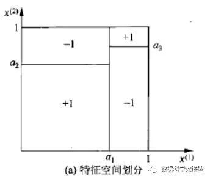
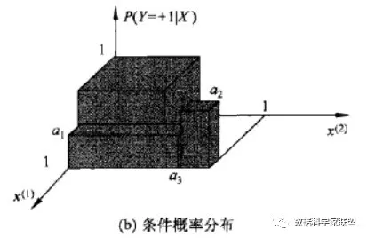
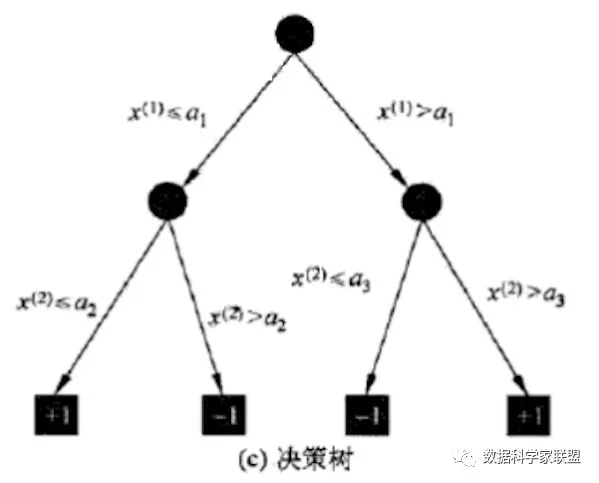
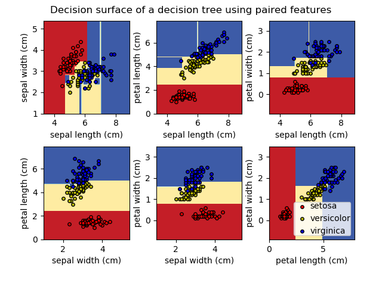
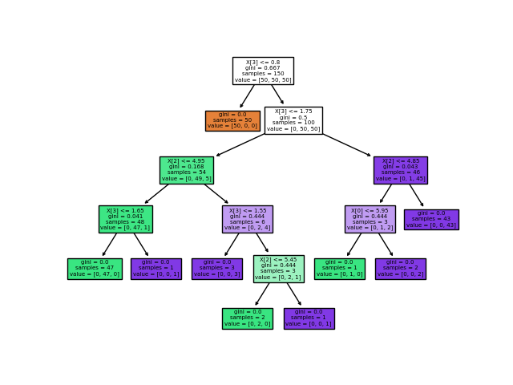

# 决策树

决策树思想的来源非常朴素，程序设计中的条件分支结构就是if-else结构，最早的决策树就是利用这类结构分割数据的一种分类学习方法。

决策树（decision tree）是一个树结构（可以是二叉树或非二叉树）。

其每个非叶节点表示一个特征属性上的测试，每个分支代表这个特征属性在某个值域上的输出，而每个叶节点存放一个类别。

使用决策树进行决策的过程就是从根节点开始，测试待分类项中相应的特征属性，并按照其值选择输出分支，直到到达叶子节点，将叶子节点存放的类别作为决策结果。

总结来说：

决策树模型核心是下面几部分：

- 结点和有向边组成
- 结点有内部结点和叶结点俩种类型
- 内部结点表示一个特征，叶节点表示一个类

## 特点

### 优点

- **决策树易于理解和实现**.人们在通过解释后都有能力去理解决策树所表达的意义。
- **只需很少的数据准备**.对于决策树，数据的准备往往是简单或者是不必要的.其他的技术往往要求先把数据一般化(归一化/标准化)，比如去掉多余的或者空白的属性。
- **既可以处理数值型数据，也可以处理类别型数据**.能够同时处理数据型和常规型属性。其他的技术往往要求数据属性的单一。
- **白盒模型**.如果给定一个观察的模型，那么根据所产生的决策树很容易推出相应的逻辑表达式。输出结果容易通过模型的结构来解释。神经网络则相反，很难解释输出的结果。
- **可以通过测试集来验证模型的性能**.易于通过静态测试来对模型进行评测。表示有可能测量该模型的可信度。
- **强健性**.对噪声处理有好的强健性。
- **很好的处理大规模数据**.在相对短的时间内能够对大型数据源做出可行且效果良好的结果。

### 缺点

- 训练一棵最优的决策树是一个完全NP问题(生成问题的一个解通常比验证一个给定的解时间花费要多得多)。 因此, 实际应用时决策树的训练采用启发式搜索算法例如 [贪心算法](https://zh.wikipedia.org/wiki/贪心算法) 来达到局部最优。这样的算法没办法得到最优的决策树。
- 决策树创建的过度复杂会导致无法很好的预测训练集之外的数据。这称作过拟合. 剪枝机制可以避免这种问题。
- 有些问题决策树没办法很好的解决,例如 异或问题。解决这种问题的时候，决策树会变得过大。 要解决这种问题，只能改变问题的领域 或者使用其他更为耗时的学习算法 (例如统计关系学习 或者 归纳逻辑编程).
- 对那些有类别型属性的数据, 信息增益 会有一定的偏置。
- 对于那些各类别样本数量不一致的数据，在决策树当中信息增益的结果偏向于那些具有更多数值的特征。

## 决策树与条件概率

在前面已经从直观上了解决策树，及其构造步骤了。现在从统计学的角度对决策树进行定义能够能好地帮助我们理解模型。

决策树表示给定特征条件下，类的条件概率分布，这个条件概率分布表示在特征空间的划分上，将特征空间根据各个特征值不断进行划分，就将特征空间分为了多个不相交的单元，在每个单元定义了一个类的概率分布，这样，这条由根节点到达叶节点的路径就成了一个条件概率分布。

假设X表示特征的随机变量，Y表示类的随机变量，那么这个条件概率可以表示为，其中X取值于给定划分下单元的集合，Y取值于类的集合。各叶结点（单元）上的条件概率往往偏向某一个类。根据输入的测试样本，由路径找到对应单元的各个类的条件概率，并将该输入测试样本分为条件概率最大的一类中，就可以完成对测试样本的分类。

下图a，表示了特种空间的一个划分。大正方形表示特征空间。这个大正方形被若干个小矩形分割，每个小矩形表示一个单元。特征空间划分上的单元构成了一个集合，X取值为单元的集合。假设只有两类正类负类，`Y = +1 OR -1`；小矩形中的数字表示单元的类。



下图b表示特征空间（图a）划分确定时，特征（划分单元）给定条件下类的条件概率分布。图b中的条件概率分布对应于图a的划分；当某个单元C的条件概率满足时，即认为该类属于正类，落在该单元的实例都视为正例。



下图c表示了根节点到各个叶子结点上不同划分的条件分布。



在理解了相关概念之后，提出两个问题：

- 特征空间的划分是如何确定的？（根据一系列的评价系数确认分类特征？）
- 该条件概率分布的概率值是如何确定的？（根据各点数据集归纳出的分类规则？）

## 决策树的学习

### 学习目标与本质

假设给定训练数据集 `D=(x1,y1),(x2,y2),...,(xn,yn)`，其中 `xi = (xi(1),xi(2),...,xi(n))^T` 为输入实例（特征向量），n为特征个数，`yi∈{1,2,...,K}`为类标记（label），`i=1,2,3,...,N`，N为样本容量。

学习目标：根据给定的训练数据集构建一个决策模型，使它能够对实例进行正确的分类。

决策树学习本质上是从训练数据集中归纳出一组分类规则。与训练数据集不相矛盾的决策树（即能对训练数据进行正确分类的决策树）可能是0个或多个。我们需要找到一个与训练数据矛盾较小的决策树，同时具有很好的泛化能力。

从另一个角度看，决策树学习是由训练数据集估计条件概率模型。基于特征空间划分的类的条件概率模型有无穷多个。我们选择的条件概率模型应该不仅对训练数据有很好地拟合，而且对未知数据有很好地预测。

### 决策树损失函数

与其他模型相同，决策树学习用损失函数表示这一目标。决策树学习的损失函数通常是正则化的极大似然函数。决策树学习的策略是以损失函数为目标函数的最小化。

> 关于极大似然函数：极大似然法是属于数理统计范畴，旨在由果溯因。把“极大似然估计”拆成三个词：极大（最大的概率）、似然（看起来是这个样子的）、估计（就是这个样子的），连起来就是：大概率看起来是这样的，那就是这样。
> 
> 比如扔一枚骰子(骰子每个面上只标记1或2)，现在告诉你扔了n次骰子其中有k次朝上的是1；然后问你这个骰子标记为1的面所占的比例w是多少?极大似然法的思想就是估计当w取值为多少的时候，k次朝上的可能性最大。具体计算方法就是对表达式求最大值，得到参数值估计值：一般就是对这个表达式求一阶导=0(二阶导<0)；
> 
> 这就是极大似然估计方法的原理：用使概率达到最大的那个概率值w来估计真实参数w。决策树生成的过程可以理解成对决策树模型的参数估计(就是基于特征空间划分的类的概率模型),根据训练数据的特征分布，选择使得模型最契合当前样本分布空间时的条件概率模型。

当损失函数确定以后，学习问题就变为在损失函数意义下选择最优决策树的问题。因为从所有可能的决策树中选取最优决策树是NP完全问题，所以现实中决策树学习算法通常采用启发式方法，近似求解这一最优化问题。这样得到的决策树是次最优的。

## 决策树的构建

决策树通常有三个步骤：

- 特征选择
- 决策树的生成
- 决策树的修剪

决策树学习的算法通常是一个递归地选择最优特征，并根据该特征对训练数据进行分割，使得对各个子数据集有一个最好的分类的过程。这一过程对应着对特征空间的划分，也对应着决策树的构建。

这一过程对应着对特征空间的划分，也对应着决策树的构建。

1. 开始：构建根节点，将所有训练数据都放在根节点，选择一个最优特征，按照这一特征将训练数据集分割成子集，使得各个子集有一个在当前条件下最好的分类。
2. 如果这些子集已经能够被基本正确分类，那么构建叶节点，并将这些子集分到所对应的叶子节点去。
3. 如果还有子集不能够被正确的分类，那么就对这些子集选择新的最优特征，继续对其进行分割，构建相应的节点，如此递归进行，直至所有训练数据子集被基本正确的分类，或者没有合适的特征为止。
4. 每个子集都被分到叶节点上，即都有了明确的类，这样就生成了一颗决策树。

以上方法就是决策树学习中的特征选择和决策树生成，这样生成的决策树可能对训练数据有很好的分类能力，但对未知的测试数据却未必有很好的分类能力，即可能发生过拟合现象。我们需要对已生成的树自下而上进行剪枝，将树变得更简单，从而使其具有更好的泛化能力。具体地，就是去掉过于细分的叶结点，使其回退到父结点，甚至更高的结点，然后将父结点或更高的结点改为新的叶结点，从而使得模型有较好的泛化能力。。

剪枝是决策树停止分支的方法之一，剪枝有分预先剪枝和后剪枝两种。预先剪枝是在树的生长过程中设定一个指标，当达到该指标时就停止生长，这样做容易产生“视界局限”，就是一旦停止分支，使得节点N成为叶节点，就断绝了其后继节点进行“好”的分支操作的任何可能性。不严格的说这会已停止的分支会误导学习算法，导致产生的树不纯度降差最大的地方过分靠近根节点。后剪枝中树首先要充分生长，直到叶节点都有最小的不纯度值为止，因而可以克服“视界局限”。然后对所有相邻的成对叶节点考虑是否消去它们，如果消去能引起令人满意的不纯度增长，那么执行消去，并令它们的公共父节点成为新的叶节点。这种“合并”叶节点的做法和节点分支的过程恰好相反，经过剪枝后叶节点常常会分布在很宽的层次上，树也变得非平衡。后剪枝技术的优点是克服了“视界局限”效应，而且无需保留部分样本用于交叉验证，所以可以充分利用全部训练集的信息。但后剪枝的计算量代价比预剪枝方法大得多，特别是在大样本集中，不过对于小样本的情况，后剪枝方法还是优于预剪枝方法的

决策树生成和决策树剪枝是个相对的过程，决策树生成旨在得到对于当前子数据集最好的分类效果(局部最优)，而决策树剪枝则是考虑全局最优，增强泛化能力。

### 特征选择

在构建决策树，进行特征选择划分时，究竟选择哪个特征更好些？

这就要求确定选择特征的准则。直观上，如果一个特征具有更好的分类能力，或者说，按照这一特征将训练数据集分割成子集，使得各个子集在当前条件下有最好的分类，那么就更应该选择这个特征。比如身高、长相、收入等。在找到特征维度之后，还要确定划分阈值，如收入定在多少，作为划分标准比较合适？

因此，首先找到一个维度，然后在维度上找到一个阈值。然后以这个维度的这个阈值为依据进行划分。核心问题是：

每个节点在哪个维度做划分？选好了维度，如何确定阈值呢？

#### 熵

##### 信息熵

熵是热力学中的概念，表示混乱程度。熵越大，热力系统中粒子无规则的运动越剧烈；熵越小，粒子越趋近于静止的状态。

引申到信息论和概率统计中，信息熵表示随机变量的不确定度。对于一组数据来说，越随机、不确定性越高，信息熵越大；不确定性越低，信息熵越小。

为了计算熵，我们需要计算所有类别所有可能值所包含的信息期望值，著名的香农公式：

$$
H = -\sum_{i=1}^k p_i log(p_i)
$$

在一个系统中，有k类的信息，其中 pi 是选择该分类的概率（n/k），再乘p的对数，求和后加上负号。这是因为概率 pi 是小于1的数，log(pi)是小于0的数，我们要求得到的熵是大于0的。

下面构造三个例子：假设有三组，每组为三类的信息，每组每类的概率为：

$$
\begin{aligned}
    &\{\frac{1}{3},\frac{1}{3},\frac{1}{3}\}: &H = 1.0986 \\
    &\{\frac{1}{10},\frac{2}{10},\frac{7}{10}\}: &H = 0.8018 \\
    &\{1,0,0\}: &H = 0.0000
\end{aligned}
$$

我们看到，信息熵H值越小，说明数据的不确定性越小。第一个式子，每种分类情况都是均等的；第二个式子，数据有70%的概率是落在第三类中，因此要比第一个式子更稳定；第三个式子，干脆只有一个类，因此熵最小为0（特别稳定）。

如果在二分类的情况下，信息熵公式也可以写为下面的形式：

$$
H = -\sum_{i=1}^k p_i log(p_i) = -x log(x) - (1 - x) log(1 - x)
$$

二分类的信息熵图形形似抛物线，以0.5为对称轴。当x=0.5时，曲线取到最大值，也就是说对于信息熵来说，只有两个类别，其中一个类别是0.5，另一个类别是1-0.5时，此时信息熵是最大的，也就是最不确定的。如果x偏向于某一类，确定性变高了，信息熵变低了。

##### 条件熵

设有随机变量(X|Y)。条件熵H(X|Y)表示在已知随机变量X的条件下随机变量Y的不确定性。

随机变量X给定的条件下随机变量Y的条件熵H(X|Y)定义为X给定条件Y下，Y的条件概率分布的熵对X的数学期望:

$$
H(X|Y) = \sum_{i=1}^n p_i H(Y|X = x_i)\\
其中： p_i = P(X = x_i), i = 1,2,...,n
$$

注意，与信息熵不同的是，条件熵是数学期望，而不是变量的不确定性。

其实条件熵意思是按一个新的变量的每个值对原变量进行分类，然后在每一个小类里面，都计算一个小熵，然后每一个小熵乘以各个类别的概率，然后求和。所谓小类，就是不包含当前所选特征的其他维度，即当前的特征是给定的条件，在其他维度下求熵，是条件下的。各类别的概率，是当前这个小类别下的样本量除以总的样本量。

我们用另一个变量对原变量分类后，原变量的不确定性就会减小了，因为新增了Y的信息，可以感受一下。不确定程度减少了多少就是信息的增益。

#### 信息增益

在划分数据集前后信息发生的变化称为信息增益，获得信息增益最高的特征就是最好的选择。

信息增益就是：**以某特征划分数据集前后的熵的差值**

划分前，样本集合D的熵（也称经验熵）是为H(D)；使用某个特征A划分数据集D，计算划分后的数据子集（给定特征A的情况下，数据集D）的条件熵（经验条件熵）H(D|A)。则公式为：

$$
g(D,A) = H(D) - H(D|A)
$$

在计算过程中，使用所有特征划分数据集D，得到多个特征划分数据集D的信息增益（列表）。从这些信息增益中选择最大的，因而当前结点的划分特征便是使信息增益最大的划分所使用的特征。

**使用**

通过对信息增益的进一步理解，我们发现：对于待划分的数据集D，其经验熵H(D)是不变的，但是划分之后得到的条件熵H(D|A)是变化的（特征A的选择不同）。

条件熵H(D|A)越小，说明使用此特征划分得到的子集的不确定性越小（也就是纯度越高），因为得到的信息增益就越大。说明在决策树构建的过程中我们总是希望集合往最快到达纯度更高的子集合方向发展，因此我们总是选择使得信息增益最大的特征来划分当前数据集D。

信息增益偏向取值较多的特征。

原因：当特征的取值较多时，根据此特征划分更容易得到纯度更高的子集，因此划分之后的熵更低，由于划分前的熵是一定的，因此信息增益更大，因此信息增益比较偏向取值较多的特征。

#### 信息增益率


## 使用sk-learn基于iris数据集绘制决策树

对于每个Iris特征，决策树学习由训练样本推断出的简单阈值规则组合而成的决策边界。



基于所有特征值的树形结构



```python
print(__doc__)

import numpy as np
import matplotlib.pyplot as plt

from sklearn.datasets import load_iris
from sklearn.tree import DecisionTreeClassifier, plot_tree

# Parameters
n_classes = 3
plot_colors = "ryb"
plot_step = 0.02

# Load data
iris = load_iris()

for pairidx, pair in enumerate([[0, 1], [0, 2], [0, 3],
                                [1, 2], [1, 3], [2, 3]]):
    # We only take the two corresponding features
    X = iris.data[:, pair]
    y = iris.target

    # Train
    clf = DecisionTreeClassifier().fit(X, y)

    # Plot the decision boundary
    plt.subplot(2, 3, pairidx + 1)

    x_min, x_max = X[:, 0].min() - 1, X[:, 0].max() + 1
    y_min, y_max = X[:, 1].min() - 1, X[:, 1].max() + 1
    xx, yy = np.meshgrid(np.arange(x_min, x_max, plot_step),
                         np.arange(y_min, y_max, plot_step))
    plt.tight_layout(h_pad=0.5, w_pad=0.5, pad=2.5)

    Z = clf.predict(np.c_[xx.ravel(), yy.ravel()])
    Z = Z.reshape(xx.shape)
    cs = plt.contourf(xx, yy, Z, cmap=plt.cm.RdYlBu)

    plt.xlabel(iris.feature_names[pair[0]])
    plt.ylabel(iris.feature_names[pair[1]])

    # Plot the training points
    for i, color in zip(range(n_classes), plot_colors):
        idx = np.where(y == i)
        plt.scatter(X[idx, 0], X[idx, 1], c=color, label=iris.target_names[i],
                    cmap=plt.cm.RdYlBu, edgecolor='black', s=15)

plt.suptitle("Decision surface of a decision tree using paired features")
plt.legend(loc='lower right', borderpad=0, handletextpad=0)
plt.axis("tight")

plt.figure()
clf = DecisionTreeClassifier().fit(iris.data, iris.target)
plot_tree(clf, filled=True)
plt.show()
```


