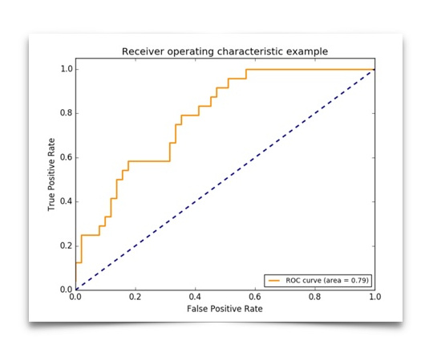

# Evaluating Machine Learning Models 1

评价指标是机器学习任务中非常重要的一环。不同机器学习任务有不同的评价指标，同一种机器学习任务也有不同指标。每个指标的着重点不一样。

## 分类评价指标

**混淆矩阵 Confusion Matrix**

|  | Predicted as Positive | Predicted as Negative |
| --- | --- | --- |
| Labeled as Positive | True Positive(TP) | False Negative(FN) |
| Labeled as Negative | False Positive(FP) | True Negative(TN) |

> - 真正(True Positive, TP)：被模型分类正确的正样本。
> - 假负(False Negative, FN)：被模型分类错误的正样本。
> - 假正(False Positive, FP)：被模型分类的负样本。
> - 真负(True Negative, TN)：被模型分类正确的负样本。

由混淆矩阵可以计算这些评价指标： 准确率，平均准确率，精确率-召回率，F1-Score，ROC曲线。

### 准确率 Accuracy

准确率就预测结果的正确率。最简单的评价预测结果的方式。

$$
accuracy = \frac{TP + TN}{TP + FN + FP + TN}
$$

### 平均准确率 Average Per-class Accuracy

$$
average\_accuracy = \frac{\frac{TP}{TP + FN} + \frac{TN}{TN + FP}}{2}
$$

### 对数损失函数 Log-loss

$$
log_loss = -\frac{1}{N}\sum_{i=1}^N y_i log p_i + (1 - y_i)log(1 - p_i)
$$

### 精确率-召回率 Precision-Recall

accuracy是最常见也是最基本的evaluation metric。但在binary classification 且正反例不平衡的情况下，尤其是我们对minority class 更感兴趣的时候，accuracy评价基本没有参考价值。什么fraud detection（欺诈检测），癌症检测，都符合这种情况。

对于一个癌症预测系统，输入检查指标，判断是否患有癌症，预测准确度99.9%。这个系统是好是坏呢？

如果癌症产生的概率是0.1%，那其实根本不需要任何机器学习算法，只要系统预测所有人都是健康的，即可达到99.9%的准确率。也就是说对于极度偏斜(Skewed Data)的数据，只使用分类准确度是不能衡量。

#### 精准率

查准率，precision是相对你自己的模型预测而言：true positive ／retrieved set。假设你的模型一共预测了100个正例，而其中80个是对的正例，那么你的precision就是80%。

即：我们关注的那个事件，预测的有多准。

$$
Precision = \frac{TP}{TP + FP}
$$

#### 召回率

查全率，recall是相对真实的答案而言： true positive ／ golden set 。假设测试集里面有100个正例，你的模型能预测覆盖到多少，如果你的模型预测到了40个正例，那你的recall就是40%。

即：我们关注的那个事件真实的发生情况下，我们成功预测的比例是多少。

$$
Recall = \frac{TP}{TP + FN}
$$

### F1-score

在一个股票预测系统中，未来股票是上涨还是下跌这样一个二分类问题。很显然“涨”才是我们关注的焦点，那么我们肯定希望：系统预测上涨的股票中，真正上涨的比例越大越好，这就是希望查准率高。那么我们是否关注查全率呢？在大盘中有太多的真实上涨股票，虽然我们漏掉了一些上升周期，但是我们没有买进，也就没有损失。但是如果查准率不高，预测上涨的结果下跌了，那就是实实在在的亏钱了。所以在这个场景中，查准率更重要。

当然也有追求召回率的场景，在医疗领域做疾病诊断，如果召回率低，意味着本来有一个病人得病了，但是没有正确预测出来，病情就恶化了。我们希望尽可能地将所有有病的患者都预测出来，而不是在看在预测有病的样例中有多准。

但是，在实际业务场景中，也有很多没有这么明显的选择。那么在同时需要关注精准率和召回率，如何在两个指标中取得平衡呢？在这种情况下，我们使用一种新的指标：F1 Score。

F1的值同时受到P、R的影响，单纯地追求P、R的提升并没有太大作用。在实际业务工程中，结合正负样本比，的确是一件非常有挑战的事。

调和平均值的特点是如果二者极度不平衡，如某一个值特别高、另一个值特别低时，得到的调和平均值也特别低；只有二者都非常高，调和平均值才会高。这样才符合我们对精准率和召回率的衡量标准。

$$
F1 = \frac{2}{\frac{1}{precision} + \frac{1}{recall}} = \frac{2 * precision * recall}{precision + recall}
$$

### AUC - Area under the Curve 和 ROC - Receiver Operating Characteristic

#### ROC 和 PRC

$$
sensitivity = TPR(recall) = \frac{TP}{TP + FN}
$$

$$
specificity = 1 - FPR = 1 - \frac{FP}{FP + TN}
$$

ROC是由点（TPR,FPR）组成的曲线。ROC曲线的x轴是伪阳性率（false positive rate），y轴是真阳性率（true positive rate）。



一般来说，如果ROC是光滑的，那么基本可以判断没有太大的overfitting。

### AUC

一般在ROC曲线中，我们关注是曲线下面的面积， 称为AUC（Area Under Curve）。这个AUC是横轴范围（0,1 ），纵轴是（0,1）所以总面积是小于1的。

AUC是ROC的积分（曲线下面积），是一个数值，一般认为越大越好，数值相对于曲线而言更容易当做调参的参照。曲线下的面积(AUC)越大，或者说曲线更接近左上角（true positive rate=1， false positive rate=0）。

PR曲线会面临一个问题，当需要获得更高recall时，model需要输出更多的样本，precision可能会伴随出现下降/不变/升高，得到的曲线会出现浮动差异（出现锯齿），无法像ROC一样保证单调性。

在正负样本分布得极不均匀(highly skewed datasets)的情况下，还有一个PRC(precision recall curve)，就是以precision recall为轴，取不同的threshold画的。PRC比ROC能更有效地反应分类器的好坏。

### 总结

因为混淆矩阵表达的信息比简单的分类准确度更全面，因此可以通过混淆矩阵得到一些有效的指标。

## 回归评价指标

简单线性回归的目标：

已知训练数据样本`x,y`，找到a和b的值，使
$$
\sum_{i=1}^m (y^{(i)} - ax^i - b)^2
$$
尽可能小

实际上是找到训练数据集中的
$$
\sum (y_{train}^{(i)} - \widehat{y}\_train^{(i)})^2
$$
最小值

可以用
$$
\sum_{i=1}^m ( y_test^{(i)} - \widehat{y}_{trest}^{(i)})^2
$$
来作为衡量回归算法好坏的标准

### MSE (Mean Squared Error，均方误差)

测试集中的数据量m不同，因为有累加操作，所以随着数据的增加 ，误差会逐渐积累；因此衡量标准和 m 相关。为了抵消掉数据量的形象，可以除去数据量，抵消误差。

$$
\frac{1}{m} \sum_{i=1}^m (y_test^{(i)} - \widehat{y}_{trest}^{(i)})^2
$$

### RMSE (root mean square error，平方根误差)

使用均方误差MSE收到量纲的影响。例如在衡量房产时，y的单位是（万元），那么衡量标准得到的结果是（万元平方）。为了解决量纲的问题，可以将其开方（为了解决方差的量纲问题，将其开方得到平方差）得到均方根误差

$$
\sqrt{MSE_test} = \sqrt{\frac{1}{m}\sum_{i=1}^m (y_{test}^{(i)} - \widehat{y}_{trest}^{(i)})^2}
$$

### MAE (Mean Absolute Error，平均绝对误差)

对于线性回归算法还有另外一种非常朴素评测标准。要求真实值与预测结果之间的距离最小，可以直接相减做绝对值，加m次再除以m，即可求出平均距离，被称作平均绝对误差。

$$
\frac{1}{m} \sum_{i=1}^m | y_{test}^{(i)} - \widehat{y}_{trest}^{(i)} |
$$

### Quantiles of Errors

### "Almost Crrect" Predictions

### R Squared

分类准确率，就是在01之间取值。但RMSE和MAE没有这样的性质，得到的误差。因此RMSE和MAE就有这样的局限性，比如我们在预测波士顿方差，RMSE值是4.9（万美元） 我们再去预测身高，可能得到的误差是10（厘米），我们不能说后者比前者更准确，因为二者的量纲根本就不是一类东西。

其实这种局限性，可以被解决。用一个新的指标R Squared。

$$
R^2 = 1 - \frac{SS_{residual}}{SS_{toal}} = 1 - \frac{\sum(\widehat{y}^{(i)} - y^{(i)})^2}{\sum(\overline{y} - y^{(i)})^2}
$$

**优点**：
- 对于分子来说，预测值和真实值之差的平方和，即使用我们的模型预测产生的错误。
- 对于分母来说，是均值和真实值之差的平方和，即认为“预测值=样本均值”这个模型（Baseline Model）所产生的错误。
- 我们使用Baseline模型产生的错误较多，我们使用自己的模型错误较少。因此用1减去较少的错误除以较多的错误，实际上是衡量了我们的模型拟合住数据的地方，即没有产生错误的相应指标。

**结论**：
- R^2 <= 1
- R^2越大也好，越大说明减数的分子小，错误率低；当我们预测模型不犯任何错误时，R^2最大值1
- 当我们的模型等于基准模型时，R^2 = 0
- 如果R^2 < 0，说明我们学习到的模型还不如基准模型。此时，很有可能我们的数据不存在任何线性关系。

## 代码

### 混淆矩阵

```python
import numpy as np
from sklearn import datasets
from sklearn.model_selection import train_test_split
from sklearn.linear_model import LogisticRegression

digits = datasets.load_digits()
X = digits.data
y = digits.target.copy()

# 要构造偏斜数据，将数字9的对应索引的元素设置为1，0～8设置为0
y[digits.target == 9] = 1
y[digits.target != 9] = 0

# 使用逻辑回归做一个分类
X_train, X_test, y_train, y_test = train_test_split(X, y, random_state=666)

log_reg = LogisticRegression()
log_reg.fit(X_train, y_train)
# 得到X_test所对应的预测值
y_log_predict = log_reg.predict(X_test)
# 输出：
# 0.9755555555555555
print(log_reg.score(X_test, y_test))


def TN(y_true, y_predict):
    assert len(y_true) == len(y_predict)
    # (y_true == 0)：向量与数值按位比较，得到的是一个布尔向量
    # 向量与向量按位与，结果还是布尔向量
    # np.sum 计算布尔向量中True的个数(True记为1，False记为0)
    return np.sum((y_true == 0) & (y_predict == 0))  # 向量与向量按位与，结果还是向量


def FP(y_true, y_predict):
    assert len(y_true) == len(y_predict)
    # (y_true == 0)：向量与数值按位比较，得到的是一个布尔向量
    # 向量与向量按位与，结果还是布尔向量
    # np.sum 计算布尔向量中True的个数(True记为1，False记为0)
    return np.sum((y_true == 0) & (y_predict == 1))  # 向量与向量按位与，结果还是向量


def FN(y_true, y_predict):
    assert len(y_true) == len(y_predict)
    # (y_true == 0)：向量与数值按位比较，得到的是一个布尔向量
    # 向量与向量按位与，结果还是布尔向量
    # np.sum 计算布尔向量中True的个数(True记为1，False记为0)
    return np.sum((y_true == 1) & (y_predict == 0))  # 向量与向量按位与，结果还是向量


def TP(y_true, y_predict):
    assert len(y_true) == len(y_predict)
    # (y_true == 0)：向量与数值按位比较，得到的是一个布尔向量
    # 向量与向量按位与，结果还是布尔向量
    # np.sum 计算布尔向量中True的个数(True记为1，False记为0)
    return np.sum((y_true == 1) & (y_predict == 1))  # 向量与向量按位与，结果还是向量


# 输出：
# TN：403
# FP：2
# FN：9
# TP：36
print('TN：', TN(y_test, y_log_predict))
print('FP：', FP(y_test, y_log_predict))
print('FN：', FN(y_test, y_log_predict))
print('TP：', TP(y_test, y_log_predict))


def confusion_matrix(y_true, y_predict):
    return np.array([
        [TN(y_true, y_predict), FP(y_true, y_predict)],
        [FN(y_true, y_predict), TP(y_true, y_predict)]
    ])


# 输出：
# [[403,   2],
# [  9,  36]])
print(confusion_matrix(y_test, y_log_predict))


def precision_score(y_true, y_predict):
    tp = TP(y_true, y_predict)
    fp = FP(y_true, y_predict)
    try:
        return tp / (tp + fp)
    except:
        return 0.0


# 输出：
# 0.9473684210526315
print('precision_score：', precision_score(y_test, y_log_predict))


def recall_score(y_true, y_predict):
    tp = TP(y_true, y_predict)
    fn = FN(y_true, y_predict)
    try:
        return tp / (tp + fn)
    except:
        return 0.0


# 输出：
# 0.8
print('recall_score：', recall_score(y_test, y_log_predict))

## 使用 scikit-learn中的混淆矩阵
from sklearn.metrics import confusion_matrix
from sklearn.metrics import precision_score
from sklearn.metrics import recall_score
from sklearn.metrics import f1_score

# 输出:
# confusion_matrix：
# [[403   2]
# [  9  36]]
# precision_score： 0.9473684210526315
# recall_score： 0.8
# f1_score： 0.8674698795180723
print('confusion_matrix：', confusion_matrix(y_test, y_log_predict), sep='\n')
print('precision_score：', precision_score(y_test, y_log_predict))
print('recall_score：', recall_score(y_test, y_log_predict))
print('f1_score：', f1_score(y_test, y_log_predict))

```
