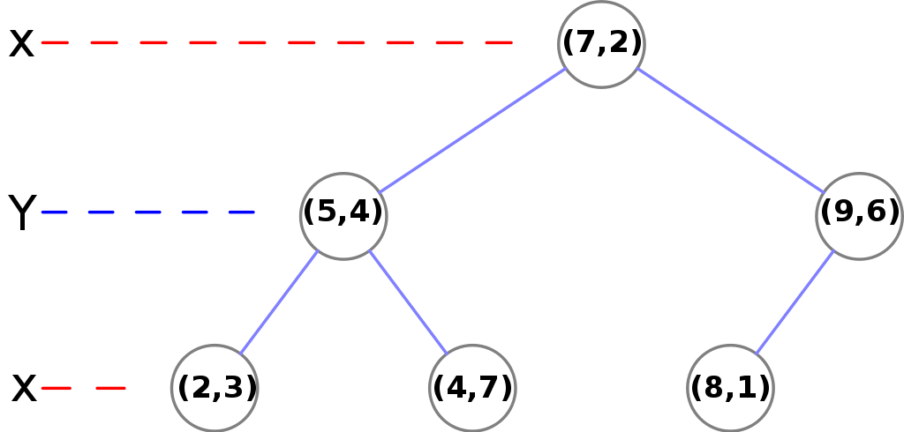
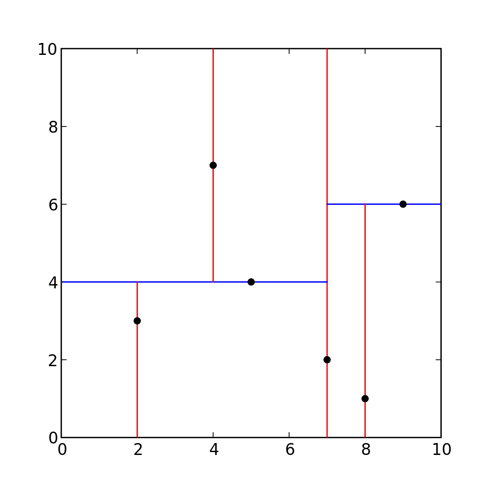

# KD 树

前面讲了knn，

kd树（ k-维树的缩写）是在k维欧几里德空间组织点，对k维空间中的实例点进行存储以便对其进行快速检索的树形数据结构，且kd树是一种二叉树。k-d树可以使用在多种应用场合，如多维键值搜索（例：范围搜寻及最邻近搜索）。k-d树是空间二分树（Binary space partitioning ）的一种特殊情况。表示对k维空间的一个划分。

k-d树是每个节点都为k维点的二叉树。所有非叶子节点可以视作用一个超平面把空间分割成两个半空间。节点左边的子树代表在超平面左边的点，节点右边的子树代表在超平面右边的点。选择超平面的方法如下：每个节点都与k维中垂直于超平面的那一维有关。因此，如果选择按照x轴划分，所有x值小于指定值的节点都会出现在左子树，所有x值大于指定值的节点都会出现在右子树。这样，超平面可以用该x值来确定，其法线为x轴的单位向量。

## 构建

### 原理

1. 循环依序取数据点的各维度来作为切分维度，
2. 取数据点在该维度的中值作为切分超平面，
3. 将中值左侧的数据点挂在其左子树，将中值右侧的数据点挂在其右子树，
4. 递归处理其子树，直至所有数据点挂载完毕。

### 优化点

- 选择切分维度：根据数据点在各维度上的分布情况，方差越大，分布越分散，从方差大的维度开始切分，有较好的切分效果和平衡性。
- 确定中值点：预先对原始数据点在所有维度进行一次排序，存储下来，然后在后续的中值选择中，无须每次都对其子集进行排序，提升了性能。也可以从原始数据点中随机选择固定数目的点，然后对其进行排序，每次从这些样本点中取中值，来作为分割超平面。该方式在实践中被证明可以取得很好性能及很好的平衡性。

### 构建过程

采用常规的构建方式，以二维平面点(x,y)的集合(2,3)，(5,4)，(9,6)，(4,7)，(8,1)，(7,2) 为例结合下图来说明k-d tree的构建过程：

1. 构建根节点时，此时的切分维度为x，如上点集合在x维从小到大排序为(2,3)，(4,7)，(5,4)，(7,2)，(8,1)，(9,6)；其中值为(7,2)。（注：2,4,5,7,8,9在数学中的中值为(5 + 7)/2=6，但因该算法的中值需在点集合之内，所以本文中值计算用的是len(points)//2=3, points\[3\]=(7,2)）
2. (2,3)，(4,7)，(5,4)挂在(7,2)节点的左子树，(8,1)，(9,6)挂在(7,2)节点的右子树。
3. 构建(7,2)节点的左子树时，点集合(2,3)，(4,7)，(5,4)此时的切分维度为y，中值为(5,4)作为分割平面，(2,3)挂在其左子树，(4,7)挂在其右子树。
4. 构建(7,2)节点的右子树时，点集合(8,1)，(9,6)此时的切分维度也为y，中值为(9,6)作为分割平面，(8,1)挂在其左子树。至此k-d tree构建完成。

上述的构建过程结合下图可以看出，构建一个k-d tree即是将一个二维平面逐步划分的过程。

需要注意的是，对于每次切分，都是循环顺序选择维度的，二维是：x->y->x…；三维则是：x->y->z->x…。

下面从三维空间来看一下k-d tree的构建及空间划分过程。首先，边框为红色的竖直平面将整个空间划分为两部分，此两部分又分别被边框为绿色的水平平面划分为上下两部分。最后此4个子空间又分别被边框为蓝色的竖直平面分割为两部分，变为8个子空间，此8个子空间即为叶子节点。

kd树的检索是KNN算法至关重要的一步，给定点p，查询数据集中与其距离最近点的过程即为最近邻搜索。

如在构建好的k-d tree上搜索(3,5)的最近邻时，对二维空间的最近邻搜索过程作分析。首先从根节点(7,2)出发，将当前最近邻设为(7,2)，对该k-d tree作深度优先遍历。以(3,5)为圆心，其到(7,2)的距离为半径画圆（多维空间为超球面），可以看出(8,1)右侧的区域与该圆不相交，所以(8,1)的右子树全部忽略。接着走到(7,2)左子树根节点(5,4)，与原最近邻对比距离后，更新当前最近邻为(5,4)。以(3,5)为圆心，其到(5,4)的距离为半径画圆，发现(7,2)右侧的区域与该圆不相交，忽略该侧所有节点，这样(7,2)的整个右子树被标记为已忽略。遍历完(5,4)的左右叶子节点，发现与当前最优距离相等，不更新最近邻。所以(3,5)的最近邻为(5,4)。

