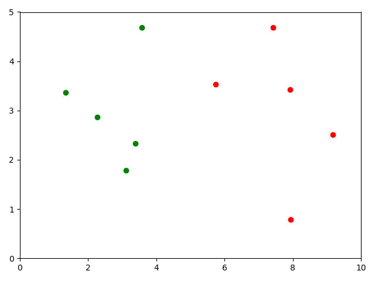
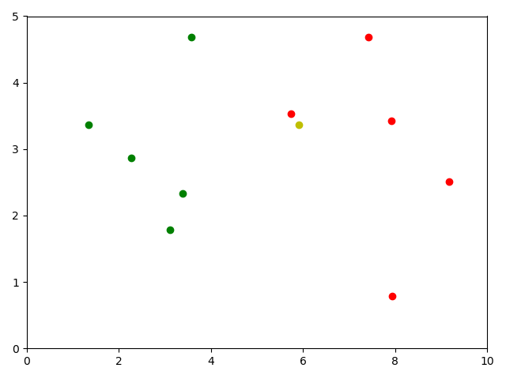

# K-NearestNeighbor 分类算法

## 概述

在模式识别领域中，K-近邻法（k Nearest Neighbor）是一种用于分类和回归的非参数统计方法。在这两种情况下，输入包含特征空间（Feature Space）中的k个最接近的训练样本。

- 在k-NN分类中，输出是一个分类族群。一个对象的分类是由其邻居的“多数表决”确定的，k个最近邻居（k为正整数，通常较小）中最常见的分类决定了赋予该对象的类别。若k = 1，则该对象的类别直接由最近的一个节点赋予。
- 在k-NN回归中，输出是该对象的属性值。该值是其k个最近邻居的值的平均值。

最近邻居法采用向量空间模型来分类，概念为相同类别的案例，彼此的相似度高，而可以借由计算与已知类别案例之相似度，来评估未知类别案例可能的分类。

K-NN是一种基于实例的学习，或者是局部近似和将所有计算推迟到分类之后的惰性学习。k-近邻算法是所有的机器学习算法中最简单的之一。

无论是分类还是回归，衡量邻居的权重都非常有用，使较近邻居的权重比较远邻居的权重大。例如，一种常见的加权方案是给每个邻居权重赋值为1/d，其中d是到邻居的距离。

邻居都取自一组已经正确分类（在回归的情况下，指属性值正确）的对象。虽然没要求明确的训练步骤，但这也可以当作是此算法的一个训练样本集。

k-近邻算法的缺点是对数据的局部结构非常敏感。

## 算法

K近邻算法的核心思想是，给定一个训练数据集，对新的输入实例，在训练数据集中找到与该实例最邻近的K个实例，这K个实例的多数属于某个类，就把该输入实例分类到这个类中。

训练样本是多维特征空间向量，其中每个训练样本带有一个类别标签。算法的训练阶段只包含存储的特征向量和训练样本的标签。

### 参数选择

在分类阶段，k是一个用户定义的常数。一个没有类别标签的向量（查询或测试点）将被归类为最接近该点的k个样本点中最频繁使用的一类。

如何选取一个最佳的K值取决于数据。

一般情况下，在分类时较大的K值能够减小噪声的影响，但会使类别之间的界限变得模糊。一个较小的K值会容易产生过拟合的现象，很容易将一些噪声学习到模型中，而忽略了数据真实的分布。一个较好的K值能通过各种启发式技术来获取。

在二元（两类）分类问题中，K值尽量要取奇数，以保证最后的计算结果会产生一个较多的类别，如果取偶数则可能会产生相等的情况，不利于预测。

噪声和非相关性特征的存在，或特征尺度与它们的重要性不一致会使K近邻算法的准确性严重降低。对于选取和缩放特征来改善分类已经作了很多研究。一个普遍的做法是利用进化算法优化功能扩展，还有一种较普遍的方法是利用训练样本的互信息进行选择特征。

常用的取K值方法是从k=1开始，使用检验集估计分类器的误差率，重复该过程，每次K增值1，允许增加一个近邻。选取产生误差最小率的K。一般K的取值不超过20，上限是n的开方，随着数据集的增大，K值也要增大。

### 距离的度量

在之前的A star 中介绍过几个距离的计算方式，这里最常见使用欧式距离，

$$
设特征空间X是n维实数向量空间R^n，x_i,x_j \in X,
$$

$$
x_i = (x_i^{(1)},x_i^{(2)},...,x_i^{(n)})^\tau，x_j = (x_j^{(1)},x_j^{(2)},...,x_j^{(n)})^\tau， 
$$

$$
x_i,x_j的欧式距离定义为：
$$

$$
L_2(x_i,x_j) = \sqrt{\sum_{l=1}^{n}|x_i^{(l)} + x_j^{(l)}|^2}
$$

一般情况下，将欧氏距离作为距离度量，但是这是只适用于连续变量。在文本分类这种离散变量情况下，另一个度量——重叠度量（或海明距离）可以用来作为度量。例如对于基因表达微阵列数据，k-NN也与Pearson和Spearman相关系数结合起来使用。通常情况下，如果运用一些特殊的算法来计算度量的话，k近邻分类精度可显著提高，如运用大间隔最近邻居或者邻里成分分析法。

### 特征值分类参数

#### 加权最近邻分类器

“多数表决”分类会在类别分布偏斜时出现缺陷。也就是说，出现频率较多的样本将会主导测试点的预测结果，因为他们比较大可能出现在测试点的K邻域而测试点的属性又是通过k邻域内的样本计算出来的。解决这个缺点的方法之一是在进行分类时将样本到k个近邻点的距离考虑进去。k近邻点中每一个的分类（对于回归问题来说，是数值）都乘以与测试点之间距离的成反比的权重。另一种克服偏斜的方式是通过数据表示形式的抽象。例如，在自组织映射（SOM）中，每个节点是相似的点的一个集群的代表（中心），而与它们在原始训练数据的密度无关。K-NN可以应用到SOM中。

k-最近邻分类器可以被视为 为k最近邻分配权重 1/k ，为其他所有邻居分配权重 0，这也可以推广高加权最近邻分类器。也就是说，第i近的邻居被赋予权重$\omega_{ni}$，其中，

$$
\sum_{i=1}^{n}\omega_{ni}
$$

#### 特征值归一化

当有多个维度作为特征值的选取时，需要进行特征值的归一化，以减少特征值本身值对计算结果的偏差量，防止计算结果偏向于特征量大的维度结果，从而导致预测错误。

这时候可以采用加权的特征值，对特征值进行标准化处理。

一般来说，假设进行kNN分类使用的样本特征是

$$
{(x_{i1},x_{i2},...,x_{in})_{i=1}^m}
$$

取每一轴上的最大值减最小值

$$
M_j = \max_{i=1,...,m}x_{ij} - \min_{i=1,...,m}x_{ij}
$$

并且在计算距离时进将每一个坐标轴除以相应的Mj以进行归一化，即：

$$
d((y_i,...,y_n),(z_1,...,z_n)) = \sqrt{\sum_{j=1}^n(\frac{y_j}{M_j} - \frac{z_j}{M_j})^2}
$$

详情见 [数据归一化](./normalization.md)

## 样例代码

### 实现算法简易过程

#### 1.准备数据：

```python
import numpy as np
import matplotlib.pyplot as plt

# raw_data_x是特征，
# raw_data_y是标签，
# 0为良性，1为恶性
raw_data_x = [
    [3.393533211, 2.331273381],
    [3.110073483, 1.781539638],
    [1.343853454, 3.368312451],
    [3.582294121, 4.679917921],
    [2.280362211, 2.866990212],
    [7.423436752, 4.685324231],
    [5.745231231, 3.532131321],
    [9.172112222, 2.511113104],
    [7.927841231, 3.421455345],
    [7.939831414, 0.791631213]
]
raw_data_y = [0, 0, 0, 0, 0, 1, 1, 1, 1, 1]  # 设置训练组
X_train = np.array(raw_data_X)
y_train = np.array(raw_data_y)
# 将数据可视化
plt.scatter(X_train[y_train == 0, 0], X_train[y_train == 0, 1], color='g', label='X')
plt.scatter(X_train[y_train == 1, 0], X_train[y_train == 1, 1], color='r', label='Y')
plt.axis([0, 10, 0, 5])
plt.show()
```



横纵坐标是两个特征维度，构成了二维平面特征中的一个点，红绿颜色是分类的标签

#### 2.计算距离

给出一个样本点 x ： `[5.90933607318, 3.365731514]`

给黄色x分类是红类还是绿类



此处使用欧氏距离计算距离。

$$
\sqrt{\sum_{i=1}^n (x_i - y_i)^2}
$$

```python
from math import sqrt

# 用来记录x到样本数据集中每个点的距离
x = [8.90933607318, 3.365731514]
# 将数据可视化
plt.scatter(X_train[y_train == 0, 0], X_train[y_train == 0, 1], color='g', label='X')
plt.scatter(X_train[y_train == 1, 0], X_train[y_train == 1, 1], color='r', label='Y')
plt.scatter(x[0], x[1], color='y', label='P')
plt.axis([0, 10, 0, 5])
plt.show()

distances = []
for x_train in X_train:
    d = sqrt(np.sum((x_train - x) ** 2))
    distances.append(
        d)
# 使用列表生成器，一行就能搞定，对于X_train中的每一个元素x_train都进行前面的运算，把结果生成一个列表
distances = [sqrt(np.sum((x_train - x) ** 2)) for x_train in X_train]

print("distances：")
print(distances)
# 输出：[2.720177874750644, 3.2164475666122163, 4.56548334870148, 2.6724913768896017, 3.6630853359847193, 2.0084386483939767, 0.23370771274512972, 3.372844619015172, 2.01927418085986, 3.2785520719823893]   为x与各样本点的距离
```

#### 3.根据k进行归类

```python

k = 5
topK_y = [y_train[i] for i in nearest[:k]]
# 输出：
# top5：
# [1, 1, 1, 0, 0]
# 设置k的值为5,取前5的分类
print(f"top{k}：")
print(topK_y)

from collections import Counter

votes = Counter(topK_y)
print("votes：")
print(votes)
# 输出：Counter({1: 3, 0: 2})   一个字典，原数组中值为0的个数为2，值为1的个数有为3

# Counter.most_common(n) 找出票数最多的n个元素，返回的是一个列表，列表中的每个元素是一个元组，元组中第一个元素是对应的元素是谁，第二个元素是频次
predict_y = votes.most_common(1)[0][0]
# votes.most_common(1) 是 [(1, 3)]
print("predict_y：")
print(predict_y)
# 输出：1 归类结果为1（红色）
```

### 完整工程代码

下面是一个 sklearn 风格的 简易kNN算法

```python
import numpy as np
from math import sqrt
from collections import Counter


class kNNClassifier:

    def __init__(self, k):
        """初始化分类器"""
        assert k >= 1, "k must be valid"
        self.k = k
        self._X_train = None
        self._y_train = None

    def fit(self, X_train, y_train):
        """根据训练数据集X_train和y_train训练kNN分类器"""
        assert X_train.shape[0] == y_train.shape[0], \
            "the size of X_train must be equal to the size of y_train"
        assert self.k <= X_train.shape[0], \
            "the size of X_train must be at least k"
        self._X_train = X_train
        self._y_train = y_train
        return self

    def predict(self, X_predict):
        """给定待预测数据集X_predict，返回表示X_predict结果的向量"""
        assert self._X_train is not None and self._y_train is not None, \
            "must fit before predict!"
        assert X_predict.shape[1] == self._X_train.shape[1], \
            "the feature number of X_predict must be equal to X_train"
        y_predict = [self._predict(x) for x in X_predict]
        # y_predict = [self._predict(x) for x in self._X_train]
        return np.array(y_predict)

    def _predict(self, x):
        """求待预测数据集X_predict与_X_train的预测值"""
        distances = [sqrt(np.sum((x_train - x) ** 2)) for x_train in self._X_train]
        nearest = np.argsort(distances)
        topK_y = [self._y_train[i] for i in nearest[:self.k]]
        votes = Counter(topK_y)
        return votes.most_common(1)[0][0]

    def __repr__(self):
        return "kNN(k=%d)" % self.k
```

调用时，

```python
# 设置初始k值
knnclf = kNNClassifier(k=5)
# 设置kNN分类器预置分类参数
knn_clf.fit(X_train, y_train)
# 放入样本点给分类器进行分类
X_predict = x.reshape(1,-1)
y_predict = knn_clf.predict(X_predict)
```

### 生成训练数据

建立了一个模型后，能否直接拿到生产环境使用？如何对模型的效果，准确度做个描述？

实际上，模型从建立好到真实使用，还差很多。

可以将原始数据中的一部分作为训练数据，另一部分作为测试数据。使用训练数据训练模型，再用测试数据看好坏。即通过测试数据判断模型好坏，然后再不断对模型进行修改。

- iris_train_test

iris数据集是UCI数据库中常用数据集

```python
from sklearn import datasets


iris = datasets.load_iris()

X = iris.data
y = iris.target
```

- tarin_test_split

分割训练集和测试集合，可以简单的测试模型的性能。

```python
import numpy as np


def train_test_split(X, y, test_ratio=0.2, seed=None):
    """将矩阵X和标签y按照test_ration分割成X_train, X_test, y_train, y_test"""
    assert X.shape[0] == y.shape[0], \
        "the size of X must be equal to the size of y"
    assert 0.0 <= test_ratio <= 1.0, \
        "test_train must be valid"
    # 是否使用随机种子，使随机结果相同，方便debug
    if seed:
        # permutation(n) 可直接生成一个随机排列的数组，含有n个元素
        np.random.seed(seed)
    shuffle_index = np.random.permutation(len(X))

    test_size = int(len(X) * test_ratio)
    test_index = shuffle_index[:test_size]
    train_index = shuffle_index[test_size:]
    X_train = X[train_index]
    X_test = X[test_index]
    y_train = y[train_index]
    y_test = y[test_index]
    return X_train, X_test, y_train, y_test
```

- 用之前完成的kNN测试一下：

```python
kNNcls = kNNClassifier(k=3)
kNNcls.fit(X_train, y_train)

y_predict = kNNcls.predict(X_test)
print(y_predict)
# [0 1 2 2 0 0 1 1 1 2 1 0 1 0 1 0 2 2 2 0 2 0 2 1 1 2 1 1 0 0]
print(y_test)
# [0 1 2 2 0 0 1 1 1 2 1 0 2 0 1 0 2 2 2 0 2 0 2 1 1 2 1 1 0 0]
# 两个向量的比较，返回一个布尔型向量，对这个布尔向量（faluse=1，true=0）sum，
print(sum(y_predict == y_test))
# 29
print(sum(y_predict == y_test) / len(y_test))
# 0.9666666666666667
```

### 超参数

超参数，就是在机器学习算法模型执行之前需要指定的参数。（调参调的就是超参数）如kNN算法中的k。

与之相对的概念是模型参数，即算法过程中学习的属于这个模型的参数（kNN中没有模型参数，回归算法有很多模型参数）

如何选择最佳的超参数，这是机器学习中的一个永恒的问题。在实际业务场景中，调参的难度大很多，一般我们会业务领域知识、经验数值、实验搜索等方面获得最佳参数。

#### 寻找好的k

针对于上一小节的手写数字识别分类代码，尝试寻找最好的k值。逻辑非常简单，就是设定一个初始化的分数，然后循环更新k值，找到最好的score

```python
# 指定最佳值的分数，初始化为0.0；设置最佳值k，初始值为-1
best_score = 0.0
best_k = -1
for k in range(1, 11):
    # 暂且设定到1～11的范围内
    knn_clf = KNeighborsClassifier(n_neighbors=k)
    knn_clf.fit(X_train, y_train)
    score = knn_clf.score(X_test, y_test)
    if score > best_score:
        best_k = k
        best_score = score
print("best_k = ", best_k)
print("best_score = ", best_score)

# 输出：
# best_k = 4
# best_score = 0.9666666666666667
```

这里可以看到这次生成的测试数据中，最好的k值是4

需要注意的是，如果我们的到的值正好在边界上，我们需要稍微扩展一下取值范围。

#### 另一个超参数：权重

距离样本数据点最近的节点，对其影响最大，那么我们使用距离的倒数作为权重。假设距离样本点最近的三个节点分别是红色、蓝色、蓝色，距离分别是1、4、3。那么普通的k近邻算法：蓝色获胜。考虑权重（距离的倒数）：红色：1，蓝色：1/3 + 1/4 = 7/12，红色胜。

在 sklearn.neighbors 的构造函数 KNeighborsClassifier 中有一个参数：weights，默认是uniform即不考虑距离，也可以写distance来考虑距离权重(默认是欧拉距离，如果要是曼哈顿距离，则可以写参数p（明可夫斯基距离的参数），这个也是超参数)

因为有两个超参数，因此使用双重循环，去查找最合适的两个参数，并打印。

```python
from sklearn.neighbors import KNeighborsClassifier
# 两种方式进行比较
best_method = ""
best_score = 0.0
best_k = -1
for method in ["uniform","distance"]:
    for k in range(1, 11):
        knn_clf = KNeighborsClassifier(n_neighbors=k, weights=method, p=2)
        knn_clf.fit(X_train, y_train)
        score = knn_clf.score(X_test, y_test)
        if score > best_score:
            best_k = k
            best_score = score
            best_method = method
print("best_method = ", method)
print("best_k = ", best_k)
print("best_score = ", best_score)

# 输出：
# best_method =  distance
# best_k =  5
# best_score =  0.9666666666666667
```

## 总结

K近邻算法是最简单有效的分类算法，简单且容易实现。但是当训练数据集很大时，需要占用大量的存储空间，而且需要计算的量比较大，时间复杂度为O(n)，当数据量较大时，可以将数据以树的形式呈现，能提高速度。

适用于类内间距小，类间间距大的数据集，并且对于类间边界分布不规则的数据效果要好于线性的分类器。

### 需要注意的问题

1. 大数吞小数  
在进行距离计算的时候，有时候某个特征的数值会特别的大，那么计算欧式距离的时候，其他的特征的值的影响就会非常的小被大数给覆盖掉了。所以我们很有必要进行特征的标准化或者叫做特征的归一化。
2. 如何处理大数据量  
一旦特征或者样本的数目特别的多，KNN的时间复杂度将会非常的高。解决方法是利用KD-Tree这种方式解决时间复杂度的问题，利用KD树可以将时间复杂度降到O(logD*N*N)。D是维度数，N是样本数。但是这样维度很多的话那么时间复杂度还是非常的高，所以可以利用类似哈希算法解决高维空间问题，只不过该算法得到的解是近似解，不是完全解。会损失精确率。
3. 怎么处理样本的重要性  
利用权重值。我们在计算距离的时候可以针对不同的邻居使用不同的权重值，比如距离越近的邻居我们使用的权重值偏大，这个可以指定算法的weights参数来设置。

## k-NN 与 K-means

相同点：

都有给定一个点，数据集中查找离其最近的点，对其进行观察的过程。

不同点：

- k-NN是分类(回归)算法，而K-means是聚类算法
- K-means是无监督学习，k-NN是监督学习
- k-NN尝试基于K个周围邻居的标记来对未标记的观察进行分类，也被成为懒惰学习法，因为涉及最小的模型训练。而K-means把一个数据集分割成簇，使得形成的簇是同构的，每个簇里的点互相靠近，试图维持这些簇之间有足够的可分离性。
- k-NN是带Label的数据集，K-means是无Label的数据集
- k-NN无明显的训练过程，基于Memory-based learning。而K-means有明显的训练过程
- k-NN的k是对于分类的数据找最近的k个数据点，将其划分类别。而K-means则是把数据集反划分为K个簇。

## k-NN的优缺点

### 优点

1. 理论成熟，思想简单，既可以用来做分类也可以用来做回归
2. 天然解决多分类问题，也可用于回归问题
3. 和朴素贝叶斯之类的算法比，对数据没有假设，准确度高，对异常点不敏感
4. 由于KNN方法主要靠周围有限的邻近的样本，而不是靠判别类域的方法来确定所属类别的，因此对于类域的交叉或重叠较多的待分样本集来说，KNN方法较其他方法更为适合

### 缺点

1. 计算量大，效率低。即使优化算法，效率也不高。
2. 高度数据相关，样本不平衡的时候，对稀有类别的预测准确率低
3. 相比决策树模型，KNN模型可解释性不强
4. 维度灾难：随着维度的增加，“看似相近”的两个点之间的距离越来越大，而knn非常依赖距离
