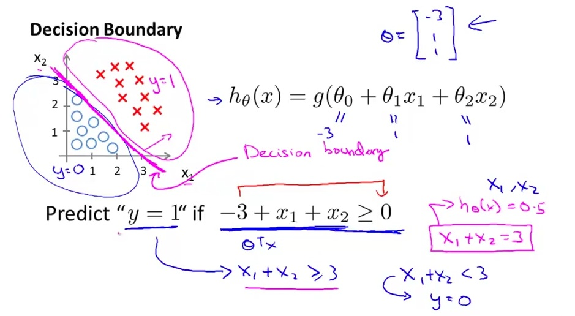
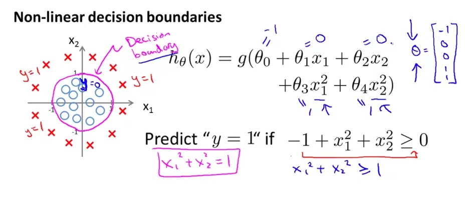
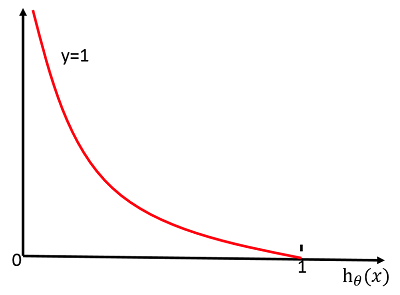
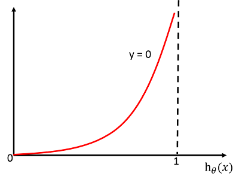
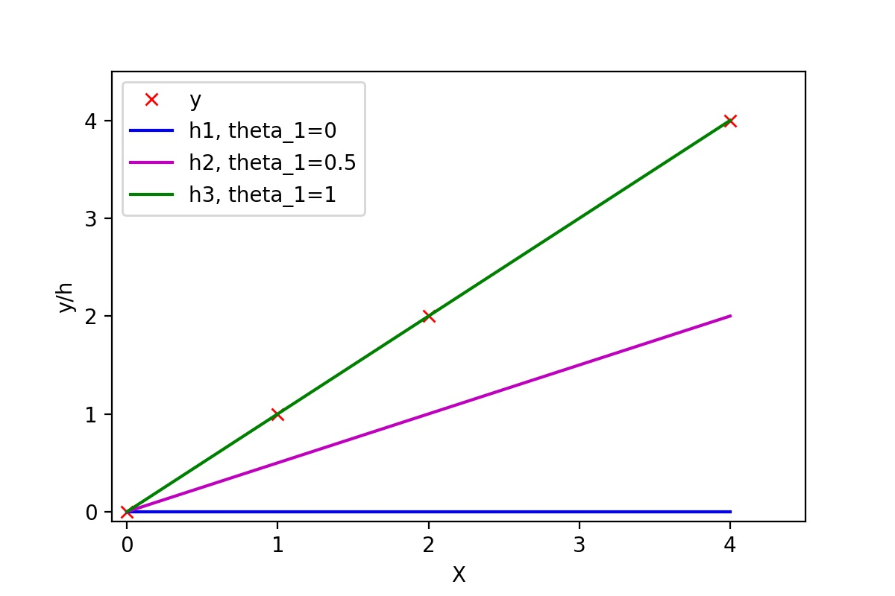
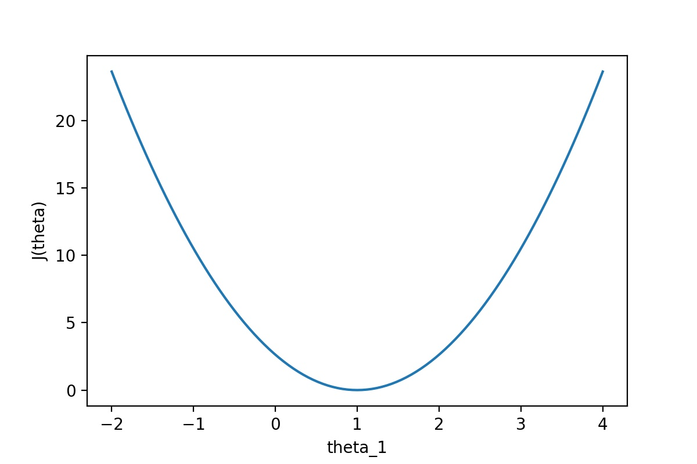

# 逻辑回归

逻辑回归（Logistic Regression, L.R.）是一种用于解决二分类（0 or 1）问题的机器学习方法，用于估计某种事物的可能性。比如某用户购买某商品的可能性，某病人患有某种疾病的可能性，以及某广告被用户点击的可能性等。 注意，这里用的是“可能性”，而非数学上的“概率”，logisitc回归的结果并非数学定义中的概率值，不可以直接当做概率值来用。该结果往往用于和其他特征值加权求和，而非直接相乘。

逻辑回归 使用率非常高，荣获各领域中的“出场率最高算法”这一殊荣，大到国家各项经济政策制定，小到计算广告CTR，都能看到 L.R. 的身影。

## 线性回归能解决分类吗

线性回归是不能解决分类问题的，因为使用线性回归模型时，我们实际上做了几个假设：

1. 因变量和自变量之间呈线性相关。
2. 自变量与干扰项相互独立。
3. 没被线性模型捕捉到的随机因素服从正态分布。

逻辑回归（Logistic Regression）与线性回归（Linear Regression）都是一种广义线性模型（generalized linear model）。逻辑回归假设因变量 y 服从伯努利分布，而线性回归假设因变量 y 服从高斯分布。 因此与线性回归有很多相同之处，去除Sigmoid映射函数的话，逻辑回归算法就是一个线性回归。可以说，逻辑回归是以线性回归为理论支持的，但是逻辑回归通过Sigmoid函数引入了非线性因素，因此可以轻松处理0/1分类问题。

## 假设函数（Hypothesis function）

首先我们要先介绍一下Sigmoid函数，也称为逻辑函数（Logistic function）：

$$
g(z) = \frac{1}{1 + e^{-z}}
$$

其函数曲线如下：


从上图可以看到sigmoid函数是一个s形的曲线，它的取值在[0, 1]之间，在远离0的地方函数的值会很快接近0或者1。它的这个特性对于解决二分类问题十分重要

逻辑回归的假设函数形式如下：

$$
h_\theta(x) = g(\theta^T x), \; g(z) = \frac{1}{1 + e^{-z}}
$$

所以：

$$
h_\theta(x) = \frac{1}{1 + e^{-\theta^T x}}
$$

其中 x 是我们的输入， θ 为我们要求取的参数。

一个机器学习的模型，实际上是把决策函数限定在某一组条件下，这组限定条件就决定了模型的假设空间。当然，我们还希望这组限定条件简单而合理。而逻辑回归模型所做的假设是：

$$
P(y=1|x; \theta) = g(\theta^T x) = \frac{1}{1 + e^{-\theta^T x}}
$$

这个函数的意思就是在给定 x 和 θ 的条件下 `y=1` 的概率。

这里 g(h) 就是我们上面提到的sigmoid函数，与之相对应的决策函数为：

$$
y^* = 1, if\,P(y = 1 | x) \gt 0.5
$$

选择0.5作为阈值是一个一般的做法，实际应用时特定的情况可以选择不同阈值，如果对正例的判别准确性要求高，可以选择阈值大一些，对正例的召回要求高，则可以选择阈值小一些。

## 决策边界（Decision Boundary）

决策边界，也称为决策面，是用于在N维空间，将不同类别样本分开的平面或曲面。

> 注意：决策边界是假设函数的属性，由参数决定，而不是由数据集的特征决定。

这里我们引用Andrew Ng 课程上的两张图来解释这个问题：

### 线性决策边界



这里决策边界为： `-3 + x1 + x2 = 0`

### 非线性决策边界



这里决策边界为： `-1 + x1^2 + x2^2 = 0`

这两张图清晰的解释了什么是决策边界，决策边界其实就是一个方程，在逻辑回归中，决策边界由 `θ^T x =0` 定义。

$$
P(y = 1 | x; \theta) = g(\theta^T x) = \frac{1}{1 + e^{-\theta^T x}}
$$

这里我们要注意理解一下假设函数和决策边界函数的区别与联系。决策边界是假设函数的属性，由假设函数的参数（ θ ）决定。

在逻辑回归中，假设函数 `h = g(z)` 用于计算样本属于某类别的可能性；

决策函数
$$
y^* = 1, if\,P(y = 1 | x) \gt 0.5
$$
用于计算（给出）样本的类别；

决策边界 `θ^T x =0` 是一个方程，用于标识出分类函数（模型）的分类边界。

## 代价函数（Cost Function）

### 什么是代价函数？

假设有训练样本 `(x, y)` ，模型为 `h` , 参数为 `θ` 。 `h(θ) = θ^T x` （ `θ^T` 表示 `θ` 的转置）。

**<1>** 概况来讲，任何能够衡量模型预测出来的值 `h(θ)` 与真实值 `y` 之间的差异的函数都可以叫做代价函数 `C(θ)` ，如果有多个样本，则可以将所有代价函数的取值求均值，记做 `J(θ)` 。因此很容易就可以得出以下关于代价函数的性质：

- 选择代价函数时，最好挑选对参数 `θ` 可微的函数（全微分存在，偏导数一定存在）
- 对于每种算法来说，代价函数不是唯一的；
- 代价函数是参数 `θ` 的函数；
- 总的代价函数`J(θ)`可以用来评价模型的好坏，代价函数越小说明模型和参数越符合训练样本`(x, y)`；
- `J(θ)`是一个标量；

**<2>** 当我们确定了模型 `h` ，后面做的所有事情就是训练模型的参数 `θ` 。那么什么时候模型的训练才能结束呢？这时候也涉及到代价函数，由于代价函数是用来衡量模型好坏的，我们的目标当然是得到最好的模型（也就是最符合训练样本的模型）。因此训练参数的过程就是不断改变 `θ` ，从而得到更小的 `J(θ)` 的过程。理想情况下，当我们取到代价函数J的最小值时，就得到了最优的参数 `θ` ，记为： `min J(θ)`

例如，`J(θ) = 0`，表示我们的模型完美的拟合了观察的数据，没有任何误差。

**<3>** 在优化参数θ的过程中，最常用的方法是梯度下降，这里的梯度就是代价函数 `J(θ)` 对 `θ1, θ2, ..., θn`的偏导数。由于需要求偏导，我们可以得到另一个关于代价函数的性质：

- 选择代价函数时，最好挑选对参数 `θ` 可微的函数（全微分存在，偏导数一定存在）

### 代价函数的常见形式

经过上面的描述，一个好的代价函数需要满足两个最基本的要求：能够评价模型的准确性，对参数 `θ` 可微。

**<1>** 在线性回归中，最常用的是均方误差(Mean squared error)，即

$$
J(\theta_0, \theta_1)
= \frac{1}{2m} \sum_{i=1}^m (\widehat{y}^{(i)} - y^{(i)})^2
= \frac{1}{2m} \sum_{i=1}^m (h_\theta (x^{(i)}) - y^{(i)})^2
$$

- `m`：训练样本的个数；
- `hθ(x)`：用参数 `θ` 和 `x` 预测出来的y值；
- `y` ：原训练样本中的 `y` 值，也就是标准答案;
- 上角标 `(i)` ：第 `i` 个样本。

**<2>** 在逻辑回归中，最常用的是代价函数是交叉熵(Cross Entropy)，交叉熵是一个常见的代价函数，在神经网络中也会用到。下面是《神经网络与深度学习》一书对交叉熵的解释：

交叉熵是对「出乎意料」（译者注：原文使用suprise）的度量。神经元的目标是去计算函数`x→y=y(x)`。但是我们让它取而代之计算函数`x→a=a(x)`。假设我们把a当作y等于1的概率，1−a是y等于0的概率。那么，交叉熵衡量的是我们在知道y的真实值时的平均「出乎意料」程度。当输出是我们期望的值，我们的「出乎意料」程度比较低；当输出不是我们期望的，我们的「出乎意料」程度就比较高。

在1948年，克劳德·艾尔伍德·香农将热力学的熵，引入到信息论，因此它又被称为香农熵(Shannon Entropy)，它是香农信息量(Shannon Information Content, SIC)的期望。香农信息量用来度量不确定性的大小：一个事件的香农信息量等于0，表示该事件的发生不会给我们提供任何新的信息，例如确定性的事件，发生的概率是1，发生了也不会引起任何惊讶；当不可能事件发生时，香农信息量为无穷大，这表示给我们提供了无穷多的新信息，并且使我们无限的惊讶。更多解释可以看[这里](https://zh.wikipedia.org/wiki/交叉熵)。

$$
J(\theta)
= -\frac{1}{m} \left[
    \sum_{i=1}^m (y^{(i)} log h_\theta (x^{(i)}) + (1 - y^{(i)}) log(1 - h_\theta (x^{(i)})) )
\right]
$$

## 代价函数（Cost Function）

### 代价函数的常见形式（cont）

但是我们会疑问，为什么这么定义代价函数呢？下面我会简单的解释一下：

对于单个的样本来讲， `J(θ)` 所对应的 `C(θ)` 为：

$$
C(\theta) = y log h_\theta (x) + (1 -y) log (1 - h_\theta (x))
$$

上面的方程等价于：

$$
C(\theta) = \left\{
    \begin{aligned}
        &-log(h_\theta (x)), &y=1 \\
        &-log(1 - h_\theta (x)), &y=0
    \end{aligned}
\right. , \;\;\;\;
where : h_\theta (x) = \frac{1}{1 + e^{-\theta^T x}}
$$

**当 y=1 时**：

$$
C(\theta) = -log(h_\theta(x))
$$

其函数图像为：



当预测值 `hθ(x) = 1`时，可以看出代价 

$$
h_\theta(x)=\frac{1}{1+e^{-\theta^Tx}}
$$

函数`C(θ)`的值为0, 这正式我们所希望的。

如果预测值 `hθ(x) = 1`时，即

$$
P(y=1 | x; \theta) = 0
$$

意思是预测 `y=1` 的概率为0，

但是事实上 `y=1` ， 因此代价函数 `C(θ) = ∞` ，相当于给学习算法一个惩罚。

**当 y=0 时**：



### 代价函数与参数

代价函数衡量的是模型预测值h(θ) 与标准答案y之间的差异，所以总的代价函数J是h(θ)和y的函数，即，`J=f(h(θ), y)`。又因为y都是训练样本中给定的，h(θ)有θ决定，所以，最终还是模型参数θ的改变导致了J的改变。对于不同的θ，对应不同的预测值h(θ)，也就对应着不同的代价函数J的取值。变化过程为：

$$
\theta- \gt h(\theta), \;\; y- \gt J(\theta)
$$

为了更直观的看到参数对代价函数的影响，举个简单的例子：

有训练样本{(0, 0), (1, 1), (2, 2), (4, 4)}，即4对训练样本，每个样本中第1个是x的值，第2个是y的值。这几个点很明显都是y=x这条直线上的点。如下图：



```python
import matplotlib.pyplot as plt
import numpy as np
X = np.array([[0, 1, 2, 4]]).T  # 都转换成列向量
y = np.array([[0, 1, 2, 4]]).T
theta1 = np.array([[0, 0]]).T  # 三个不同的theta_1值
theta2 = np.array([[0, 0.5]]).T
theta3 = np.array([[0, 1]]).T
X_size = X.shape
X_0 = np.ones((X_size[0],1))  # 添加x_0
X_with_x0 = np.concatenate((X_0, X), axis=1)
h1 = np.dot(X_with_x0, theta1)
h2 = np.dot(X_with_x0, theta2)
h3 = np.dot(X_with_x0, theta3)
plt.plot(X, y, 'rx', label='y')
plt.plot(X, h1, 'b', label='h1, theta_1=0')
plt.plot(X, h2, 'm', label='h2, theta_1=0.5')
plt.plot(X, h3, 'g', label='h3, theta_1=1')
plt.xlabel('X')
plt.ylabel('y/h')
plt.axis([-0.1, 4.5, -0.1, 4.5])
plt.legend(loc='upper left')
plt.savefig('liner_gression_error.png', dpi=200)
```

常数项为0，所以可以取θ0=0，然后取不同的θ1，可以得到不同的拟合直线。当θ1=0时，拟合的直线是y=0，即蓝色线段，此时距离样本点最远，代价函数的值（误差）也最大；当θ1=1时，拟合的直线是y=x，即绿色线段，此时拟合的直线经过每一个样本点，代价函数的值为0。

通过下图可以查看随着θ1的变化，J(θ)的变化情况：



```python
# 计算代价函数的值
def calcu_cost(theta, X, y):
    m = X.shape[0]  # sample size
    X_0 = np.ones((m,1))
    X_with_x0 = np.concatenate((X_0, X), axis=1)
    h = np.dot(X_with_x0, theta)
    return(np.dot((h-y).T, (h-y))/(2*m))

X = np.array([[0, 1, 2, 4]]).T
y = np.array([[0, 1, 2, 4]]).T
theta_0 = np.zeros((101, 1))
theta_1 = np.array([np.linspace(-2, 4, 101)]).T
theta = np.concatenate((theta_0, theta_1), axis=1)  # 101组不同的参数
J_list = []
for i in range(101):
    current_theta = theta[i:i+1].T
    cost = calcu_cost(current_theta, X, y)
    J_list.append(cost[0,0])
plt.plot(theta_1, J_list)
plt.xlabel('theta_1')
plt.ylabel('J(theta)')
plt.savefig('cost_theta.png', dpi=200)
```

从图中可以很直观的看到θ对代价函数的影响，当`θ1=1`时，代价函数`J(θ)`取到最小值。因为线性回归模型的代价函数（均方误差）的性质非常好，因此也可以直接使用代数的方法，求`J(θ)`的一阶导数为0的点，就可以直接求出最优的θ值。

### 代价函数与梯度

梯度下降中的梯度指的是代价函数对各个参数的偏导数，偏导数的方向决定了在学习过程中参数下降的方向，学习率（通常用α表示）决定了每步变化的步长，有了导数和学习率就可以使用梯度下降算法（Gradient Descent Algorithm）更新参数了, 即求解使 `J(θ)` 最小的参数 `θ` :

$$
\theta_j
= \theta_j - \alpha(\frac{\partial}{\partial \theta_j})J(\theta)
= \theta_j - \alpha(\frac{1}{m})\sum_{i=1}^m (h_\theta (x^{(i)}) - y^{(i)}) x_j^{(i)}
$$

看来其和线性回归中的梯度下降函数形式一模一样，但其实是不一样的，因为在logistic回归中

$$
h_\theta (x) = \frac{1}{1 + e^{-\theta^T x}}
$$

关于从

$$
\theta_j = \theta_j - \alpha(\frac{\partial}{\partial \theta_j}) J(\theta)
$$

到

$$
\theta_j = \theta_j - \alpha(\frac{1}{m})\sum_{i=1}^m (h_\theta(x^{(i)}) - y^{(i)}) x_j^{(i)}
$$

推导如下：

$$
\begin{aligned}
    \frac{\partial}{\partial \theta_j}J(\theta)
    &= \frac{\partial}{\partial \theta_j} \left[
        -\frac{1}{m} \sum_{i=1}^m \left[
                y^{(i)} log(h_\theta(x^{(i)})) + (1 - y^{(i)})log(1 - h_\theta(x^{(i)})))
            \right]
        \right]\\
    &= -\frac{1}{m} \sum_{i=1}^m \left[
            y^{(i)} \frac{1}{h_\theta(x^{(i)})} \frac{\partial}{\partial \theta_j} h_\theta(x^{(i)}) + (1 - y^{(i)}) \frac{1}{1 - h_\theta(x^{(i)})} \frac{\partial}{\partial \theta_j} h_\theta(x^{(i)})
        \right]\\
    &= -\frac{1}{m} \sum_{i=1}^m \left[
            y^{(i)} \frac{1}{h_\theta(x^{(i)})} - (1 - y^{(i)}) \frac{1}{1 - h_\theta(x^{(i)})}
        \right]
        \frac{\partial}{\partial \theta_j} h_\theta(x^{(i)})\\
    &= -\frac{1}{m} \sum_{i=1}^m \left[
            y^{(i)} \frac{1}{h_\theta(x^{(i)})} - (1 - y^{(i)}) \frac{1}{1 - h_\theta(x^{(i)})}
        \right]
        \frac{\partial}{\partial \theta_j} g(\theta^Tx^{(i)})
\end{aligned}
$$

其中：

$$
\begin{aligned}
    \because \frac{\partial}{\partial \theta_j} g(\theta^T x^{(i)})
    &= \frac{\partial}{\partial \theta_j} \frac{1}{1 + e^{-\theta^T x^{(i)}}}\\
    &= \frac{e^{-\theta^T x^{(i)}}}{(1 + e^{\theta^T x^{(i)}})^2} \frac{\partial}{\partial \theta_j} \theta^T x^{(i)}\\
    &= g(\theta^T x^{i})(1 - g(\theta^T x^{(i)}))x_j^{(i)}\\
    \therefore \frac{\partial}{\partial \theta_j}J(\theta)
    &= -\frac{1}{m}\sum_{i=1}^m \left[
            y^{(i)}(1 - g(\theta^T x^{(i)})) - (1 - y^{(i)}) g(\theta^T x^{(i)})
        \right] x_j^{(i)}\\
    &= -\frac{1}{m}\sum_{i=1}^m (y^{(i)} - g(\theta^T x^{(i)})) x_j^{(i)}\\
    &= \frac{1}{m}\sum_{i=1}^m (h_\theta(x^{(i)}) - y^{(i)}) x_j^{(i)}
\end{aligned}
$$
