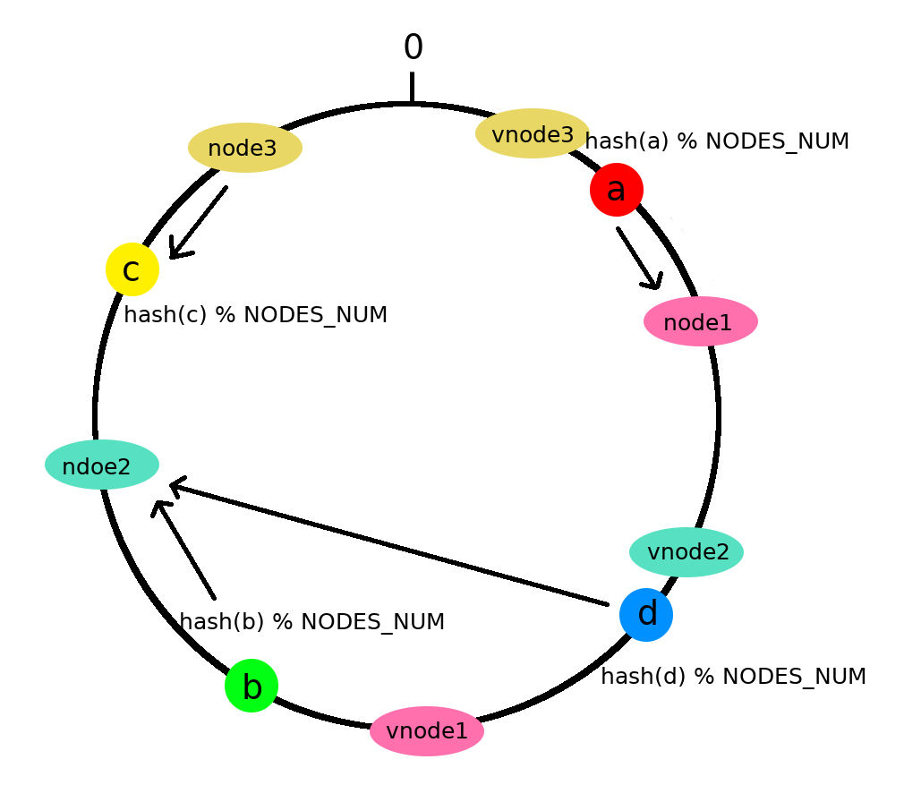

# 一致性哈希算法

## 引入

> **一致雜湊**是一種特殊的雜湊演算法。在使用一致雜湊演算法後，雜湊表槽位數（大小）的改變平均只需要對$K/n$個關鍵字重新對映，其中$K$是關鍵字的數量，$n$是槽位數量。然而在傳統的雜湊表中，添加或刪除一個槽位的幾乎需要對所有關鍵字進行重新對映。<br/>
>
> --------  維基百科，自由的百科全書

- **意义**

> 在使用n台快取伺服器時，一種常用的負載均衡方式是，對資源o的請求使用 $hash(o)=o\,mod\,n$ 來對映到某一台快取伺服器。當增加或減少一台快取伺服器時這種方式可能會改變所有資源對應的hash值，也就是所有的快取都失效了，這會使得快取伺服器大量集中地向原始內容伺服器更新快取。因此需要一致雜湊演算法來避免這樣的問題。 一致雜湊儘可能使同一個資源對映到同一台快取伺服器。這種方式要求增加一台快取伺服器時，新的伺服器儘量分擔儲存其他所有伺服器的快取資源。減少一台快取伺服器時，其他所有伺服器也可以儘量分擔儲存它的快取資源。 一致雜湊演算法的主要思想是將每個快取伺服器與一個或多個雜湊值域區間關聯起來，其中區間邊界通過計算快取伺服器對應的雜湊值來決定。（定義區間的雜湊函式不一定和計算快取伺服器雜湊值的函式相同，但是兩個函式的返回值的範圍需要匹配。）如果一個快取伺服器被移除，則它所對應的區間會被併入到鄰近的區間，其他的快取伺服器不需要任何改變。
>
> --------  維基百科，自由的百科全書

- 原理

> 一致雜湊將每個物件對映到圓環邊上的一個點，系統再將可用的節點機器對映到圓環的不同位置。尋找某個物件對應的機器時，需要用一致雜湊演算法計算得到物件對應圓環邊上位置，沿著圓環邊上尋找直到遇到某個節點機器，這台機器即為物件應該儲存的位置。 當刪除一台節點機器時，這台機器上儲存的所有物件都要移動到下一台機器。添加一台機器到圓環邊上某個點時，這個點的下一台機器需要將這個節點前對應的物件移動到新機器上。 更改物件在節點機器上的分布可以通過調整節點機器的位置來實現。
> 
> --------  維基百科，自由的百科全書

啊。。很懒哇，就先wiki上吧
嘻嘻

## 实现

### 一致性哈希算法的性质

考虑到分布式系统每个节点都有可能失效，并且新的节点很可能动态的增加进来，如何保证当系统的节点数目发生变化时仍然能够对外提供良好的服务，这是值得考虑的，尤其实在设计分布式缓存系统时，如果某台服务器失效，对于整个系统来说如果不采用合适的算法来保证一致性，那么缓存于系统中的所有数据都可能会失效（即由于系统节点数目变少，客户端在请求某一对象时需要重新计算其hash值（通常与系统中的节点数目有关），由于hash值已经改变，所以很可能找不到保存该对象的服务器节点），因此一致性hash就显得至关重要，良好的分布式cahce系统中的一致性hash算法应该满足以下几个方面：

- **平衡性(Balance)** 平衡性是指哈希的结果能够尽可能分布到所有的缓冲中去，这样可以使得所有的缓冲空间都得到利用。很多哈希算法都能够满足这一条件。
- **单调性(Monotonicity)** 单调性是指如果已经有一些内容通过哈希分派到了相应的缓冲中，又有新的缓冲区加入到系统中，那么哈希的结果应能够保证原有已分配的内容可以被映射到新的缓冲区中去，而不会被映射到旧的缓冲集合中的其他缓冲区。简单的哈算法往往不能满足单调性的要求，如最简单的线性哈希：x = (ax + b) mod (P)，在上式中，P表示全部缓冲的大小。不难看出，当缓冲大小发生变化时(从P1到P2)，原来所有的哈希结果均会发生变化，从而不满足单调性的要求。哈希结果的变化意味着当缓冲空间发生变化时，所有的映射关系需要在系统内全部更新。而在P2P系统内，缓冲的变化等价于Peer加入或退出系统，这一情况在P2P系统中会频繁发生，因此会带来极大计算和传输负荷。单调性就是要求哈希算法能够应对这种情况。
- **分散性(Spread)** 在分布式环境中，终端有可能看不到所有的缓冲，而是只能看到其中的一部分。当终端希望通过哈希过程将内容映射到缓冲上时，由于不同终端所见的缓冲范围有可能不同，从而导致哈希的结果不一致，最终的结果是相同的内容被不同的终端映射到不同的缓冲区中。这种情况显然是应该避免的，因为它导致相同内容被存储到不同缓冲中去，降低了系统存储的效率。分散性的定义就是上述情况发生的严重程度。好的哈希算法应能够尽量避免不一致的情况发生，也就是尽量降低分散性。
- **负载(Load)** 负载问题实际上是从另一个角度看待分散性问题。既然不同的终端可能将相同的内容映射到不同的缓冲区中，那么对于一个特定的缓冲区而言，也可能被不同的用户映射为不同的内容。与分散性一样，这种情况也是应当避免的，因此好的哈希算法应能够尽量降低缓冲的负荷。
- **平滑性(Smoothness)** 平滑性是指缓存服务器的数目平滑改变和缓存对象的平滑改变是一致的。


### 普通Hash算法：

普通Hash算法是对其Hash值取模，得以较均匀的散列分布在节点上


```c
for item in ITEMS:
    k = hash(item)
    n = h % NODES_NUM
    nodes[n] + item
```

此算法可以让数据均匀的散列在这些节点中，依靠Hash算法的均匀性（大部分Hash算法均可实现。

item都有一个HashKey，此算法不难看出，强依赖于node的数目；如果node的数目发生变化，item对应的node将会发生剧烈变化，大量数据需要迁移（99%的数据），重新计算并移动到新的node中。

### 一致性哈希算法

一致性哈希算法可以保证增加或删除node时，对于大多数的item可以分配到原来的node中，将数据迁移量降低。

如何解决这个问题呢，一致性哈希算法的解决方案是把节点也加进哈希中。


```c
for node in NODES:
    h = _hash(node)
    ring.append(h)
    ring.sort()
    hash2node[h] = node

for item in ITEMS:
    h = _hash(item)
    // 搜索ring上最近的hash
    n = ring.location_left(h) % NODES_NUM
    nodes[hash2node[ring[n]]] + item
```

此时，当插入一个新的node时，数据迁移量低于1%。

但是数据项在其中的分布则非常不均匀。

分布不均匀的原因是什么呢？
- 数据项本身的哈希值并未改变，仍是均匀分布。
- 判断数据项的哈希落在哪个节点的算法变了
- 节点在哈希后分布在环上不均匀，导致每个节点实际占据环上区间大小不一。


### 改进-虚节点

通过添加虚节点，使其节点的分布较为均匀。



```c
for node in NODES:
    for virtnode in VIRTNODES:
        h = _hash(node.virtnode)
        // 构造ring
        ring.append(h)
        # 记录hash所对应节点
        hash2node[h] = node
ring.sort()

for item in ITEMS:
    h = _hash(item)
    // 搜索ring上最近的hash
    n = ring.location_left(h) % (NODES_NUM * VIRTNODES_NUM)
    nodes[hash2node[ring[n]]] + item
```

此时通过添加分布节点为多个虚拟节点的方法，使节点在"环"上所分布的更加均匀，既保证了节点变化时对数据分布的影响进可能小，又保证了数据分布的均匀性。


### 改进-映射空间

虚节点是靠增加节点数量，加强了对节点区间分布的均匀性，增加了存储这些虚拟节点信息所需的空间。

此处还有一个方式解决了分布不均匀的问题，改进了数据分布的算法，将环上的空间均匀的映射到了一个线性空间，这样保证了分布的均匀性。

```c
for part in 2^LOG_NODE:
    ring.append(part)
    part2node[part] = part % NODES_NUM
for item in ITEMS:
    h = _hash(item) >> PARTITION
    part = ring.location_left(h)
    n = part % NODES_NUM
    nodes[n] + item
```

此方法中，分布是比较理想的，数据迁移量也是比较理想，但并不如虚节点好。只是不需要牺牲空间。


