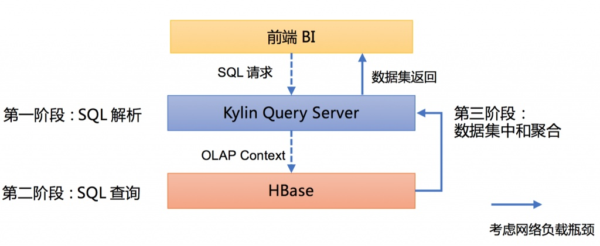

# 多唯计算 - Kylin

## 概述

Apache Kylin™是一个开源的分布式分析引擎，提供Hadoop之上的SQL查询接口及多维分析（OLAP）能力以支持超大规模数据。

因为有时候无法预先精准判断出后面需要聚合的列，所以需要有提前的cube计算，预计算后方便后面使用。

在Apache Kylin的实际部署过程中，SQL查询有时并不能如预期在很短的时间内完成，需要开发人员进行有针对性的分析和优化。


## 角色定义

| 名称 | 备注 |
| --- | --- |
| 表(table) | 表定义在hive中，是数据立方体（Data cube）的数据源，在build cube 之前，必须首先同步在 kylin中。 |
| 模型(model) | 模型描述了一个【星型模式】的数据结构，它定义了一个事实表（Fact Table）和多个查找表（Lookup Table）的连接和过滤关系。 |
| 立方体(cube) | 确定使用的模型、表的维度、度量，并且设置了数据段分区和合并的规则 |
| 立方体数据段(cube segment) | cube构建（build）后的数据载体，一个 segment 映射hbase中的一张表，cube实例构建（build）后，会产生一个新的segment，一旦某个已经构建的立方体的原始数据发生变化，只需刷新（fresh）变化的时间段所关联的segment即可 |
| 作业(job) | 对立方体实例发出构建（build）请求后，会产生一个作业。该作业记录了立方体实例build时的每一步任务信息。作业的状态信息反映构建立方体实例的结果信息。 |

## 作业状态

| 状态 | 描述 |
| --- | --- |
| NEW | 新作业 |
| PENDING | 暂停 |
| RUNNING | 运行 |
| FINISHED | 完成 |
| ERROR | 失败 |
| DISCARDED | 丢弃(用户触发) |

## 多维计算

- 维度  
  维度就是观察数据的角度。
- 度量  
  度量是具体考察的聚合数量值。
- 事实表  
  存储事实记录的表。
- 维度表  
  也称为查找表，维度信息存储。
- 维度基数  
  该维度在数据集中出现的不同值数量。
- Cube  
  1. Cube 数据立方体，对原始数据建立多维度索引，采用预计算的方式大大加快数据的查询效率，一般应用为结果为聚合数据类型的实时查询领域。
  2. Cuboid 数据立方体本质上是在明确的维度和度量场景下，将多个维度按照不同组合方式进行分组产生的度量结果，而其中的任何一种组织方式
  3. Cube Segment是Cube计算产生的一个数据片段（如增量Cube，会随着事实表的时间分区来进行Cube的增量构建，而每天产生的Cube底层的数据片段即为Segment）
- Cube膨胀  
  Cube膨胀是由于维度组合产生的数据量比原始数据大出的倍数。如果维度有过多的高基维会导致维度组合对应的数据会更多。
- Cube结果保存  
  Kylin的cube构建的结果会保存到


## 查询流程

Apache Kylin 查询的整个生命周期分为三个阶段



### SQL 解析

在收到SQL请求后，Kylin Query Server会调用Calcite对SQL语句进行解析。

Calcite的工作流程：

1. Parse
   - 通过使用JavaCC生成的解析器解析查询语句
2. Validate
   - 使用数据库的元数据对查询进行验证
3. Optimize
   - 优化查询计划的逻辑(logical plan)，并转换为物理表达式(physical expression)
4. Execute
   - 物理计划被转换为指定应用程序的执行内容

#### AST生成

首先，Calcite会将SQL语句通过范式编译器解析为一颗抽象语义树（AST）。


#### AST优化

然后Calcite对这棵AST树进行优化，将Project（select部分）和Filter（where部分）Push down至Hadoop集群。


#### 定义实施计划

接着定义implement plan，共有两种方式：HepPlanner（启发式优化）和VolcanoPlanner（基于代价的优化）。目前Kylin只启用了一些必要的HepPlanner规则，大部分使用的是VolcanoPlanner。

### SQL查询

针对子查询，UNION等场景，Calcite将SQL分解为多个OLAPContext，同时执行Filter Pushdown和Limit Pushdown等优化手段，然后提交到HBase上执行。

### 数据集中和聚合

HBase上的查询任务执行完成后，数据返回至Kylin Query Server端，由Calcite聚合多个OLAP Context的查询结果后，最后返回给前端BI。在了解Apache Kylin的查询生命周期以后，碰到一些查询速度较慢的情况，就能够有针对性地进行分析和优化了。

#### RowKey顺序

从模型设计角度，需要合理调整RowKey中维度的排列顺序，原则是把过滤字段（例如PART_DT等日期型字段）和高基维（例如BUYER_ID，SELLER_ID等客户字段）放在Rowkey的前列，这样能够显著提升【第二阶段SQL查询】在HBase上数据扫描和I/O读取的效率。


#### SQL查询优化

Kylin遵循的是“Scatter and gather”模式，而有的时候在【第二阶段SQL查询】时无法实现Filter Pushdown和Limit Pushdown等优化手段，需要等待数据集中返回Kylin后再筛选数据，这样数据吞吐量会很大，影响查询性能。优化方法是重写SQL语句。

例如，该SQL查询的筛选条件放在子查询中，因此无法实现Filter Pushdown。

```sql
select
 KYLIN_SALES.PART_DT,
 sum(KYLIN_SALES.PRICE)
from KYLIN_SALES
inner join (
  select 
   ACCOUNT_ID,
   ACCOUNT_BUYER_LEVEL
  from KYLIN_ACCOUNT
  -- 这里的where在子查询中，无法push down
  where ACCOUNT_COUNTRY = 'US'
) as TT
on KYLIN_SALES.BUYER_ID = TT.ACCOUNT_ID
group by KYLIN_SALES.PART_DT
```

可以改为下面的写法：

```sql
select
  KYLIN_SALES.PART_DT,
  sum(KYLIN_SALES.PRICE)
from KYLIN_SALES
inner join KYLIN_ACCOUNT as TT
on KYLIN_SALES.BUYER_ID = TT.ACCOUNT_ID
where TT.ACCOUNT_COUNTRY = 'US'
group by KYLIN_SALES.PART_DT
```

#### 聚合维度

如果查询击中了Base Cuboid，则【第三阶段数据集中和聚合】将会花费大量时间，优化方法是调整模型中聚合组，联合维度，必要维度的设计。

在日志中可以看到查询击中的Cuboid组合，比如`Cuboid Ids`为131071，将其转换为二进制数值是0x1 1111 1111 1111 1111，从右至左，共有17个1，表示该Cuboid中包含了17个维度（这里从右至左指代的维度的对应顺序是Cube模型中Rowkey中自下而上定义的维度），而Cube模型中所有维度的数量是17，说明击中了Base Cuboid。

#### 性能调节

可以在`setent.sh`文件中设置Kylin节点的JVM运行配置。

对于一些复杂的SQL语句，如果包含子查询的话，尽量避免Left Join操作，尤其是Join的两个数据集都较大的情况下，会对查询性能有显著的影响。建议将SQL的数据处理逻辑放在ETL阶段，而前端SQL逻辑保持简单明了。

## Cube构建流程

Apache Kylin 的主要工作就是为源数据构建 N 个维度的 Cube，实现聚合的预计算。从理论上说，构建 N 个维度的 Cube 就会生成 2^N 个 Cuboid。


Kylin的Cube构建任务分成若干子任务，然后由任务引擎依次执行，包括了hive数据源读取操作、mr计算|spark计算、hbase写入操作等。通常cube构建耗时不定，从分钟级别到小时级别而耗时的长短取决于【数据量】、【模型复杂度】、【集群计算能力】、【参数配置优化】等多个方面

### 1. 创建临时的Hive平表

首先将数据从数据源Hive库表中选择将要进行多维计算的【事实表Fact Table】(如有需要还要确定【维表 Lookup Table】使用join关联) 提取出来形成一个数据集插入到一个临时表。如果是【增量构建】，则Cube是分区的，Kylin会加上一个时间条件以确保只有在时间范围内的数据才会被提取。可以在这个步骤的log查看相关的Hive命令.

#### 全量构建和增量构建

如果cube的分区列与Hive表的分区列相同，那么根据它过滤数据能让Hive聪明地跳过不匹配的分区。因此强烈建议用Hive的分区列（如果它是日期列）作为cube的分区列。这对于那些数据量很大的表来说几乎是必须的，否则Hive不得不每次在这步扫描全部文件，消耗非常长的时间。

**全量构建**

对于多维计算模型中没有指定时间列做数据分区的Cube来说，kylin会使用全量构建

**增量构建**

增量构建是基于某个时间列分区进行数据过滤来进行构建任务的，所以形成的segment对应了一个时间范围，如下图所示。而segment对应的范围采用了前闭后开原则，即包含开始时间但不包含结束时间，这样保证segment总体上不会有重复情况。

**segment合并**

由于增量构建或流式数据源会产生大量的segment，这样会造成查询性能的下降，另外segmengt对应的hbase的HTable也会增多对hdfs带来影响，这样就有必要对segment进行合并形成较大的segment。

在进行segment合并时kylin会直接对cuboid文件作为输入而不需要从原始数据源中提取(因为维度有对应编码并形成了单独文件)这样重新产生新的segment及对应的HTable后才结束，并将之前的segment及HTable删除。

### 2. 重新分发中间表

在之前的一步之后，根据数据的分布情况甚至过滤条件等原因，Hive在HDFS上的目录里生成了数据文件：有些是大文件，有些是小文件甚至空文件。这种不平衡的文件分布会导致之后的MR任务出现数据倾斜的问题：有些mapper完成得很快，但其他的就很慢，所以我们要使用shuffle机制进行重新分发为后续计算提供帮助。

其次，Kylin会运行 “INSERT OVERWRITE TABLE … DISTRIBUTE BY “ 形式的HiveQL来分发数据到指定数量的reducer上。

在很多情况下，Kylin请求Hive随机分发数据到reducer，然后得到大小相近的文件，分发的语句是”DISTRIBUTE BY RAND()”。

如果你的cube指定了一个高基数的列，比如”USER_ID”，作为”分片”维度(在cube的“高级设置”页面)，Kylin会让Hive根据该列的值重新分发数据，那么在该列有着相同值的行将被分发到同一个文件。这比随机要分发要好得多，因为不仅重新分布了数据，并且在没有额外代价的情况下对数据进行了预先分类，如此一来接下来的cube build处理会从中受益。在典型的场景下，这样优化可以减少40%的build时长。在这个案例中分发的语句是”DISTRIBUTE BY USER_ID”：

请注意: 
1. "分片"列应该是高基数的维度列，并且它会出现在很多的cuboid中（不只是出现在少数的cuboid）。 使用它来合理进行分发可以在每个时间范围内的数据均匀分布，否则会造成数据倾斜，从而降低build效率。典型的正面例子是：“USER_ID”、“SELLER_ID”、“PRODUCT”、“CELL_NUMBER”等等，这些列的基数应该大于一千(远大于reducer的数量)。
2. "分片"对cube的存储同样有好处，不过这超出了本文的范围。

### 3. 构建维度字典

#### 提取事实表的唯一列
在这一步骤Kylin运行MR任务来提取使用字典编码的维度列的唯一值。

如果这一步从任何意义上讲不能在合理的时间内完成，你可以放弃任务并考虑重新设计cube，因为继续下去会花费更长的时间。

你可以通过降低取样的比例（kylin.job.cubing.inmen.sampling.percent）来加速这个步骤，但是帮助可能不大而且影响了cube统计数据的准确性，所有我们并不推荐。

#### 构建维度字典

有了前一步提取的维度列唯一值，Kylin会在内存里构建字典。通常这一步比较快，但如果唯一值集合很大，Kylin可能会报出类似“字典不支持过高基数”。对于UHC类型的列，请使用其他编码方式，比如“fixed_length”、“integer”等等。

**维度编码**

| 编码类型 | 说明 | 备注 |
| --- | --- | --- |
| 字典编码 | 维度值的基数较小且数据量较大时会大大节省空间 | kylin.dictionary.max.cardinality字典大小 |
| 时间编码 | Date编码/Time编码使用较少的空间存储对应数值 |  |
| 数字编码 | Integer编码适合对int或bigint类型值编码 |  |
| 定长编码 | Fixed_length编码设置定长，如身份证 | UTF-8 |

**维度字典**

Dictionary表示需要为这个维度建立字典树。因为每一个维度的dictionary都会保存在内存中，如果字典树占用很大的内存会影响kylin的使用甚至导致OOM，对于dictionary的编码使用的是字典树，它的原理实际上是为每一个维度成员赋予一个整数的id，实际存储的时候存储的是这个id的二进制值（使用int最多占用4个字节），并且保证每一个id的顺序和维度成员的顺序相同的，例如aaa的id=1，aab的id=2，aac的id=3，这样在查询的时候就可以直接根据column>aaa转换成id>1，方便hbase coprocessor的处理。

**全局字段**

有部分列存在需要在全局中使用，则可以构建全局字典，共同使用，以节省存储空间。

### 4. 保存cuboid的统计数据和创建 HTable

1. 将采集的cuboid的统计信息保存到kylin的元数据存储，供后续使用
2. 为本次cube构建产生的segment创建HBase table

### 5. 构建基础cuboid

cube确立之后基础cuboid就产生了，就是所有维度都参与的组合，如上图4-D base cuboid，这样当kylin采用【layer】逐层构建时，将会已“临时平表”作为数据源先构建base cuboid，然后由基础cuboid来N-1的逐层构建。用Hive的中间表构建基础的cuboid，是“逐层”构建cube算法的第一轮MR计算。Mapper的数目与第二步的reducer数目相等；Reducer的数目是根据cube统计数据估算的：默认情况下每500MB输出使用一个reducer；如果观察到reducer的数量较少，你可以将kylin.properties里的“kylin.job.mapreduce.default.reduce.input.mb”设为小一点的数值以获得过多的资源，比如:

`kylin.job.mapreduce.default.reduce.input.mb=200`

### 6. 构建N维Cuboid

这些步骤是“逐层”构建cube的过程，每一步以前一步的输出作为输入，然后去掉一个维度以聚合得到一个子cuboid。举个例子，cuboid ABCD去掉A得到BCD，去掉B得到ACD。

有些cuboid可以从一个以上的父cuboid聚合得到，这种情况下，Kylin会选择最小的一个父cuboid。举例,AB可以从ABC(id:1110)和ABD(id:1101)生成，则ABD会被选中，因为它的比ABC要小。在这基础上，如果D的基数较小，聚合运算的成本就会比较低。

当设计rowkey序列的时候，请记得将基数较小的维度放在末尾。这样不仅有利于cube构建，而且有助于cube查询，因为预聚合也遵循相同的规则。

通常来说，从N维到(N/2)维的构建比较慢，因为这是cuboid数量爆炸性增长的阶段：N维有1个cuboid，(N-1)维有N个cuboid，(N-2)维有N*(N-1)个cuboid，以此类推。经过(N/2)维构建的步骤，整个构建任务会逐渐变快。

### 7. 构建cube

这个步骤使用一个新的算法来构建cube：“逐片”构建（也称为“内存”构建）。它会使用一轮MR来计算所有的cuboids，但是比通常情况下更耗内存。配置文件”conf/kylin_job_inmem.xml”正是为这步而设。默认情况下它为每个mapper申请3GB内存。如果你的集群有充足的内存，你可以在上述配置文件中分配更多内存给mapper，这样它会用尽可能多的内存来缓存数据以获得更好的性能，比如：

```xml
<property>
    <name>mapreduce.map.memory.mb</name>
    <value>6144</value>
    <description></description>
</property>

<property>
    <name>mapreduce.map.java.opts</name>
    <value>-Xmx5632m</value>
    <description></description>
</property>
```

请注意，Kylin会根据数据分布（从cube的统计数据里获得）自动选择最优的算法，没有被选中的算法对应的步骤会被跳过。你不需要显式地选择构建算法。

### 8. 将cuboid数据转换为HFile

这一步启动一个MR任务来讲cuboid文件（序列文件格式）转换为HBase的HFile格式。Kylin通过cube统计数据计算HBase的region数目，默认情况下每5GB数据对应一个region。Region越多，MR使用的reducer也会越多。如果你观察到reducer数目较小且性能较差，你可以将“conf/kylin.properties”里的以下参数设小一点，比如：

```properties
kylin.hbase.region.cut=2
kylin.hbase.hfile.size.gb=1
```

### 9. 将HFile导入HBase表

这一步使用HBase API来讲HFile导入region server，这是轻量级并快速的一步。

### 10. 更新cube信息

在导入数据到HBase后，Kylin在元数据中将对应的cube segment标记为ready。

### 11. 清理资源

将中间宽表从Hive删除。这一步不会阻塞任何操作，因为在前一步segment已经被标记为ready。如果这一步发生错误，不用担心，垃圾回收工作可以晚些再通过Kylin的StorageCleanupJob完成。

## Cube优化

“随着维度数目的增加，Cuboid 的数量会爆炸式地增长。为了缓解 Cube 的构建压力，Apache Kylin 引入了一系列的高级设置，帮助用户筛选出真正需要的 Cuboid。这些高级设置包括聚合组（Aggregation Group）、联合维度（Joint Dimension）、层级维度（Hierachy Dimension）和必要维度（Mandatory Dimension）等。”

### 聚合组

#### 剪枝原理

Apache Kylin 的主要工作就是为源数据构建 N 个维度的 Cube，实现聚合的预计算。从理论上说，构建 N 个维度的 Cube 就会生成 2^N 个 Cuboid。

所以，只要降低最终 Cuboid 的数量，就可以减小膨胀率，达到对 Cube 剪枝的效果。

**例如**：

构建一个 4 个维度（A，B，C, D）的 Cube，就需要生成 16 个Cuboid。


那么问题来了，如果这 4 个维度（A，B，C, D），能够根据某业务逻辑找出一个隐藏的规律，即：当进行聚合时，用户仅仅关注维度 AB 组合和维度 CD 组合（即只会通过维度 A 和 B 或者 C 和 D 进行聚合，而不会通过 A 和 C、B 和 C、A 和 D、B 和 D 进行聚合），那么就可以通过设置聚合组，使生成的 Cuboid 数目从 16 个缩减成 8 个（大大降低 Cube 膨胀率），如下图所示。


用户关心的聚合组之间可能包含相同的维度，例如聚合组 ABC 和聚合组 BCD 都包含维度 B 和维度 C。这些聚合组之间会衍生出相同的 Cuboid，例如聚合组 ABC 会产生 Cuboid BC，聚合组 BCD 也会产生 Cuboid BC。这些 Cuboid不会被重复生成，一份 Cuboid 为这些聚合组所共有，如下图所示。


#### 问题

有一个Cube使用了聚合组进行剪枝操作，完美的将 AB 和 CD 分到了两个聚合组中，将膨胀率降低了一半。

```sql
select A,B,sum(VALUE)
from test_agg_group
where D = 1
group by A,B;
```

执行上面语句时会发现，特别慢，

日志信息截取：

```text
==========================[QUERY]===============================
Query Id: 7fe300c2-211c-9429-eebf-b4cc57bfd679
SQL: select A,B,sum(VALUE)
from test_agg_group
where D = 1
group by A,B;
User: ADMIN
Success: true
Duration: 4.891
Project: 0000_reserved
Realization Names: [CUBE[name=test_agg_group]]
Cuboid Ids: [15]
Total scan count: 1000000
Total scan bytes: 51000000
Result row count: 100000
Accept Partial: true
Is Partial Result: false
Hit Exception Cache: false
Storage cache used: false
Is Query Push-Down: false
Is Prepare: false
Trace URL: null
Message: null
==========================[QUERY]===============================
```

通过对cuboid的观察可以看出，查询击中了Base Cuboid，导致`Total scan count`是`Result row count`的十倍。

原因是：

1. C 字段的基数非常大
2. D 字段的基数非常小

通过查看 SQL 执行的日志信息我们也能看到。当以 D 字段为过滤条件时，只能使用包含 ABCD 四个字段的 Cuboid 进行扫描。

但是 C 字段的基数非常大，所以该 Cuboid 的行数也就非常多。同时， C 字段并没有进行筛选，使用了基数非常小的 D 字段进行了筛选（一共 1000w 行，D字段有 500w 行是 1，500w 行是 2）。

最终导致要扫描完 Cuboid ABCD 的 100w 行才能得到计算结果。

那么如果筛选字段不是 D 而是 C，我们尝试下估算下需要扫描多少行呢？

```text
==========================[QUERY]===============================
Query Id: e304ae37-f7ec-233b-d353-845e2feba908
SQL: select "A","B",sum("VALUE")
from test_agg_group
where "C" = 100000
group by 1,2
User: ADMIN
Success: true
Duration: 0.806
Project: 0000_reserved
Realization Names: [CUBE[name=test_agg_group]]
Cuboid Ids: [15]
Total scan count: 2
Total scan bytes: 102
Result row count: 2
Accept Partial: true
Is Partial Result: false
Hit Exception Cache: false
Storage cache used: false
Is Query Push-Down: false
Is Prepare: false
Trace URL: null
Message: null
==========================[QUERY]===============================
```

仅需要扫描个位数的行即可，因为 C 字段基数大，包含的重复值很少。而且我们可以看到，这条 SQL 和最初的 SQL 都是用了 Cuboid Id 为 15 的 Cuboid 进行查询，也就是包含了 ABCD 四个字段的 Cuboid。

#### 总结

分聚合组时，哪怕用户仅仅关注维度 AB 组合和维度 CD 组合，但用户会可能用 D 作为过滤条件来查询 AB 组合，就一定要保证 ABD 要分到同一个聚合组当中。

如果字段的基数不像例子中这么极端，聚合组随便怎么分对性能影响应该都不大。

使用场景：

在某些业务场景下，事实表中出现了不同的业务维度，如交易主题中的订单数据(可能是关联后的宽表)中包含了用户相关维度、产品维度、支付维度、地区维度等等(因为可能共用一个数据模型model)，而数据使用方会根据自身需求分别分析其中的一部分维度的多维计算，如涉及用户方面分析的数据使用方向计算的维度【用户性别、年龄段、所在地区、产品分类】度量【交易额、交易数量、交易人数】；涉及支付方面的数据使用方向计算的维度【支付类型、支付网络类型、支付时间段、产品分类】度量【交易额、交易数量】，简单来说就是数据模型中局部的维度组合及对应的度量值

### 强制维度

如果将一个维度设置成强制维度如dx，那么所有的Cuboid都会含有这个维度，换句话说kylin 只会预计算含有这个维度的Cuboid。那么以后查询cube时必须在分组中出现此维度【group by dx】

强制维度一般用在必选的维度中而且是粗粒度的，如时间、地区、xx类型等

### 层次结构

具有上下级层次关系的维度，从使用的角度来看一般会按照粒度进行由粗到细的过程而不会单独使用较细粒度来进行分析，也就是说该维度使用会按照【group by 粗粒度、细粒度】

例如时间维度、地区维度

年、季度、月、周、日

国家、省、市、县区

### 联合惟独

如果将几个维度被当做联合维度，那么构建的Cuboid，要么都包含这几个维度，要不都不含有。换句话说就是把这几个维度当做一个维度来看。

适用场景
1. 多种低基维的一种“联合维度”（一般建议为单个维度值在10以内，而联合维度的基数叉乘<10000）
2. 有业务关系的维度组合
3. 查询较少的或查询优先级较低的维度组合
