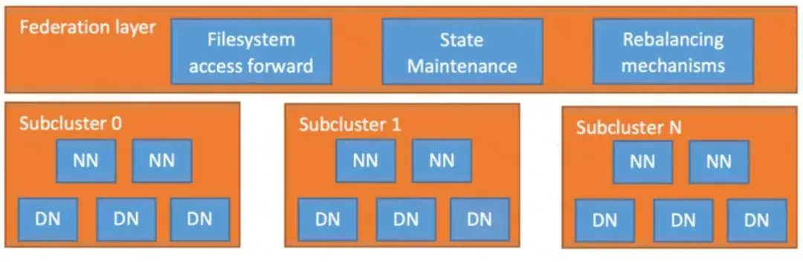
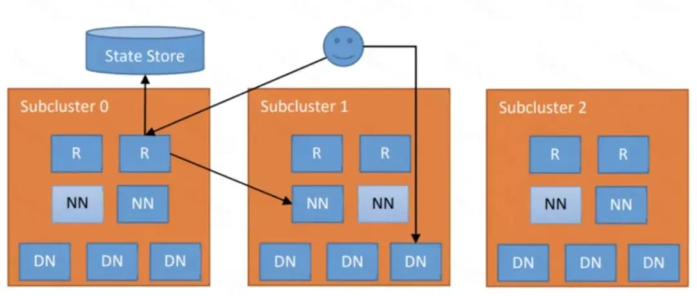

# Router-Based HDFS Federation

本文摘抄自 滴滴技术 分享的文章

仅作个人学习记录使用

如有侵权请联系 `neal73.zhao@outlook.com`

## 背景引入

HDFS的Master/Slave架构，使得其具有单点瓶颈问题。为此推出了Federation方案来解决。但是使用这个方案会引入一个问题，就是出现了多个命名空间(namespace)。类似于使用了多个集群的情况。为了解决这一问题，社区提供了基于客户端的解决方案---ViewFS。但ViewFS升级困难，并且对于新增的目录需要增加挂载配置。

社区在新版本又推出了一个新的解决方案 --- Router-Based Federation。该方案是基于服务端进行实现的，比较好管理和维护。(2.9+,3.0+版本)

## 介绍

Router-Based Federation 对外提供了 Router 服务，包含在 Federation layer 中，如下图所示。这个 Router 服务将允许用户透明地访问任何子集群，让子集群独立管理自己的 Blockpool。为了实现这些目标，Federation layer 必须将 Block 访问引导至适当的子群集。同时，它具有可扩展性，高可用性和容错性。



Federation layer 包含多个组件。Router 是一个与 Namenode 具有相同接口的组件，根据 State Store 的元数据信息将客户端请求转发给正确的子集群。State Store 组件包含了远程挂载表（具有 ViewFS 特性，但在客户端之间共享）和有关 SubCluster 的负载/空间信息。

下图架构中显示每个子集群增加了 Router（标记为“R”）和逻辑集中式（但物理分布式）的状态存储（State Store），以及每个 SubCluster 的 Namenodes（“NN”）和 Datanodes（“DN”）。这种方法与 YARN Federation（YARN-2915）具有相同的架构。



## Router 组件

系统中可以有多个的 Router，每个 Router 有两个角色：
1. 向客户端提供一个全局 Namenode 接口并负责转发请求正确的子群集中的 Active Namenode
2. 在 State Store 中维护关于 Namenode 的信息。

Router 在收到客户端请求，根据 mount-table 中的信息查找正确的子集群，然后转发对该集群请求到对应子集群 Active Namenode。在收到 Active Namenode 的响应结果之后，将结果返回给客户端 。 为了提升性能，Router 可以缓存远程挂载表条目和子集群的状态。

对于 Namenode 信息的维护，Router 定期检查一个 Namenode 的状态和向 State Store 报告其高可用性（HA）状态和负载/空间状态。 为了提高 Namenode HA 的性能，Router 使用 State Store 中的高可用性状态信息,以将请求转发到最有可能处于活动状态的 Namenode。

### 可用性与容错性

Router 是无状态的，所有 Router 同时提供服务。如果某个 Router 变成不可用，不影响其他任何 Router 提供服务。

客户端配置他们的 DFS HA 客户端（例如 ConfiguredFailoverProvider 或 RequestHedgingProxyProvider）与 Federation 中的所有 Router 配合使用。

为了实现高可用性和灵活性，多个 Router 可以监控相同的 Namenode 并把心跳发送信息到 State Store。 如果 Router 出现故障，这会增加信息的恢复能力。

### Safe Mode

如果 Router 不能连接到 State Store，它可能会错误地提供过期 locations 的访问，让 Federation 进入不一致的状态。

为防止这种情况发生，当 Router 无法连接到 State Store 一段时间后，它会进入安全模式（类似于 Namenode 的 safe mode）。当客户端尝试访问 safe mode 的 Router 时候，会抛出异常，客户端的 Proxy 捕获后，会尝试连接其他的 Router。类似于 Namenode，Router 保持在这个安全模式，直到它确定 State Store 可用为止。

这可以防止 Router 启动时出现不一致。 假定一个 Router 如果在一段时间内没有心跳（例如，心跳间隔的五倍），则它已经死亡或处于安全模式。

### 交互接口

为了与用户和管理员进行交互，Router 公开了多个接口。包括 RPC、Admin、WebUI 。

RPC 实现了客户端与 HDFS 交互的最常见接口。 目前仅支持使用普通 MapReduce，Spark 和 Hive ( on Tez，Spark 和MapReduce）。一些高级特性，如快照、加密和分层存储在未来版本实现。 所有未实现的功能都会抛出异常。

Admin 为管理员实现的一个 RPC 接口，包括从子集群获取信息、添加/删除条目到 mout table。也可以通过命令行获取和修改 Federation 信息。WebUI 实现了一个可视化 Federation 状态，模仿了当前的 Namenode UI，除此之外，还包含 mout table，每个子集群的成员信息以及 Router 的状态。

## State Store 组件

State Store 维护的信息包括：
1. 子集群的块访问负载，可用磁盘空间，HA 状态等状态
2. 文件夹/文件和子集群之间的映射，即远程 Mount Table
3. Router 的状态。State Store 的后端存储是可配置的。 既可以可以存储在文件中，也可以存在 ZooKeeper 中。

### Membership

Membership 反映了 Federation 中的 Namenode 的状态。包括有关子集群的信息，例如存储量和节点数量。Router 定期检测一个或多个 Namenode 的信息。

### Mount Table

管理文件夹和子集群之间的映射。 它与 ViewFS 中的 Mount Table 类似：
```
hdfs://tmp → hdfs://C0-1/tmp 
/* Folder tmp is mapped to folder tmp in subcluster C0-1 */
```

### Router State

为了跟踪 Router 中 caches 的状态，Router 将其版本信息、状态信息等存储在 State Store 中。

作者：滴滴技术
链接：https://juejin.im/post/5ccf9f3fe51d453ae37293d4
