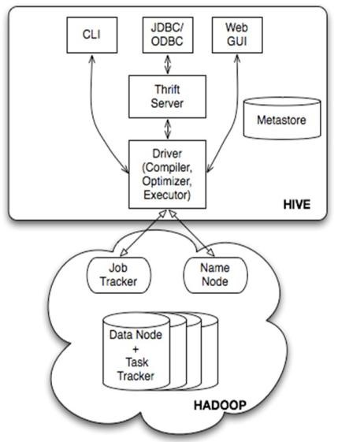
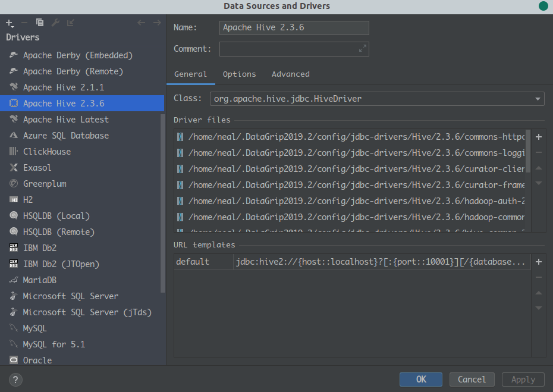

# Hive安装配置

Hive是一个数据仓库工具，基于Hadoop，可以通过类sql的方式来对数据提供读、写及管理的功能。比直接用mapreduce开发效率高，提供了快速开发的能力。

**特点**

可扩展  延展性  容错性

## Hive组成



- 客户端：CLI、JDBC、WebUI
- Thrift Server：Thrift协议RPC通信服务
- metastore：元数据存储（库/表的定义等
- Driver：解析器，将hql抽象成表达式树
- Compiler：编译hql语句，生成一个有向无环的执行计划，hive在mr引擎上就是编译成mapreduce的job
- Optimizer：将执行计划进行优化，减少不必要的列、使用分区、使用索引等操作，优化job。
- Executor：将优化后的执行计划提交给Hadoop上的yarn，执行job


## Hive的安装部署

- Hive是基于Hadoop的，最好选用跟Hadoop合适的版本进行安装。
- Hive的存储基于hdfs/hbase，默认的计算引擎基于mapreduce(hive2.x以上版本不推荐使用mr引擎)

### 安装：

https://hive.apache.org/downloads.html

去官网下载合适版本的安装包

如果网络不顺畅可以尝试 [清华大学开源镜像站 - /apache/hive](https://mirrors.tuna.tsinghua.edu.cn/apache/hive/)

解压后配置环境变量，

```bash
# echo 'export HIVE_HOME=/home/apache-hive-2.3.6' >> /etc/profile
# echo 'export PATH=$PATH:$HIVE_HOME/bin' >> /etc/profile
# source /etc/profile
```

**一、本地模式**

使用默认的derby进行存储，用于测试，不需要配置，但是只支持单session。

配置 hive-env.sh的JAVA_HOME

启动Hive

元数据会在启动hive命令的目录下生成


**二、远程模式**

通常使用关系型数据库来进行元数据存储（mysql、oracle等

支持多session，但需要安装关系型数据库，并需要配置

进行配置：

hive-site.xml

```xml
<configuration>

<!--连接数据库地址，名称 -->  
<property>
  <name>javax.jdo.option.ConnectionURL</name>
  <value>jdbc:mysql://hdfs02:3306/hive?createDatabaseIfNotExist=true&amp;useSSL=false</value>  
</property>  
<!--连接数据库驱动 --> 
<property>
  <name>javax.jdo.option.ConnectionDriverName</name>  
  <value>com.mysql.jdbc.Driver</value>  
</property> 
<!--连接数据库用户名称 -->  
<property>  
  <name>javax.jdo.option.ConnectionUserName</name>  
  <value>root</value>
</property> 
<!--连接数据库用户密码 -->  
<property>  
  <name>javax.jdo.option.ConnectionPassword</name>  
  <value>123456</value>
</property>

<!--Hive作业的HDFS根目录位置 --> 
<property>
    <name>hive.exec.scratchdir</name>
    <value>/user/hive/tmp</value>
</property>
<!--Hive作业的HDFS根目录创建写权限 --> 
<property>
    <name>hive.scratch.dir.permission</name>
    <value>777</value>
</property>
<!--hive的元数据服务-->
<property>
    <name>hive.metastore.uris</name>
    <value>thrift://hdfs03:9083</value>
</property>
<!--hdfs上hive元数据存放位置 --> 
<property>  
    <name>hive.metastore.warehouse.dir</name>  
    <value>/user/hive/warehouse</value>   
</property>

<property>
    <name>hive.metastore.local</name>
    <value>true</value>
</property>
<property>
    <name>hive.metastore.schema.verification</name>
    <value>false</value>
</property>
<property>
    <name>datanucleus.schema.autoCreateAll</name>
    <value>true</value>
</property>

<property>
    <name>hive.server2.thrift.port</name>
    <value>10000</value>
</property>
<property>
    <name>hive.server2.thrift.bind.host</name>
    <value>hdfs03</value>
</property>
<property>
    <name>hive.server2.webui.host</name>
    <value>hdfs03</value>
</property>
<property>
    <name>hive.server2.webui.port</name>
    <value>10001</value>
</property>

<!--客户端显示当前查询表的头信息 --> 
 <property>
  <name>hive.cli.print.header</name>
  <value>true</value>
</property>
<!--客户端显示当前数据库名称信息 --> 
<property>
  <name>hive.cli.print.current.db</name>
  <value>true</value>
</property> 
<property>
   <name>hive.server2.enable.doAs</name>
   <value>false</value>
</property>
</configuration>
```

将mysql的JDBC驱动包放在$HIVE_HOME/lib目录下

启动hive，初始化元数据 `schematool -dbType mysql -initSchema`

启动服务 `nohup hiveserver2 > hiveserver2.log 2>&1 &`


## 连接Hive

### 使用hive命令

> 略

### 使用beeline

1. 开启metastore服务
2. 开启hiveserver2服务
3. 进入 beeline
4. 使用 !connect jdbc:hive2://hdfs03:10000 命令进入hive 

> 没有配置权限的情况，用户名和密码可以直接敲回车跳过，或者任意输入
>
> beeline退出使用 !exit 命令

### 使用JDBC连接


- 配置jdbc使用java代码可用maven导包
- 图形化工具连接 需手动配置hive的jdbc依赖

#### 配置JDBC Driver

本文使用DataGrid，也可以使用Idea Ultimate版本自带的database工具连接。使用方法一样。

DataGrip打开Data Sources and Drivers 

创建一个新的 Apache Hive Driver

配置合适版本的驱动包



由于 hive-jdbc 不是包含所有依赖的包(这里是 HA 的 HiveServer, 需要有 ZK 的依赖, 也可以直接连接 HiveServer), 所以需要导入 Driver 的全部 jar, 如下：

> commons-httpclient-3.0.1.jar<br>
> commons-logging-1.2.jar<br>
> curator-client-2.7.1.jar<br>
> curator-framework-2.7.1.jar<br>
> hadoop-auth-2.9.2.jar<br>
> hadoop-common-2.9.2.jar<br>
> hive-common-2.3.6.jar<br>
> hive-exec-2.3.6.jar<br>
> hive-jdbc-2.3.6.jar<br>
> hive-metastore-2.3.6.jar<br>
> hive-service-2.3.6.jar<br>
> httpclient-4.4.jar<br>
> httpcore-4.4.jar<br>
> slf4j-api-1.7.25.jar<br>
> zookeeper-3.4.6.jar<br>
> 
> 这里的文件有部分是hive的lib中找，有部分是从hadoop的库(\$\{HADOOP_HOME\}\/share\/hadoop/common/lib)中找<br>
> 我的Hive版本是2.3.6，Hadoop的版本是2.9.2。<br>

#### 配置连接Hive

和连接其他数据库类似, 配置好连接名, JDBC URL, 用户, 密码 即可

URL可以有两种形式：
- `jdbc:hive2://<hiveserver_host>:<port>`: 直接连接某个 HiveServer
- `jdbc:hive2://<zookeeper_server1>:<port>,<zookeeper_server2>:<port>;zooKeeperNamespace=<hiveserver_namespace>`: 通过 Zookeeper 连接 HiveServer(需要多几个依赖)


打开连接即可使用了。

