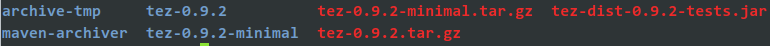
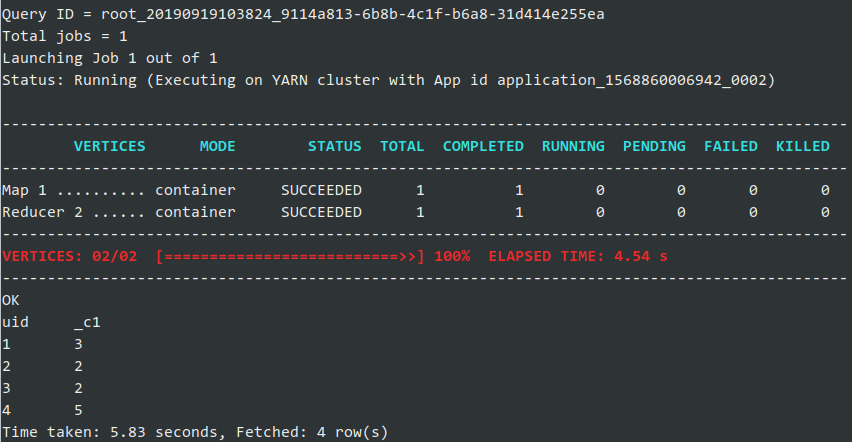

# Hive引擎Tez

环境：  
System: CentOS Linux release 7.6.1810 (Core)  
Hadoop: 2.9.2  

Java: jdk 1.8.0_211  
Hive: 2.3.6  
tez: 0.9.2  

编译依赖：  
protobuf: protobuf-2.5.0  

编译工具安装：  
yum install -y gcc-c++ openssl-devel glibc autoconf automake libtool  

## 首先到官网下载tez0.9.2-sec.tar.gz源码包

[https://mirrors.tuna.tsinghua.edu.cn/apache/tez/0.9.2/](https://mirrors.tuna.tsinghua.edu.cn/apache/tez/0.9.2/)

也可以直接下载二进制包，解压后可跳过此步骤

### 1.安装protobuf-2.5.0

```
cd protobuf-2.5.0  
./configure  
make  
make install  
使用protoc --version 验证是否成功
```

### 2.解压源码包

### 3.修改配置: vim pom.xml

```xml
<hadoop.version>2.7.0</hadoop.version>
此处根据自己的Hadoop版本来改  ==>
<hadoop.version>2.9.2</hadoop.version>

<!-- 这两个模块注释掉
<module>tez-ext-serive-test</module>
<module>tez-ui</module> -->
```

### 4.使用maven编译

> mvn clean package -DskipTests=true -Dmaven.javadoc.skip=true

## 跟Hadoop、Hive整合

### 1.进入./tez-dist/target



### 2.将tez-0.9.2.tar.gz压缩包上传到HDFS上：/tez-0.9.2

```
hadoop fs -mkdir /tez-0.9.2
hadoop fs -put ./tez-0.9.2.tar.gz /tez-0.9.2
```
### 3.在TEZ_HOME下创建conf目录并编辑tez-site.xml  
mkdir conf  
vim tez-site.xml  
```xml
<?xml version="1.0" encoding="UTF-8"?>
<?xml-stylesheet type="text/xsl" href="configuration.xsl"?>
<configuration>
  <property>
    <name>tez.lib.uris</name>
    <value>${fs.defaultFS}/tez-0.9.2/tez-0.9.2.tar.gz</value>
  </property>
</configuration>
```
### 4.将tez-0.9.2移动到想要的位置并配置环境变量  
export TEZ_HOME=path/tez-0.9.2  
export TEZ_CONF_DIR=$TEZ_HOME/conf  
1. 编辑Hadoop配置  
cd $HADOOP_HOME/etc/hadoop  
vim hadoop-env.sh  
```bash
export TEZ_HOME=/home/tez-0.9.2
for jar in $TEZ_HOME/*.jar; do
        export HADOOP_CLASSPATH=$HADOOP_CLASSPATH:$jar
done
for jar in $TEZ_HOME/lib/*.jar; do
        export HADOOP_CLASSPATH=$HADOOP_CLASSPATH:$jar
done
```

## 进入hive设置

set hive.execution.engine=tez;

执行语句进行测试  
`select uid,count(1) from test group by uid;`




## 配置Hive默认引擎

vim $HIVE_HOME/conf/hive-site.xml

```xml
     <property>
         <name>hive.execution.engine</name>
         <!--<value>mr</value>-->
         <value>tez</value>
     </property>
```


## 问题

### 1.找不到DAG类  

二进制包需要上传 $TEZ_HOME/share/tez.tar.gz

### 2.机器内存不足  

出现类似下面的报错信息

```c
Failing this attempt.Diagnostics: [2019-09-26 17:33:34.455]Container [pid=19299,containerID=container_1569490318346_0002_02_000001] is running beyond virtual memory limits. Current usage: 315.5 MB of 1 GB physical memory used; 2.7 GB of 2.1 GB virtual memory used. Killing container.

```

vim $TEZ_CONF_DIR/tez-site.xml

```xml
  <!-- 此处值默认为0.8，根据需要调整，使其变小 -->
  <property>
    <name>tez.container.max.java.heap.fraction</name>
    <value>0.8</value>
  </property>
```

### 3.tez-ui  

修改 apache-tez-0.9.2-src/tez-ui/pom.xml文件，  
在`<artifactId>exec-maven-plugin</artifactId>`下面的`<arguments></arguments>`中  
追加`<argument>--allow-root</argument>`，如下部分：  

```xml
<plugin>
  <artifactId>exec-maven-plugin</artifactId>
  <groupId>org.codehaus.mojo</groupId>
  <executions>
    <execution>
      <id>Bower install</id>
      <phase>generate-sources</phase>
      <goals>
        <goal>exec</goal>
      </goals>
      <configuration>
        <workingDirectory>${webappDir}</workingDirectory>
        <executable>${node.executable}</executable>
        <arguments>
          <argument>node_modules/bower/bin/bower</argument>
          <argument>install</argument>
          <argument>--remove-unnecessary-resolutions=false</argument>
          <argument>--allow-root</argument>
        </arguments>
      </configuration>
    </execution>
```

### 4.tez-mapreduce编译错误

```
[ERROR] COMPILATION ERROR : 
[INFO] -------------------------------------------------------------
[ERROR] /opt/programs/apache-tez-0.9.2-src/tez-mapreduce/src/main/java/org/apache/tez/mapreduce/hadoop/mapreduce/JobContextImpl.java:[57,8] org.apache.tez.mapreduce.hadoop.mapreduce.JobContextImpl is not abstract and does not override abstract method userClassesTakesPrecedence() in org.apache.hadoop.mapreduce.JobContext
[INFO] 1 error
[INFO] -------------------------------------------------------------
```

修改`apache-tez-0.9.2-src/tez-mapreduce/src/main/java/org/apache/tez/mapreduce/hadoop/mapreduce/JobContextImpl.java`文件：在最后追加下面代码

```java
465   @Override
466   public Progressable getProgressible() {
467     return progress;
468   }
469  
470   @Override
471   public boolean userClassesTakesPrecedence() {
472     return getJobConf().getBoolean(MRJobConfig.MAPREDUCE_JOB_USER_CLASSPATH_FIRST, false);
473   }
```

### 5.整合lzo

拷贝lzo包到解压后的lib目录

`cp hadoop-lzo/target/hadoop-lzo-0.4.21-SNAPSHOT.jar $TEZ_HOME/lib`

重新打包 tez

`cd $TEZ_HOME`  
`tar -zcf tez-0.9.2.tar.gz ./`

更新hdfs上的tez包

`hadoop fs -rm /tez-0.9.2/tez-0.9.2.tar.gz`  
`hadoop fs -put ./ tez-0.9.2.tar.gz /tez-0.9.2/`  


