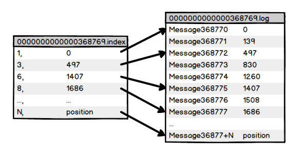

# Kafka的数据

## 消息传输

Kafka大量使用了pagecache，以提高消息的读写速度

现代Unix操作系统提供了一种数据从pagecache到socket的高度优化的编码路径，sendfile，数据从file到socket的传输路径：

1. 操作系统从硬盘(disk)读取数据到内核空间(kernel space)的页面缓存(pagecache)中
2. 应用将数据从内核空间(kernel space)读入到用户的空间缓存(user-space buffer)中
3. 应用将数据写回内核空间(kernel space)的套接字缓冲区(_(socket buffer)中
4. 操作系统从套接字缓冲区(socket buffer)复制数据到通过网络发送的NIC缓冲区(NIC buffer)


## 数据文件存储

Kafka中的消息是以topic分类的，生产者生产消息，消费者消费消息，都是面向topic的。

topic是逻辑上的概念，而partition是物理上的概念。

一个topic对应多个partition，一个partition对应一组log文件，该文件中存储的就是producer生产的数据，Producer生产的消息会不断追加到该log文件的末端，且每条数据都有自己的offset，消费者组中的消费者会实时记录消费到了哪个offset，以便出错恢复数据时，从上次的位置继续消费。

日志只能追加写，可以让写入的时候不影响日志的读，这也是Kafka实现高吞吐的方法。


### Partition

对于一个partition，里面有很多大小相等的segment数据文件，(这个文件的配置可以在`$KAFKA_HOME/conf/server.properties`中调整)，存储方式为 log 的形式。

分区的原因：
1. 方便在集群中扩展，每个 Partition 可以通过调整以适应它所在的机器，而一个 topic 又可以有多个 Partition 组成，因此整个集群就可以适应任意大小的数据了；
2. 可以提高并发，因为可以以 Partition 为单位读写了。

分区的规则：
1. 指明partition的情况下，直接将指明的值作为partition的值
2. 没有指明partition的情况，有key

KafkaProducer.java，Partitioner.java
```java
KafkaProducer.java

    KafkaProducer.send
    =>  doSend
    ==> int partition = partition(record, serializedKey, serializedValue, cluster);

    /**
     * computes partition for given record.
     * if the record has partition returns the value otherwise
     * calls configured partitioner class to compute the partition.
     */
    private int partition(ProducerRecord<K, V> record, byte[] serializedKey, byte[] serializedValue, Cluster cluster) {
        Integer partition = record.partition();
        // partition不为空直接返回 record.partition()
        // partition为空则调用partitioner的partition方法
        return partition != null ?
                partition :
                partitioner.partition(
                        record.topic(), record.key(), serializedKey, record.value(), serializedValue, cluster);
    }


Partitioner.java

    partitioner.partition
    => DefaultPartitioner.java

    /**
     * Compute the partition for the given record.
     *
     * @param topic The topic name
     * @param key The key to partition on (or null if no key)
     * @param keyBytes serialized key to partition on (or null if no key)
     * @param value The value to partition on or null
     * @param valueBytes serialized value to partition on or null
     * @param cluster The current cluster metadata
     */
    public int partition(String topic, Object key, byte[] keyBytes, Object value, byte[] valueBytes, Cluster cluster) {
        List<PartitionInfo> partitions = cluster.partitionsForTopic(topic);
        int numPartitions = partitions.size();
        if (keyBytes == null) {
            // partition和key都为空，取随机数，以后自增1
            int nextValue = nextValue(topic);
            List<PartitionInfo> availablePartitions = cluster.availablePartitionsForTopic(topic);
            if (availablePartitions.size() > 0) {
                int part = Utils.toPositive(nextValue) % availablePartitions.size();
                return availablePartitions.get(part).partition();
            } else {
                // no partitions are available, 
                // give a non-available partition
                return Utils.toPositive(nextValue) % numPartitions;
            }
        } else {
            // hash the keyBytes to choose a partition
            // key不为空，则根据key对numPartitions取余后取正数的值进行分区
            return Utils.toPositive(Utils.murmur2(keyBytes)) % numPartitions;
        }
    }
```


### Segment

#### LogSegment file
- 组成
  1. *.index，偏移量索引文件，上一个segment的最后一个消息的偏移量
  2. *.log，日志文件，保存了所有的消息
  3. *.timeindex，保存的是时间索引(0.10.0.1开始)，目前支持的时间戳为CreateTime 和 LogAppendTime： 
     - CreateTime表示 producer 创建这条消息的时间；
     - LogAppendTime表示 broker 接收到这条消息的时间(是 leader broker 将这条消息写入到 log 的时间)
  4. *.snaphot，快照文件
  5. *.deleted，被删除
  6. *.cleaned，日志清理临时文件
  7. *.swap，Log Compaction之后的临时文件
  8. leader-epoch-checkpoint，每一任leader开始写入消息时的offset，follower被选为leader时会根据这个确定哪些消息可用
- 命名规则
  1. partition的第一个segment从0开始，
  2. 后续每个segment文件名为上一个segment文件最后一条消息的offset
  3. offset的数值最大为64位(long类型)，20位数字字符长度，前面用0填充
  4. 文件名相同的集合称为一组LogSegment
  5. 每个partition单独维护一套offset

#### Segment File



Segment的索引文件中存储元数据，数据文件中存储消息，索引文件中的元数据只想数据文件中的消息的物理偏移位置。

segment index file 没有为数据文件中的每条 message 建立索引，而是采用稀疏索引的存储方式，每隔一定字节的数据建立一条索引，这样可以减小 索引文件，通过 map 可以直接进行内存操作， 稀疏索引为数据文件的每个对应 message 设置一个元数据指针， 这样比稠密索引 节省了存储空间，但是查找时需要消耗更多的时间，其实最后通过 *.index 文件中 position 无法直接定位到 没有建立索引 的 message， 而是需要通过顺序查找，再继续在 *.log 文件中继续往下查找。

例如8,1686，表示数据文件中第8条(全局partition表示第368777条消息)，以及该消息的物理偏移地址为1407。


#### 切分Segment条件

1. 日志大小：  
当前日志分段文件的大小超过了 broker 端参数 log.segment.bytes 配置的值。log.segment.bytes 参数的默认值为 1073741824，即 1GB。
2. 当前 activeSegment的寿命超过了配置的LogSegment最长存活时间。  
当前日志分段中消息的最大时间戳与当前系统的时间戳的差值大于 log.roll.ms 或 log.roll.hours 参数配置的值。如果同时配置了 log.roll.ms 和 log.roll.hours 参数，那么 log.roll.ms 的优先级高。默认情况下，只配置了 log.roll.hours 参数，其值为168，即 7 天。
3. 索引文件满了。  
偏移量索引文件或时间戳索引文件的大小达到 broker 端参数 log.index.size.max.bytes 配置的值。log.index.size.max.bytes 的默认值为 10485760，即 10MB。  
追加的消息的偏移量与当前日志分段的偏移量之间的差值大于 Integer.MAX_VALUE，即要追加的消息的偏移量不能转变为相对偏移量。

> 在偏移量索引文件中，每个索引项共占用8个字节，并分为两部分。相对偏移量和物理地址。
> 相对偏移量：表示消息相对与基准偏移量的偏移量，占4个字节
> 物理地址：消息在日志分段文件中对应的物理位置，也占4个字节
> 4个字节刚好对应 Integer.MAX_VALUE ，如果大于 Integer.MAX_VALUE ，则不能用4个字节进行表示了。

#### 切分Segment过程

索引文件会根据 log.index.size.max.bytes 值进行预先分配空间，即文件创建的时候就是最大值，当真正的进行索引文件切分的时候，才会将其裁剪到实际数据大小的文件。这一点是跟日志文件有所区别的地方。其意义降低了代码逻辑的复杂性。


### Record

log中写入的数据称为Record。以RecordBatch为单位写入，每个Batch中至少有一个Record。RecordBatch的数据结构：

#### RecordBatch:
```
baseOffset: int64(8byte)
batchLength: int32(4byte)
partitionLeaderEpoch: int32(4byte)
magic: int8 (current magic value is 2)(1byte)
crc: int32(4byte)
attributes: int16(2byte)
    bit 0~2:
        0: no compression
        1: gzip
        2: snappy
        3: lz4
        4: zstd
    bit 3: timestampType
    bit 4: isTransactional (0 means not transactional)
    bit 5: isControlBatch (0 means not a control batch)
    bit 6~15: unused
lastOffsetDelta: int32(4byte)
firstTimestamp: int64(8byte)
maxTimestamp: int64(8byte)
producerId: int64(8byte)
producerEpoch: int16(2byte)
baseSequence: int32(4byte)
records: [Record]
```

#### Record:
```
length: varint
attributes: int8(1byte)
    bit 0~7: unused
timestampDelta: varint
offsetDelta: varint
keyLength: varint
key: byte[]
valueLen: varint
value: byte[]
Headers => [Header]
```

#### Record Header:
```
headerKeyLength: varint
headerKey: String
headerValueLength: varint
Value: byte[]
```

#### 如图所示：


### 文件存储结构总结

- 将 topic 中一个 partition 大文件分割成多个小文件段，这样更容易定期清除和删除已经消费完的文件，减少磁盘占用。
- 通过索引可以快速定位到 message 和 确定 response 的最大大小。
- 通过 index 元数据全部映射到 memory，可以避免 segment file的 IO 磁盘操作。
- 通过索引文件稀疏存储，可以大幅降低 index 文件元数据占用空间大小。

## Writes

The log allows serial appends which always go to the last file. This file is rolled over to a fresh file when it reaches a configurable size (say 1GB). The log takes two configuration parameters: M, which gives the number of messages to write before forcing the OS to flush the file to disk, and S, which gives a number of seconds after which a flush is forced. This gives a durability guarantee of losing at most M messages or S seconds of data in the event of a system crash.

## Reads

Reads are done by giving the 64-bit logical offset of a message and an S-byte max chunk size. This will return an iterator over the messages contained in the S-byte buffer. S is intended to be larger than any single message, but in the event of an abnormally large message, the read can be retried multiple times, each time doubling the buffer size, until the message is read successfully. A maximum message and buffer size can be specified to make the server reject messages larger than some size, and to give a bound to the client on the maximum it needs to ever read to get a complete message. It is likely that the read buffer ends with a partial message, this is easily detected by the size delimiting.

The actual process of reading from an offset requires first locating the log segment file in which the data is stored, calculating the file-specific offset from the global offset value, and then reading from that file offset. The search is done as a simple binary search variation against an in-memory range maintained for each file.

The log provides the capability of getting the most recently written message to allow clients to start subscribing as of "right now". This is also useful in the case the consumer fails to consume its data within its SLA-specified number of days. In this case when the client attempts to consume a non-existent offset it is given an OutOfRangeException and can either reset itself or fail as appropriate to the use case.

The following is the format of the results sent to the consumer.

```
MessageSetSend (fetch result)
 
total length     : 4 bytes
error code       : 2 bytes
message 1        : x bytes
...
message n        : x bytes
```

```
MultiMessageSetSend (multiFetch result)
 
total length       : 4 bytes
error code         : 2 bytes
messageSetSend 1
...
messageSetSend n
```


## Deletes

Data is deleted one log segment at a time. The log manager allows pluggable delete policies to choose which files are eligible for deletion. The current policy deletes any log with a modification time of more than N days ago, though a policy which retained the last N GB could also be useful. To avoid locking reads while still allowing deletes that modify the segment list we use a copy-on-write style segment list implementation that provides consistent views to allow a binary search to proceed on an immutable static snapshot view of the log segments while deletes are progressing.


