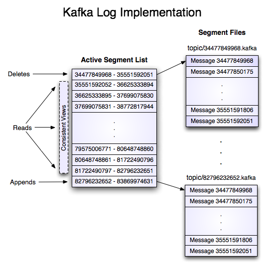

# Kafka的数据存储

## partition中的数据文件

对于一个partition，里面有很多大小相等的segment数据文件，(这个文件的配置可以在$KAFKA_HOME/conf/server.properties中调整)，存储方式为 log 的形式。

## Segment

**LogSegment file**：
- 组成
  1. *.index，偏移量索引文件，上一个segment的最后一个消息的偏移量
  2. *.log，日志文件，保存了所有的消息
  3. *.timeindex，保存的是时间索引
  4. *.snaphot，快照文件
  5. *.deleted，被删除
  6. *.cleaned，日志清理临时文件
  7. *.swap，Log Compaction之后的临时文件
  8. leader-epoch-checkpoint，每一任leader开始写入消息时的offset，follower被选为leader时会根据这个确定哪些消息可用
- 命名规则
  1. partition的第一个segment从0开始，
  2. 后续每个segment文件名为上一个segment文件最后一条消息的offset，
  3. offset的数值最大为64位(long类型)，20位数字字符长度，前面用0填充
  4. 文件名相同的集合称为一组LogSegment




**切分Segment条件**：

1. 日志大小：  
当前日志分段文件的大小超过了 broker 端参数 log.segment.bytes 配置的值。log.segment.bytes 参数的默认值为 1073741824，即 1GB。
2. 当前 activeSegment的寿命超过了配置的LogSegment最长存活时间。  
当前日志分段中消息的最大时间戳与当前系统的时间戳的差值大于 log.roll.ms 或 log.roll.hours 参数配置的值。如果同时配置了 log.roll.ms 和 log.roll.hours 参数，那么 log.roll.ms 的优先级高。默认情况下，只配置了 log.roll.hours 参数，其值为168，即 7 天。
3. 索引文件满了。  
偏移量索引文件或时间戳索引文件的大小达到 broker 端参数 log.index.size.max.bytes 配置的值。log.index.size.max.bytes 的默认值为 10485760，即 10MB。  
追加的消息的偏移量与当前日志分段的偏移量之间的差值大于 Integer.MAX_VALUE，即要追加的消息的偏移量不能转变为相对偏移量。

> 在偏移量索引文件中，每个索引项共占用8个字节，并分为两部分。相对偏移量和物理地址。
> 相对偏移量：表示消息相对与基准偏移量的偏移量，占4个字节
> 物理地址：消息在日志分段文件中对应的物理位置，也占4个字节
> 4个字节刚好对应 Integer.MAX_VALUE ，如果大于 Integer.MAX_VALUE ，则不能用4个字节进行表示了。

**切分Segment过程**：

索引文件会根据 log.index.size.max.bytes 值进行预先分配空间，即文件创建的时候就是最大值，当真正的进行索引文件切分的时候，才会将其裁剪到实际数据大小的文件。这一点是跟日志文件有所区别的地方。其意义降低了代码逻辑的复杂性。


## Record

log中写入的数据称为Record。以RecordBatch为单位写入，每个Batch中至少有一个Record。RecordBatch的数据结构：

#### RecordBatch:
```
baseOffset: int64
batchLength: int32
partitionLeaderEpoch: int32
magic: int8 (current magic value is 2)
crc: int32
attributes: int16
    bit 0~2:
        0: no compression
        1: gzip
        2: snappy
        3: lz4
        4: zstd
    bit 3: timestampType
    bit 4: isTransactional (0 means not transactional)
    bit 5: isControlBatch (0 means not a control batch)
    bit 6~15: unused
lastOffsetDelta: int32
firstTimestamp: int64
maxTimestamp: int64
producerId: int64
producerEpoch: int16
baseSequence: int32
records: [Record]
```

#### Record:
```
length: varint
attributes: int8
    bit 0~7: unused
timestampDelta: varint
offsetDelta: varint
keyLength: varint
key: byte[]
valueLen: varint
value: byte[]
Headers => [Header]
```

#### Record Header:
```
headerKeyLength: varint
headerKey: String
headerValueLength: varint
Value: byte[]
```

#### 如图所示：


