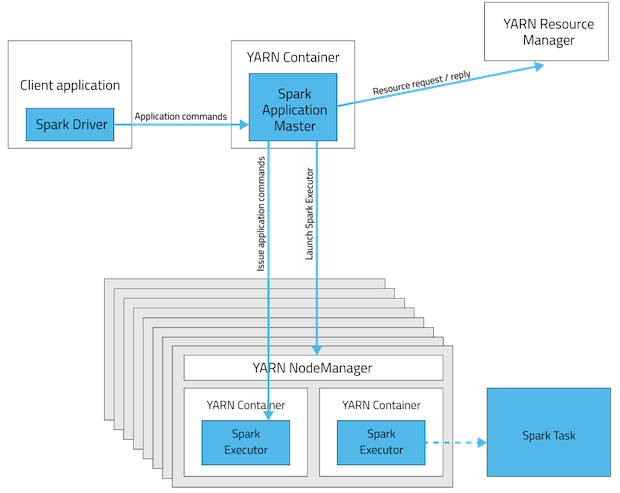

# Spark on Yarn

Spark on Yarn 任务提交

## Spark on Yarn 两种模式

### Cluster 模式


### Client 模式




## Spark on Yarn 的启动


## spark Job 生成提交流程

### 客户端操作

- **1**、 根据yarnConf来初始化yarnClient，并启动yarnClient；
- **2**、 创建客户端Application，并获取Application的ID，进一步判断集群中的资源是否满足executor和ApplicationMaster申请的资源，如果不满足则抛出IllegalArgumentException
- **3**、 设置资源、环境变量：其中包括了设置Application的Staging目录、准备本地资源（jar文件、log4j.properties）、设置Application其中的环境变量、创建Container启动的Context等；
- **4**、 设置Application提交的Context，包括设置应用的名字、队列、AM的申请的Container、标记该作业的类型为Spark；
- **5**、 申请Memory，并最终通过yarnClient.submitApplication向ResourceManager提交该Application。

当作业提交到YARN上之后，客户端就没事了，甚至在终端关掉那个进程也没事，因为整个作业运行在YARN集群上进行，运行的结果将会保存到HDFS或者日志中。

```scala
java SparkSubmit

// JVM
- Process(SparkSubmit)

// 启动进程
- main

    - SparkSubmitArguments

    // 提交
    - SUBMIT  ->  submit()

        // 准备环境
        - prepareSubmitEnvironment

            - childMainClass = "org.apache.spark.deploy.yarn.Client"
            - childMainClass = args.mainClass
        - doRunMain  ->  runMain

            // 反射加载类
            - Utils.ClassForName(childMainClass)
            // 查找main方法
            - mainClass.getMethod("main", new Array[String](0).getClass)
            // 调用main方法
            - mainMethod.invoke


2 Client

- main

    - new ClientArguments

    - new Client

        - yarnClient = YarnClient.createYarnClient

    - client.run

        // 获取Application的ID
        // 判断资源是否满足executor和Application Master申请的资源，不满足则抛出异常
        - appId = submitApplication

        // 封装指令
        // command = bin/java org.apache.spark.deploy.yarn.ApplicationMaster
        // (command = bin/java org.apache.spark.deploy.yarn.ExecutorLauncher  client)
        - createContainerLaunchContext
        - createApplicationSubmissionContext

        // 向Yarn的ResourceManager提交应用，提交指令
        // appContext中包含了应用的名字，队列，AM申请的Container，作业类型等信息
        - yarnClient.submitApplication(appContext)
```

### 提交到YARN集群，YARN操作

- **1**、 运行ApplicationMaster的run方法；
- **2**、 设置好相关的环境变量。
- **3**、 创建amClient，并启动；
- **4**、 在Spark UI启动之前设置Spark UI的AmIpFilter；
- **5**、 在startUserClass函数专门启动了一个线程（名称为Driver的线程）来启动用户提交的Application，也就是启动了Driver。在Driver中将会初始化SparkContext；
- **6**、 等待SparkContext初始化完成，最多等待spark.yarn.applicationMaster.waitTries次数（默认为10），如果等待了的次数超过了配置的，程序将会退出；否则用SparkContext初始化yarnAllocator；
- **7**、 当SparkContext、Driver初始化完成的时候，通过amClient向ResourceManager注册ApplicationMaster;
- **8**、 分配并启动Executeors。在启动Executeors之前，先要通过yarnAllocator获取到numExecutors个Container，然后在Container中启动Executeors。 如果在启动Executeors的过程中失败的次数达到了maxNumExecutorFailures的次数，maxNumExecutorFailures的计算规则如下：
```scala
// Default to numExecutors * 2, with minimum of 3
private val maxNumExecutorFailures = sparkConf.getInt("spark.yarn.max.executor.failures",
    sparkConf.getInt("spark.yarn.max.worker.failures", math.max(args.numExecutors * 2, 3)))
```
- 那么这个Application将失败，将Application Status标明为FAILED，并将关闭SparkContext。其实，启动Executeors是通过ExecutorRunnable实现的，而ExecutorRunnable内部是启动CoarseGrainedExecutorBackend的。
- **9**、 最后，Task将在CoarseGrainedExecutorBackend里面运行，然后运行状况会通过Akka通知CoarseGrainedScheduler，直到作业运行完成。


```scala
3 ApplicationMaster

// 启动进程
- main

    - new ApplicationMasterArguments(args)

    // 创建应用管理器
    - new ApplicationMaster(amArgs, new YarnRMClient)

    // 运行
    - runDriver

        // 启动用户指定的spark应用
        - startUserApplication

            // 获取用户应用的main方法
            - userClassLoader.loadClass(args.userClass).getMethod("main", classOf[Array[String]])

            // 启动Driver线程，执行用户类的main方法
            - val userThread = new Thread
            - userThread.setContextClassLoader(userClassLoader)
            - userThread.setName("Driver")
            - userThread.start()

        // 注册ApplicationMaster
        - registerAM

            // 获取Yarn资源
            // client: YarnRMClient
            - client.register

            // 分配Yarn资源
            - allocator.allocateResources()

                // 处理可分配资源
                - handleAllocatedContainers(allocatedContainers.asScala)

                    // 运行可分配的Container
                    - runAllocatedContainers(containersToUse)

                        - new ExecutorRunnable().run

                            - startContainer

                                // 封装指令
                                // command = bin/java org.apache.spark.executor.CoarseGrainedExecutorBackend
                                - perpareCommand
```

```scala
4 CoarseGrainedExecutorBackend

// RpcEndpint
/*
 * The life-cycle of an endpoint is:
 *
 * constructor -> onStart -> receive* -> onStop
 */

    - onStart
        // ExecutorBackend向ApplicationMaster反向注册
        - ref.ask[Boolean](RegisterExecutor(executorId, self, hostname, cores, extractLogUrls))

    - receive

        // 注册Executor
        - case RegisteredExecutor
            - new Executor(executorId, hostname, env, userClassPath, isLocal = false)

        // 运行任务
        - case LaunchTask(data)
            - executor.launchTask(this, taskDesc)

// 启动进程
- main

    - run

        env.rpcEnv.setupEndpoint("Executor", new CoarseGrainedExecutorBackend(env.rpcEnv, driverUrl, executorId, hostname, cores, userClassPath, env))

        dispatcher.registerRpcEndpoint(name, endpoint)

// Executor的后台进程
=> CoarseGrainedExecutorBackend
    // 注册
    -> ref.ask[Boolean](RegisterExecutor(executorId, self, hostname, cores, extractLogUrls))
// Scheduler的后台进程
=> CoarseGrainedSchedulerBackend(SparkContext)
    -> addressToExecutorId(executorAddress) = executorId
    -> totalCoreCount.addAndGet(Executor.cores)
    -> totalRegisteredExecutors.addAndGet(1)
    -> executorRef.send(RegisteredExecutor)
    -> executorDataMap.put(executorId, data)
// ExecutorBackend进程 新建 Executor对象
=> CoarseGrainedExecutorBackend
    -> executor = new Executor(executorId, hostname, env, userClassPath, isLocal = false)

```

## spark Job 执行流程

执行action算子，最终都是调用了`RDD.SparkContext.runJob`

```scala
1 SparkContext

- runJob

    - dagScheduler.runJob(rdd, cleanedFunc, partitions, callSite, resultHandler, localProperties.get)
```

## DAG任务流程

### DAG任务 划分Stage，

```scala
2 DAGScheduler

- runJob

    - submitJob

        // 提交 JobSubmitted
        // 此处最终为 BlockingQueue(阻塞队列) 的 put(提交)
        - eventProcessLoop.post(JobSubmitted(jobId, rdd, func2, partitions.toArray, callSite, waiter, SerializationUtils.clone(properties)))

        // 提交后 EventLoop 执行 run() -> onReceive -> EventLoop 的实现类 DAGSchedulerEventProcessLoop 的onReceive
        => onReceive(eventQueue.take())

        - case JobSubmitted => dagScheduler.handleJobSubmitted

            -> finalStage = createResultStage

                -> val parents = getOrCreateParentStages(rdd, jobId)

                    -> getShuffleDependencies(rdd)

                        // 遍历 rdd 的所有依赖，遇到ShuffleDependecy则放入parents: HashSet[ShuffleDependency]中最后一起返回
                        -> waitingForVisit.push(rdd)
                        -> waitingForVistit .pop -> toVisit
                            toVisit.dependencies.foreach {
                            case shuffleDep: ShuffleDependency[_, _, _] => parents += shuffleDep
                            case dependency => waitingForVisit.push(dependency.rdd)
                            }

                    -> getOrCreateShuffleMapStage(shuffleDep, firstJobId)

                        -> shuffleIdToMapStage.get

                        // 逻辑同getShuffleDependencies 最终返回 ancestors: Stack[ShuffleDependency]
                        -> None => getMissingAncestorShuffleDependencies

                        -> 

                -> val stage = new ResultStage(id, rdd, func, partitions, parents, jobId, callSite)
            
            // Job 里包含了 Stage (finalStage) ，finalStage中包含了 parents: List[Stage]
            -> val job = new ActiveJob(jobId, finalStage, callSite, listener, properties)

            // 设置 Job 到 fianlStage: ResultStage 中
            -> finalStage.setActiveJob(job)

            -> submitStage(finalStage)
```

### DAG任务 提交Stage

生成Task
```scala
2 DAGScheduler

//提交任务
-> submitStage(finalStage)

    // 获取 stage里的rdd，遍历rdd.dependecies，获取其中的ShuffleDependecy，放入missing中并返回
    -> val missing = getMissingParentStages(stage).sortBy(_.id)

    // 如果 missing 为空，则提交任务，
    // 否则递归调用 submitStage(missing.parent)
    // 先提交最底依赖的父Stage，然后子Stage提交
    -> submitMissingTasks(stage, jobId.get)

        // 每个partitions创建一个Task
        -> val tasks: Seq[Task[_]] = stage match {
            case stage: ShuffleMapStage => partitionsToCompute.map(new ShuffleMapTask)
            case stage: ResultStage => partitionsToCompute.map(new ResultTask)
           }
        
        // 把前面创建的tasks创建为TaskSet
        // 如果DAGScheduler中的`!tasks.size>0`，submitWaitingChildStages(stage)
        -> taskScheduler.submitTasks(new TaskSet(tasks, ...))
            
            // TaskScheDuler发送提交Task的唤醒提交的请求
            -> CoarseGrainedSchedulerBackend.reviveOffers
```

Driver发送Task给Executor，Executor启动Task
```scala
3 CoarseGrainedSchedulerBackend

-> reviveOffers

    // 给Driver终端发送ReviveOffers
    -> driverEndpoint.send(ReviveOffers)

        -> makeOffers()

            -> launchTasks(taskDescs)

                // task的 HashMap 序列化发送给Executor
                -> executorDataMap(task.executorId).executorEndpoint.send(LaunchTask(new SerializableBuffer(serializedTask)))

4 CoarseGrainedExecutorBackend

- LaunchTask

    // 接收到的task(data.value)反编码成TaskDescription
    // 启动Task
    -> executor.launchTask(this, TaskDescription.decode(data.value))

```

Spark 任务执行优化请看 [Tune Spark Job](./tuning-spark-job.md)

以上，Spark On Yarn的 Cluter模式的调度。
