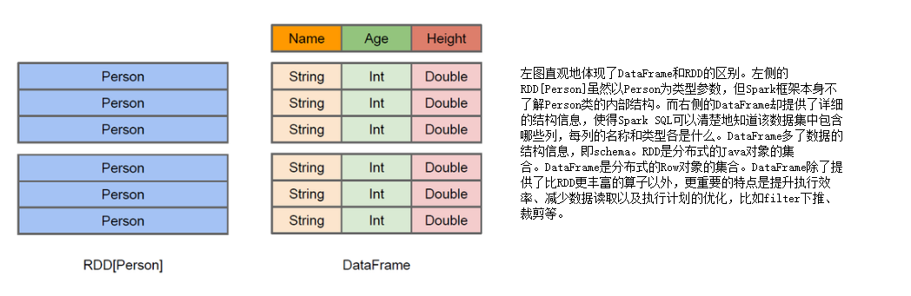
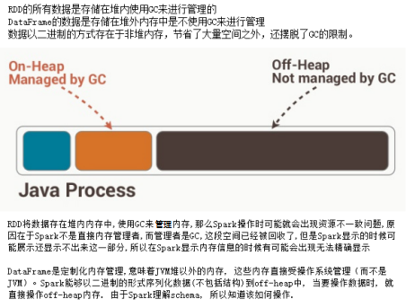
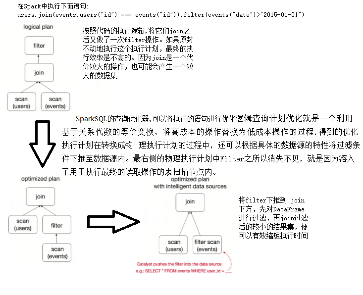

# Spark SQL

## 概念

处理结构化数据的模块，DataFrame和DataSet

#### RDD vs DataFrames vs DataSet

首先从版本的产生上来看
RDD (Spark1.0) —> Dataframe(Spark1.3) —> Dataset(Spark1.6)

##### RDD

RDD是一个懒执行的不可变的可以支持Functional(函数式编程)的并行数据集合。

RDD的最大好处就是简单，API的人性化程度很高。

RDD的劣势是性能限制，它是一个JVM驻内存对象，这也就决定了存在GC的限制和数据增加时Java序列化成本的升高。

##### DataFrame

简单来说DataFrame是RDD+Schema的集合

与RDD类似，DataFrame也是一个分布式数据容器。然而DataFrame更像传统数据库的二维表格，除了数据以外，还记录数据的结构信息，即schema。同时，与Hive类似，DataFrame也支持嵌套数据类型（struct、array和map）。



DataFrame是为数据提供了Schema的视图。可以把它当做数据库中的一张表来对待

DataFrame也是懒执行的。

性能上比RDD要高，主要有两方面原因： 

###### 定制化内存管理



###### 优化的执行计划



Dataframe的劣势在于在编译期缺少类型安全检查，导致运行时出错.

ps:DataFrame只是知道字段，但是不知道字段的类型，所以在执行这些操作的时候是没办法在编译的时候检查是否类型失败的，比如你可以对一个String进行减法操作，在执行的时候才报错，而DataSet不仅仅知道字段，而且知道字段类型，所以有更严格的错误检查

##### Dataset

是Dataframe API的一个扩展，是Spark最新的数据抽象

用户友好的API风格，既具有类型安全检查也具有Dataframe的查询优化特性。

Dataset支持编解码器，当需要访问非堆上的数据时可以避免反序列化整个对象，提高了效率。

样例类被用来在Dataset中定义数据的结构信息，样例类中每个属性的名称直接映射到DataSet中的字段名称。

Dataframe是Dataset的特列，DataFrame=Dataset\[Row\] ，所以可以通过as方法将Dataframe转换为Dataset。Row是一个类型，跟Car、Person这些的类型一样，所有的表结构信息我们都用Row来表示。

DataSet是强类型的。比如可以有Dataset\[Car\]，Dataset\[Person\].

ps:DataSet\[Row\]这个类似于我们学习的泛型Row就是泛型类型

#### 三者的共性

1. RDD、DataFrame、Dataset全都是spark平台下的分布式弹性数据集，为处理超大型数据提供便利
2. 三者都有惰性机制，在进行创建、转换，如map方法时，不会立即执行，只有在遇到Action如foreach时，三者才会开始遍历运算，极端情况下，如果代码里面有创建、转换，但是后面没有在Action中使用对应的结果，在执行时会被直接跳过.
3. 三者都会根据spark的内存情况自动缓存运算，这样即使数据量很大，也不用担心会内存溢出
4. 三者都有partition的概念
5. 三者有许多共同的函数，如filter，排序等
6. 在对DataFrame和Dataset进行操作许多操作都需要这个包进行支持
7. DataFrame和Dataset均可使用模式匹配获取各个字段的值和类型

#### 三者的区别

##### RDD

1. RDD一般和spark mlib同时使用
2. RDD不支持sparksql操作

##### DataFrame

1. 与RDD和Dataset不同，DataFrame每一行的类型固定为Row，只有通过解析才能获取各个字段的值每一列的值没法直接访问
2. DataFrame与Dataset一般不与spark mlib同时使用
3. DataFrame与Dataset均支持sparksql的操作，比如select，groupby之类，还能注册临时表/视窗，进行sql语句操作
4. DataFrame与Dataset支持一些特别方便的保存方式，比如保存成csv，可以带上表头，这样每一列的字段名一目了然
5. 利用这样的保存方式，可以方便的获得字段名和列的对应，而且分隔符（delimiter）可以自由指定。

##### Dataset

1. Dataset和DataFrame拥有完全相同的成员函数，区别只是每一行的数据类型不同。
2. DataFrame也可以叫Dataset[Row],每一行的类型是Row，不解析，每一行究竟有哪些字段，各个字段又是什么类型都无从得知，只能用上面提到的getAS方法或者共性中的第七条提到的模式匹配拿出特定字段
3. Dataset中，每一行是什么类型是不一定的，在自定义了case class之后可以很自由的获得每一行的信息
4. Dataset在需要访问列中的某个字段时是非常方便的，然而，如果要写一些适配性很强的函数时，如果使用Dataset，行的类型又不确定，可能是各种case class，无法实现适配，这时候用DataFrame即Dataset[Row]就能比较好的解决问题


## 转换

##### RDD转DataFrame

1. 直接转换即使用元组的模式存储在转换
2. 使用样例类的模式匹配Scheam在转换
3. StructType直接指定Schema在转换

##### RDD转DataSet

使用样例类的模式匹配Scheam再转换

ps:其余读取文件的方式可以直接获取对应的DataFrame

##### DataSet和DataFrame之间的互相转换

###### DataSet转换DataFrame

调用toDF方法,直接用case class中定义的属性

###### DataFrame转换DataSet

调用as[对应样例类类名]

###### DataSet和DataFrame转换为RDD

DataSet对象或DataFrame对象调用rdd方法就可以转换为rdd


## UDF和UDAF

```scala
sparkSession.udf.register("myUDF",(str: String) => "str:" + str)
```

```scala
abstract class UserDefinedAggregateFunction extends Serializable

  /**
   * A `StructType` represents data types of input arguments of this aggregate function.
   * For example, if a [[UserDefinedAggregateFunction]] expects two input arguments
   * with type of `DoubleType` and `LongType`, the returned `StructType` will look like
   *
   * ```
   *   new StructType()
   *    .add("doubleInput", DoubleType)
   *    .add("longInput", LongType)
   * ```
   *
   * The name of a field of this `StructType` is only used to identify the corresponding
   * input argument. Users can choose names to identify the input arguments.
   *
   * @since 1.5.0
   */
  def inputSchema: StructType

  /**
   * A `StructType` represents data types of values in the aggregation buffer.
   * For example, if a [[UserDefinedAggregateFunction]]'s buffer has two values
   * (i.e. two intermediate values) with type of `DoubleType` and `LongType`,
   * the returned `StructType` will look like
   *
   * ```
   *   new StructType()
   *    .add("doubleInput", DoubleType)
   *    .add("longInput", LongType)
   * ```
   *
   * The name of a field of this `StructType` is only used to identify the corresponding
   * buffer value. Users can choose names to identify the input arguments.
   *
   * @since 1.5.0
   */
  def bufferSchema: StructType

  /**
   * The `DataType` of the returned value of this [[UserDefinedAggregateFunction]].
   *
   * @since 1.5.0
   */
  def dataType: DataType

  /**
   * Returns true iff this function is deterministic, i.e. given the same input,
   * always return the same output.
   *
   * @since 1.5.0
   */
  def deterministic: Boolean

  /**
   * Initializes the given aggregation buffer, i.e. the zero value of the aggregation buffer.
   *
   * The contract should be that applying the merge function on two initial buffers should just
   * return the initial buffer itself, i.e.
   * `merge(initialBuffer, initialBuffer)` should equal `initialBuffer`.
   *
   * @since 1.5.0
   */
  def initialize(buffer: MutableAggregationBuffer): Unit

  /**
   * Updates the given aggregation buffer `buffer` with new input data from `input`.
   *
   * This is called once per input row.
   *
   * @since 1.5.0
   */
  def update(buffer: MutableAggregationBuffer, input: Row): Unit

  /**
   * Merges two aggregation buffers and stores the updated buffer values back to `buffer1`.
   *
   * This is called when we merge two partially aggregated data together.
   *
   * @since 1.5.0
   */
  def merge(buffer1: MutableAggregationBuffer, buffer2: Row): Unit

  /**
   * Calculates the final result of this [[UserDefinedAggregateFunction]] based on the given
   * aggregation buffer.
   *
   * @since 1.5.0
   */
  def evaluate(buffer: Row): Any
```

强类型聚合函数

```scala
abstract class Aggregator[-IN, BUF, OUT] extends Serializable

  /**
   * A zero value for this aggregation. Should satisfy the property that any b + zero = b.
   * @since 1.6.0
   */
  def zero: BUF

  /**
   * Combine two values to produce a new value.  For performance, the function may modify `b` and
   * return it instead of constructing new object for b.
   * @since 1.6.0
   */
  def reduce(b: BUF, a: IN): BUF

  /**
   * Merge two intermediate values.
   * @since 1.6.0
   */
  def merge(b1: BUF, b2: BUF): BUF

  /**
   * Transform the output of the reduction.
   * @since 1.6.0
   */
  def finish(reduction: BUF): OUT

  /**
   * Specifies the `Encoder` for the intermediate value type.
   * @since 2.0.0
   */
  def bufferEncoder: Encoder[BUF]

  /**
   * Specifies the `Encoder` for the final ouput value type.
   * @since 2.0.0
   */
  def outputEncoder: Encoder[OUT]
```

## 开窗函数

```
over() 开窗函数：
       在使用聚合函数后，会将多行变成一行，而开窗函数是将一行变成多行；
       并且在使用聚合函数后，如果要显示其他的列必须将列加入到group by中，
       而使用开窗函数后，可以不使用group by，直接将所有信息显示出来。
        开窗函数适用于在每一行的最后一列添加聚合函数的结果。

常用开窗函数：
  1.为每条数据显示聚合信息.(聚合函数() over())
  2.为每条数据提供分组的聚合函数结果(聚合函数() over(partition by 字段) as 别名) 
        --按照字段分组，分组后进行计算
  3.与排名函数一起使用(row number() over(order by 字段) as 别名)

常用分析函数：
  1、row_number() over(partition by ... order by ...)
  2、rank() over(partition by ... order by ...)
  3、dense_rank() over(partition by ... order by ...)
  4、count() over(partition by ... order by ...)
  5、max() over(partition by ... order by ...)
  6、min() over(partition by ... order by ...)
  7、sum() over(partition by ... order by ...)
  8、avg() over(partition by ... order by ...)
  9、first_value() over(partition by ... order by ...)
  10、last_value() over(partition by ... order by ...)
  11、lag() over(partition by ... order by ...)
  12、lead() over(partition by ... order by ...)

lag 和lead 可以 获取结果集中，按一定排序所排列的当前行的上下相邻若干offset 的某个行的某个列(不用结果集的自关联）；
lag ，lead 分别是向前，向后；
lag 和lead 有三个参数，第一个参数是列名，第二个参数是偏移的offset，第三个参数是 超出记录窗口时的默认值

row_number() 行号，1 2 3 4 5 ...
rank() 跳跃排序，1 2 2 4 5 ...
dense_rank() 连续排序，1 2 2 3 4 ...
```
