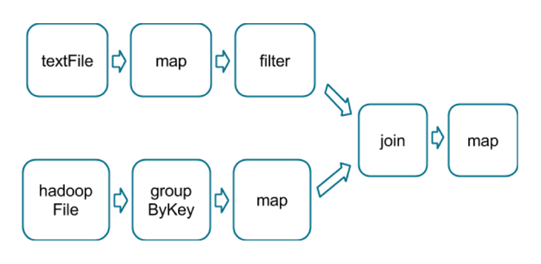
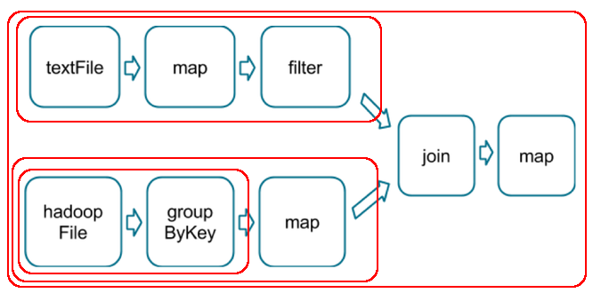
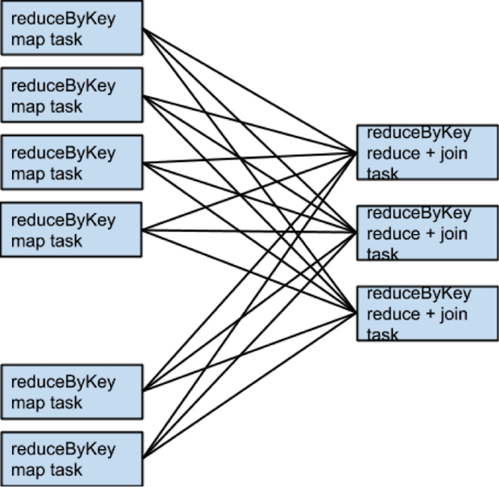
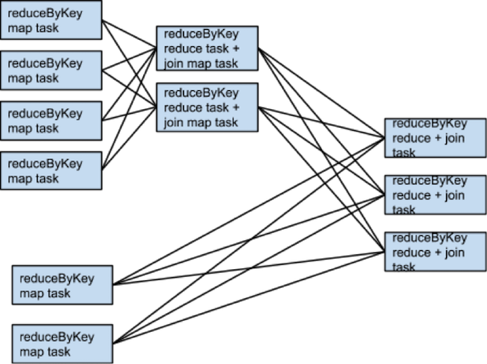
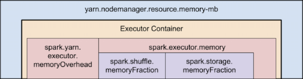

# Tune Spark Job

> 本文来源于 Cloudera Blog  
> 
> https://blog.cloudera.com/how-to-tune-your-apache-spark-jobs-part-1/
> 
> https://blog.cloudera.com/how-to-tune-your-apache-spark-jobs-part-2/
> 
> 并加入自己的修正。

## How Spark Executes Your Program

详情见[Spark Job exec](./spark-on-yarn#spark-job-zhi-hang-liu-cheng)

一个Spark应用包括一个driver进程和若干个分布在集群的各个节点上的executor进程。

driver主要负责调度一些高层次的任务流（flow of work）。exectuor负责执行这些任务，这些任务以task的形式存在， 同时存储用户设置需要caching的数据。 task和所有的executor的生命周期为程序的整个运行过程（如果使用了dynamic resource allocation时可能不是这样的）。一个executor可以运行多个任务，任务的运行是并行的。如何调度这些进程是通过集群管理框架完成的（比如YARN，Mesos，Spark Standalone），任何一个Spark程序都会包含一个driver和多个executor进程。


如上图，在执行层次结构的最上方是一系列Job。调用一个Spark内部的action会产生一个Spark job来完成它。为了确定这些job的实际内容，Spark检查RDD的DAG再计算出执行plan。这个plan以最远端的RDD为起点（最远端指的是对外没有依赖的RDD或者数据已经缓存下来的 RDD），以产生结果RDD的action为结束 。

执行的plan由一系列stage组成，stage是job的transformation的组合，stage 对应于一系列 task， task 指的对于不同的数据集执行的相同代码。每个stage包含不需要shuffle所有数据的transformation的序列。

什么决定数据是否需要shuffle呢？RDD包含固定数目的 partition， 每个 partiton 包含若干的 record。对于那些通过 narrow tansformation（窄依赖，比如 map 和 filter）返回的RDD，一个 partition 中的 record 只需要从父RDD 对应的 partition 中的 record 计算得到。每个对象只依赖于父 RDD 的一个对象。有些操作（比如 coalesce）可能导致一个 task 处理多个输入partition ，但是这种transformation 仍然被认为是窄的，因为用于计算的多个输入 record 始终是来自有限个数的 partition。

然而Spark也支持宽依赖的 transformation，比如 groupByKey，reduceByKey。在这种依赖中，计算得到一个 partition 中的数据需要从父 RDD 中的多个 partition 中读取数据。所有拥有相同 key 的元组最终会被聚合到同一个 partition 中，被同一个 stage 处理。为了完成这种操作， Spark需要对数据进行 shuffle，意味着数据需要在集群内传递，最终生成由新的partition 集合组成的新的 stage。

在下面的代码中，只有一个 action 以及一系列处理文本的 transformation， 这些代码就只有一个 stage，因为没有哪个操作需要从不同的 partition 里面读取数据。

```scala
sc.textFile("someFile.txt").
  map(mapFunc).
  flatMap(flatMapFunc).
  filter(filterFunc).
  count
```

跟上面的代码不同，下面一段代码需要统计总共出现超过1000次的字母。

```scala
val tokenized = sc.textFile("someFile.txt").flatMap(_.split('\\s+'))
val wordCounts = tokenized.map((_, 1)).reduceByKey(_ + _)
val filtered = wordCounts.filter(_._2 >= 1000)
val charCounts = filtered.flatMap(_._1.toCharArray).map((_, 1)).
  reduceByKey(_ + _)
charCounts.collect
```

这段代码可以分成三个stage。recudeByKey 操作是各 stage 之间的分界，因为计算 recudeByKey 的输出需要按照可以重新分配 partition。

这里还有一个更加复杂的 transfromation 图，包含一个有多路依赖的 join transformation。



红色的框框展示了运行时使用的 stage 图。



运行到每个 stage 的边界时，数据在父 stage 中通过 task 写到磁盘上，而在子 stage 中经过网络通过 task去读取数据。这些操作会导致很重的网络以及磁盘的I/O，所以 stage 的边界是非常占资源的，在编写 Spark 程序的时候需要尽量避免的。父 stage 中 partition 个数与子 stage 的 partition 个数可能不同，所以那些产生 stage 边界的 transformation 常常需要接受一个numPartition 的参数来决定子 stage 中的数据将被切分为多少个 partition。

正如在调试 MapReduce 是选择 reducor 的个数是一项非常重要的参数，调整在 stage 边界时的 partition 个数经常可以很大程度上影响程序的执行效率。我们会在后面的章节中讨论如何调整这些值。

## Picking the Right Operators

当需要使用 Spark 完成某项功能时，程序员需要从不同的 action和transformation中选择不同的方案以获得相同的结果。但是不同的方案，最后执行的效率可能有云泥之别。避免常见的陷阱,选择正确的方案可以使得最后的表现有巨大的不同。一些规则和深入的理解可以帮助你做出更好的选择。

选择 Operator 方案的主要目标是减少 shuffle 的次数以及被 shuffle 的文件的大小。因为 shuffle 是最耗资源的操作，所有 shuffle 的数据都需要写到磁盘并且通过网络传递。repartition，join，cogroup，以及任何 \*By 或者 \*ByKey 的 transformation 都需要 shuffle 数据。这些 Operator 不是所有都是平等的，但是有些常见的性能陷阱是需要注意的。

### Avoid GroupByKey when performing an associative reductive operation

**当进行联合规约操作时，避免使用 groupByKey。** 举个例子，rdd.groupByKey().mapValues(\_.sum) 与 rdd.reduceByKey(\_ + \_) 执行的结果是一样的，但是前者需要把全部的数据通过网络传递一遍，而后者只需要根据每个 key 局部的 partition 累积结果，在 shuffle 的之后把局部的累积值相加后得到结果。

```scala
val words = Array("one", "two", "two", "three", "three", "three")
val wordPairsRDD = sc.parallelize(words).map(word => (word, 1))
//group
val wordCountsWithGroup = wordPairsRDD
  .groupByKey()
  .map(t => (t._1, t._2.sum))
  .collect
//reduce
val wordCountsWithReduce = wordPairsRDD
  .reduceByKey(_ + _)
  .collect
```

虽然两个函数都能得出正确的结果，reduceByKey 更适合使用在大数据集上。 这是因为 Spark 知道它可以在每个分区shuffle数据之前，聚合key值相同的数据。

借助下图可以理解在 reduceByKey 里发生了什么。 注意在数据对被shuffle前同一机器上同样 key的数据是怎样被组合的(reduceByKey 中的 lamdba 函数)。然后 lamdba 函数在每个区上被再次调用来将所有值 reduce 成一个最终结果。


但是，当调用 groupByKey 时，所有的键值对(key-value pair) 都会被shuffle。在网络上传输这些数据非常没有必要。

为了确定将数据对shuffle到哪台主机，Spark 会对数据对的 key 调用一个分区函数。 当shuffle的数据量大于单台执行机器内存总量时，Spark 会把数据保存到磁盘上。 不过在保存时每次只会处理一个 key 的数据，所以当单个 key 的键值对超过内存容量会存在内存溢出的可能。 我们应避免将数据保存到磁盘上，这会严重影响性能。


你可以想象一个非常大的数据集，在使用 reduceByKey 和 groupByKey 时他们的差别会被放大更多倍。

以下函数应该优先于 groupByKey ：

- combineByKey 组合数据，但是组合之后的数据类型与输入时值的类型不一样。
- foldByKey 合并每一个 key 的所有值，在级联函数和“零值”中使用。

### Avoid reduceByKey When the input and output value types are different

- **当输入和输出的类型不一致时，避免使用 reduceByKey。** 举个例子，我们需要实现为每一个key查找所有不相同的 string。一个方法是利用map 把每个元素的转换成一个 Set，再使用 reduceByKey 将这些 Set 合并起来
```scala
rdd.map(kv => (kv._1, new Set[String]() + kv._2))
    .reduceByKey(_ ++ _)
```
这段代码生成了无数的非必须的对象，因为需要为每个 record 新建一个Set。这里使用 aggregateByKey 更加适合，因为这个操作是在 map 阶段做聚合。
```scala
val zero = new collection.mutable.Set[String]()
rdd.aggregateByKey(zero)(
    (set, v) => set += v,
    (set1, set2) => set1 ++= set2)
```

### Avoid the flatMap-join-groupBy pattern

**避免 flatMap-join-groupBy 的模式。** 当有两个已经按照key分组的数据集，你希望将两个数据集合并，并且保持分组，这种情况可以使用 cogroup。这样可以避免对group进行装箱拆箱的开销。

## When Shuffles Don’t Happen

当然了解在哪些 transformation 上不会发生 shuffle 也是非常重要的。当前一个 transformation 已经用相同的 patitioner 把数据分区了，Spark知道如何避免 shuffle。参考以下代码：

```scala
rdd1 = someRdd.reduceByKey(...)
rdd2 = someOtherRdd.reduceByKey(...)
rdd3 = rdd1.join(rdd2)
```

因为没有 partitioner 传递给 reduceByKey，所以系统使用默认的 partitioner，所以 rdd1 和 rdd2 都会使用 hash 进行分区。代码中的两个 reduceByKey 会发生两次 shuffle 。如果 RDD 包含相同个数的 partition， join 的时候将不会发生额外的 shuffle。因为这里的 RDD 使用相同的 hash 方式进行 partition，所以全部 RDD 中同一个 partition 中的 key的集合都是相同的。因此，rdd3中一个 partiton 的输出只依赖rdd2和rdd1的同一个对应的 partition，所以第三次 shuffle 是不必要的。

举个例子说，当 someRdd 有4个 partition， someOtherRdd 有两个 partition，两个 reduceByKey 都使用3个 partiton，所有的 task 会按照如下的方式执行：



如果 rdd1 和 rdd2 在 reduceByKey 时使用不同的 partitioner 或者使用默认的 partitioner, 但是 partition 的个数不同，那么在join时只用一个 RDD (partiton 数更少的那个)需要重新 shuffle。

相同的 tansformation，相同的输入，不同的 partition 个数的情况：



当两个数据集需要 join 时，避免 shuffle 的一个方法是使用 broadcast variables。如果一个数据集小到能够塞进一个 executor 的内存中，那么它就可以在 driver 中写入到一个 hash table中，然后 broadcast 到所有的 executor 中。然后 map transformation 可以引用这个 hash table 作查询。

## When More Shuffles are Better

尽可能减少 shuffle 的准则也有例外的场合。如果额外的 shuffle 能够增加并发那么这也能够提高性能。比如当你的数据保存在几个没有切分过的大文件中时，那么使用 InputFormat 产生分 partition 可能会导致每个 partiton 中聚集了大量的 record，如果 partition 不够，导致没有启动足够的并发。在这种情况下，我们需要在数据载入之后使用repartiton（会导致shuffle)提高 partiton 的个数，这样能够充分使用集群的CPU。

另外一种例外情况是在使用 recude 或者 aggregate action 聚集数据到 driver 时，如果把 partititon 个数很多的数据进行聚合时，单进程执行的 driver merge 所有 partition 的输出时很容易成为计算的瓶颈。为了缓解 driver 的计算压力，可以使用 reduceByKey 或者 aggregateByKey 执行分布式的 aggregate 操作把数据分布到更少的 partition 上。每个 partition 中的数据并行的进行 merge，再把 merge 的结果发个driver 以进行最后一轮 aggregation。下面 [treeReduce](#treeReduce) 和 [treeAggregate](#treeAggregate) 源码查看如何使用。

### treeReduce

```scala
  /**
   * Reduces the elements of this RDD in a multi-level tree pattern.
   *
   * @param depth suggested depth of the tree (default: 2)
   * @see [[org.apache.spark.rdd.RDD#reduce]]
   */
  def treeReduce(f: (T, T) => T, depth: Int = 2): T = withScope {
    require(depth >= 1, s"Depth must be greater than or equal to 1 but got $depth.")
    val cleanF = context.clean(f)
    val reducePartition: Iterator[T] => Option[T] = iter => {
      if (iter.hasNext) {
        Some(iter.reduceLeft(cleanF))
      } else {
        None
      }
    }
    val partiallyReduced = mapPartitions(it => Iterator(reducePartition(it)))
    val op: (Option[T], Option[T]) => Option[T] = (c, x) => {
      if (c.isDefined && x.isDefined) {
        Some(cleanF(c.get, x.get))
      } else if (c.isDefined) {
        c
      } else if (x.isDefined) {
        x
      } else {
        None
      }
    }
    partiallyReduced.treeAggregate(Option.empty[T])(op, op, depth)
      .getOrElse(throw new UnsupportedOperationException("empty collection"))
  }
```

### treeAggregate

```scala
  /**
   * Aggregates the elements of this RDD in a multi-level tree pattern.
   *
   * @param depth suggested depth of the tree (default: 2)
   * @see [[org.apache.spark.rdd.RDD#aggregate]]
   */
  def treeAggregate[U: ClassTag](zeroValue: U)(
      seqOp: (U, T) => U,
      combOp: (U, U) => U,
      depth: Int = 2): U = withScope {
    require(depth >= 1, s"Depth must be greater than or equal to 1 but got $depth.")
    if (partitions.length == 0) {
      Utils.clone(zeroValue, context.env.closureSerializer.newInstance())
    } else {
      val cleanSeqOp = context.clean(seqOp)
      val cleanCombOp = context.clean(combOp)
      val aggregatePartition =
        (it: Iterator[T]) => it.aggregate(zeroValue)(cleanSeqOp, cleanCombOp)
      var partiallyAggregated = mapPartitions(it => Iterator(aggregatePartition(it)))
      var numPartitions = partiallyAggregated.partitions.length
      val scale = math.max(math.ceil(math.pow(numPartitions, 1.0 / depth)).toInt, 2)
      // If creating an extra level doesn't help reduce
      // the wall-clock time, we stop tree aggregation.

      // Don't trigger TreeAggregation when it doesn't save wall-clock time
      while (numPartitions > scale + math.ceil(numPartitions.toDouble / scale)) {
        numPartitions /= scale
        val curNumPartitions = numPartitions
        partiallyAggregated = partiallyAggregated.mapPartitionsWithIndex {
          (i, iter) => iter.map((i % curNumPartitions, _))
        }.reduceByKey(new HashPartitioner(curNumPartitions), cleanCombOp).values
      }
      partiallyAggregated.reduce(cleanCombOp)
    }
  }
```

这个技巧在已经按照 Key 聚集的数据集上格外有效，比如当一个应用是需要统计一个语料库中每个单词出现的次数，并且把结果输出到一个map中。一个实现的方式是使用 aggregation，在每个 partition 中本地计算一个 map，然后在 driver 中把各个 partition 中计算的 map merge 起来。另一种方式是通过 aggregateByKey 把 merge 的操作分布到各个 partiton 中计算，然后在简单地通过 collectAsMap 把结果输出到 driver 中。

## Secondary Sort

还有一个重要的技巧是了解接口 [repartitionAndSortWithinPartitions](https://spark.apache.org/docs/latest/api/scala/#org.apache.spark.rdd.OrderedRDDFunctions)。这是一个听起来很晦涩的 transformation，但是却能涵盖各种奇怪情况下的排序，这个 transformation 把排序推迟到 shuffle 操作中，这使大量的数据有效的输出，排序操作可以和其他操作合并。

例如，Apache Hive on Spark 在join的实现中，使用了这个 transformation 。而且这个操作在 secondary sort 模式中扮演着至关重要的角色。[secondary sort](https://www.quora.com/What-is-secondary-sort-in-Hadoop-and-how-does-it-work) 模式是指用户期望数据按照 key 分组，并且希望按照特定的顺序遍历 value，该算法出现在需要按用户对事件分组，然后根据事件发生的时间顺序分析每个用户时间的情况中。使用 `repartitionAndSortWithinPartitions` 再加上一部分用户的额外的工作可以实现 secondary sort。

例如，Apache Hive on Spark在其join实现中使用了此转换。在二级排序模式中，它也起着至关重要的作用。在该模式中，您都希望按键对记录进行分组，然后在遍历与键相对应的值时，以特定的顺序显示它们。该算法出现在需要按用户对事件进行分组，然后根据事件发生的时间顺序分析每个用户事件的算法中。目前，利用repartitionAndSortWithinPartitions进行辅助排序需要用户付出一些精力，但是SPARK-3655会大大简化事情。

## Tuning Resource Allocation

Spark用户经常有以下问题：“我有一个500节点的集群，但运行我的application时，一次只有两个task，HELP！” 给定控制 `Spark's resource utilization` 的参数值，问题并非不公平，在本节中将会教你如何合理分配调度所有资源。

Spark推荐的建议和配置根据不同的集群管理系统`YARN,Mesos,and Spark Standalone`而有所不同，我们将主要集中在 YARN 上，因为这个是 Cloudera 推荐的方式。

关于Spark on Yarn的知识，查看前面的文章 [Spark on Yarn](./spark-on-yarn.md) 

Spark（以及YARN） 需要关心的两项主要的资源是 CPU 和 内存， 磁盘和 IO 当然也影响着 Spark 的性能，但是不管是 Spark 还是 Yarn 目前都没法对他们做实时有效的管理。

在一个 Spark 应用中，每个 Spark executor 都拥有相同固定个数的 core 以及相同固定大小的堆大小。core 的个数可以在执行 `spark-submit` 或者`spark-shell` 时，通过参数`--executor-cores`指定，也可以在 `spark-defaults.conf` 配置文件或者 SparkConf 对象中设置 `spark.executor.cores` 参数。同样地，堆的大小可以通过 `--executor-memory` 参数或者 `spark.executor.memory` 配置项配置。core 配置项控制一个 executor 中task的并发数。 `--executor-cores 5`意味着每个executor 中最多同时可以有5个 task 运行。memory 参数影响 Spark 可以缓存的数据的大小，也就是在 group,aggregate 以及 join 操作时 shuffle 的数据结构的最大值。

命令行参数`--num-executors` 或者 配置项`spark.executor.instances` 控制需要的 executor 个数。从` CDH 5.4 / Spark 1.3 `开始，可以通过设置 `spark.dynamicAllocation.enabled` 参数打开动态分配 来 避免使用这个参数。动态分配可以使的 Spark 的应用在有积压的等待 task 时请求 executor，并且在空闲时释放这些 executor。

同时 Spark 需求的资源如何跟 YARN 中可用的资源配合也是需要着重考虑的，YARN 相关的参数有：

- `yarn.nodemanager.resource.memory-mb` 控制在每个节点上 container 能够使用的最大内存；
- `yarn.nodemanager.resource.cpu-vcores` 控制在每个节点上 container 能够使用的最大core个数；

请求5个 core 会生成向 YARN 要5个虚拟core的请求。但是从 YARN　请求内存相对比较复杂，因为以下的一些原因：

- `--executor-memory` 或 `spark.executor.memory` 控制 executor 的堆的大小，但是 JVM 本身也会占用一定的堆空间，比如 `interned String` 或者 `direct byte buffer`， `spark.yarn.executor.memoryOverhead` 属性决定了向 YARN 请求的每个 executor 的内存大小，默认值为`max(384, 0.7 * spark.executor.memory)`;
- YARN 可能会比请求的内存高一点，YARN 的 `yarn.scheduler.minimum-allocation-mb` 和 `yarn.scheduler.increment-allocation-mb` 属性控制请求的最小值和增加量。

下面展示的是 Spark on YARN 内存结构（未按比例缩放）：



如果以上这些还不够决定Spark executor 个数，那么可以考虑下面一些概念：

- 应用程序的master，是一个非 executor 的容器，它拥有从 YARN 请求资源的能力，它自己本身所占的资源也需要被计算在内。在 yarn-client 模式下，它默认请求 1024MB 和 1个core。在 yarn-cluster 模式中，应用的 master 运行 driver，所以使用参数 `--driver-memory` 和 `--driver-cores` 配置它的资源常常很有用。
- 在 executor 执行的时候配置过大的 memory 经常会导致过长的GC延时，64G是推荐的一个executor内存大小的上限。
- 我们注意到 HDFS client 在大量并发线程时会有性能问题。大概的估计是每个executor 中最多5个并行的 task 就可以占满的写入带宽。
- 运行微型 executor （比如只有一个core而且只有够执行一个task的内存）会抛弃在一个JVM上同时运行多个task的好处。比如 broadcast 变量需要为每个 executor 复制一遍，这么多小executor会导致更多的数据拷贝。

为了让上面的说明更具体一点。我们举例子说明如何完全用满整个集群的资源。

假设一个集群中NodeManager运行在6个节点上，每个节点有16个core以及64GB的内存。那么NodeManager的容量为：`yarn.nodemanager.resource.memory-mb` 和 `yarn.nodemanager.resource.cpu-vcores` 可以设为 `63 * 1024 = 64512 (megabytes)` 和 `15`。我们避免使用 100% 的 YARN container 资源，因为还要为 OS 和 hadoop 的 Daemon 留一部分资源。在上面的场景中，我们预留了1个core和1G的内存给这些进程。

所以看起来我们最先想到的配置会是这样的：`--num-executors 6 --executor-cores 15 --executor-memory 63G`。但是这个配置可能无法达到我们的需求，因为：

- 63GB+ 的executor memory 塞不进只有63GB容量的 NodeManager；
- 应用程序的 master 也需要占用一个core，意味着在某个节点上，没有15个core给 executor 使用；
- 15个core会影响HDFS IO的吞吐量。

配置成 `--num-executors 17 --executor-cores 5 --executor-memory 19G` 可能会效果更好，因为：

- 这个配置会在每个节点上生成3个 executor，除了应用的master运行的机器，这台机器上只会运行2个 executor;
- `--executor-memory` 被分成3份(63G/每个节点3个executor)=21。 `21 -  21 × 0.07 ~ 19`。

## Tuning Parallelism

我们知道 Spark 是一套数据并行处理的引擎。但是 Spark 并不是神奇得能够将所有计算并行化，它没办法从所有的并行化方案中找出最优的那个。每个 Spark stage 中包含若干个 task，每个 task 串行地处理数据。在调试 Spark 的job时，task 的个数可能是决定程序性能的最重要的参数。

那么这个数字是由什么决定的呢？前文介绍了 Spark 如何将 RDD 转换成一组 stage。task 的个数与 stage 中上一个 RDD 的 partition 个数相同。而一个 RDD 的 partition 个数与被它依赖的 RDD 的 partition 个数相同。除了以下的情况： coalesce transformation 可以创建一个具有更少 partition 个数的RDD，union transformation 产出的 RDD 的 partition 个数是它父 RDD 的 partition 个数之和， cartesian 返回的 RDD 的 partition 个数是它们的积。

如果一个 RDD 没有父 RDD 呢？ 由 textFile 或者 hadoopFile 生成的 RDD 的 partition 个数由它们底层使用的 MapReduce InputFormat 决定的。一般情况下，每读到的一个 HDFS block 会生成一个partition。通过 parallelize 接口生成的 RDD 的 partition 个数由用户指定，如果用户没有指定则由参数 spark.default.parallelism 决定。

要想知道 partition 的个数，可以通过接口 `rdd.partitions().size()` 获得。

要想知道 task 的个数，可以通过WebUI的 "Total Tasks" 查看。

这里最需要关心的问题在于 task 的个数太小。如果运行时 task 的个数比实际可用的 slot 还少，那么程序解没法使用到所有的 CPU 资源。

过少的 task 个数可能会导致在一些聚集操作时， 每个 task 的内存压力会很大。任何 join，cogroup，*ByKey 操作都会在内存生成一个 hash-map或者 buffer 用于分组或者排序。join， cogroup ，groupByKey 会在 shuffle 时在 fetching 端使用这些数据结构，reduceByKey ，aggregateByKey 会在 shuffle 时在两端都会使用这些数据结构。

当需要进行这个聚集操作的 record 不能完全轻易塞进内存中时，一些问题就会暴露出来。首先，在内存中保有大量这些数据构的 record 会增加GC的压力，可能会导致流程停顿下来。其次，如果数据不能完全载入内存，Spark 会将这些数据写到磁盘，这会引起磁盘IO和排序。这可能是导致 Spark Job 慢的首要原因。

那么如何增加你的 partition 的个数呢？如果你的 stage 是从 Hadoop 读取数据，你可以做以下的选项：

- 使用 repartition 选项，会引发 shuffle；
- 配置 InputFormat，将文件分得更小；
- 写入 HDFS 文件时使用更小的block。

如果stage 从其他stage中获得输入，引发stage 边界的操作会接受一个 numPartitions的参数，比如

```scala
val rdd2 = rdd1.reduceByKey(_ + _, numPartitions = X)
```

X 应该取什么值？最直接的方法就是做实验。不停的将 partition 的个数从上次实验的 partition 个数乘以1.5，直到性能不再提升为止。

同时也有一些原则用于计算 X，但是也不是非常的有效，是因为有些参数是很难计算的。这里写到不是因为它们很实用，而是可以帮助理解。这里主要的目标是启动足够的 task 可以使得每个 task 接受的数据能够都塞进它所分配到的内存中。

每个 task 可用的内存通过这个公式计算：`spark.executor.memory × spark.shuffle.memoryFraction × spark.shuffle.safetyFraction) ÷ spark.executor.cores` 。 `memory fraction` 和 `safety fraction` 默认值分别 0.2 和 0.8。

在内存中所有 shuffle 数据的大小很难确定。最可行的是找出一个 stage 运行的 Shuffle Spill（memory） 和 Shuffle Spill(Disk) 之间的比例。再用所有 shuffle write 乘以这个比例。但是如果这个 stage 是 reduce 时，可能会有点复杂：

$$
\frac
{(observed\ shuffle\ write) × (observed\ shuffle\ spill\ memory) × (spark.executor.cores)}
{(observed\ shuffle\ spill\ disk) × (spark.executor.memory) × (spark.shuffle.memoryFraction) × (spark.shuffle.safetyFraction)}
$$

然后四舍五入，因为较多的分区通常比较少的分区更好。

在有所疑虑的时候，使用更多的 task 数（也就是 partition 数）通常效果会更好，这与 MapRecuce 中建议 task 数目选择尽量保守的建议相反。这个因为 MapReduce 在启动 task 时相比需要更大的代价，而Spark没有

## Slimming Down Your Data Structures

Spark 的数据流由一组 record 构成。一个 record 有两种表达形式:一种是反序列化的 Java对象，另外一种是序列化的二进制形式。通常情况下，Spark 对内存中的 record 使用反序列化之后的形式，对要存到磁盘上或者需要通过网络传输的 record 使用序列化之后的形式。也有计划在内存中存储序列化之后的 record。

参数`spark.serializer` 控制这两种形式之间的转换的方式。Kryo serializer，`org.apache.spark.serializer.KryoSerializer` 是推荐的选择。但不幸的是它不是默认的配置，因为 KryoSerializer 在早期的 Spark 版本中不稳定，而 Spark 不想打破版本的兼容性，所以没有把 KryoSerializer 作为默认配置，但是 KryoSerializer 应该在任何情况下都是第一的选择。

record在这两种形式切换的频率对 Spark 应用的运行效率具有很大的影响。检查传递的数据的类型，看看能否改进是非常值得一试的。

持久化RDD 时通常需要知道有多少个分区被存储。可以在WebUI中看到Cached Partitions。当遇到数据复用或者shuffle等耗时的操作后，可以使用cache或persist(StorageLevel)来进行持久化缓存。

过多的反序列化record 可能会导致数据spill到磁盘更加频繁，减少缓存的对象的个数。(例如： MEMORY storage level)

过多的序列化record 导致更多的磁盘和网络IO，同样也会使得能够 Cache 在内存中的record 个数减少，这里主要的解决方案是把所有的用户自定义的 class 都通过 [SparkConf#registerKryoClasses](http://spark.apache.org/docs/latest/api/scala/index.html#org.apache.spark.SparkConf@registerKryoClasses(classes:Array[Class[_]]):org.apache.spark.SparkConf) 的API定义和传递。

## Data Formats

任何时候你都可以决定你的数据以怎样的格式保存在磁盘上，可以使用可扩展的二进制格式比如：`Avro，Parquet，Thrift，Protobuf`。当人们在谈论在Hadoop上使用Avro，Thrift或者Protobuf时，意味着每个 record 是一个 `Avro/Thrift/Protobuf` 结构，并保存成 sequence file。而不是JSON格式。

## Conclusion

You should now have a good understanding of the basic factors in involved in creating a performance-efficient Spark program!

> Sandy Ryza is a Data Scientist at Cloudera, an Apache Spark committer, and an Apache Hadoop PMC member. He is a co-author of the O’Reilly Media book, [Advanced Analytics with Spark](http://shop.oreilly.com/product/0636920035091.do).
