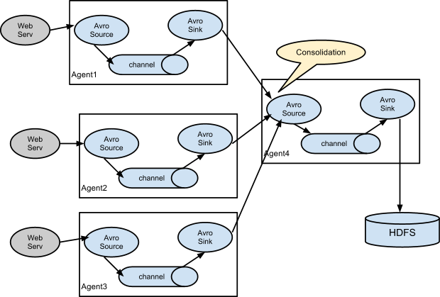

# Flume

## Overview

> Apache Flume is a distributed, reliable, and available system for efficiently collecting, aggregating and moving large amounts of log data from many different sources to a centralized data store.
> 
> The use of Apache Flume is not only restricted to log data aggregation. Since data sources are customizable, Flume can be used to transport massive quantities of event data including but not limited to network traffic data, social-media-generated data, email messages and pretty much any data source possible.

Apache Flume 用来收集、聚合、转移不同来源的大量日志数据到中央数据仓库的工具，具有分布式、高可靠、高可用的特点。

Apache Flume 的使用不仅限于日志数据聚合。 由于数据源是可定制的，因此Flume可用于传输大量事件数据，包括但不限于网络流量数据、社交媒体生成的数据、电子邮件以及几乎所有可能的数据源。

1. 它有一个简单、灵活的基于流的数据流结构。
2. 具有故障转移机制和负载均衡机制。
3. 使用了一个简单的可扩展的数据模型（source、channel、sink）。
4. 声明式配置，可以动态更新配置 （配置修改后，不用重启服务即可生效）

Flume1.8.0和Flume1.9.0需要Java1.8或更高版本的依赖

## 体系 Architecture

### 数据流模型 Data flow model

Event是Flume定义的一个数据流传输的最小单元。Agent就是一个Flume的实例，本质是一个JVM进程，该JVM进程控制Event数据流从外部日志生产者那里传输到目的地（或者是下一个Agent）。

一个完整的Agent包含三个组件：Source、Channel、Sink
- Source是数据的来源和方式
- Channel是一个数据的缓冲池
- Sink定义了数据输出的方式和目的地

Source消耗由外部（如Web服务器）传递给它的Event。外部以Flume Source识别的格式向Flume发送Event。例如，Avro Flume Source可接收从Avro客户端（或其他FlumeSink）接收Avro Event。用Thrift Flume Source也可以实现类似的流程，接收的Event数据可以是任何语言编写的只要符合Thrift协议即可。

当Source接收Event时，它将其存储到一个或多个channel。该channel是一个被动存储器，可以保持Event直到它被Sink消耗。『文件channel』就是一个例子 - 它由本地文件系统支持。sink从channel中移除Event并将其放入外部存储库（如HDFS，通过 Flume的 HDFS Sink 实现）或将其转发到流中下一个Flume Agent（下一跳）的Flume Source。

Agent中的source和sink与channel存取Event是异步的。

Flume的Source负责消费外部传递给它的数据（比如web服务器的日志）。外部的数据生产方以Flume Source识别的格式向Flume发送Event。

### 复杂流 Complex flows

Flume可以设置多级Agent连接的方式传输Event数据。也支持扇入和扇出的部署方式，类似于负载均衡方式或多点同时备份的方式。

1. 可以部署多个Agent组成一个数据流的传输链。
2. 扇入（多对一）和扇出（一对多）的概念，就是说Agent可以将数据流发到多个下级Agent，也可以从多个Agent发到一个Agent中。

> 可以根据自己的业务需求来任意组合传输日志的Agent实例，引用一张后面章节的图，这就是一个扇入方式的Flume部署方式，前三个Agent的数据都汇总到一个Agent4上，最后由Agent4统一存储到HDFS。

### 可靠性 Reliability

Event会在每个Agent的Channel上进行缓存，随后Event将会传递到流中的下一个Agent或目的地（比如HDFS）。只有成功地发送到下一个Agent或目的地后Event才会从Channel中删除。这一步保证了Event数据流在Flume Agent中传输时端到端的可靠性。

> Flume的这个channel最重要的功能是用来保证数据的可靠传输的。其实另外一个重要的功能也不可忽视，就是实现了数据流入和流出的异步执行。

Flume使用事务来保证Event的 可靠传输。Source和Sink对channel提供的每个Event数据分别封装一个事务用于存储和恢复，这样就保证了数据流的集合在点对点之间的可靠传输。在多层架构的情况下，来自前一层的sink和来自下一层的Source 都会有事务在运行以确保数据安全地传输到下一层的Channel中。

### 可恢复性 Recoverability

Event数据会缓存在Channel中用来在失败的时候恢复出来。Flume支持保存在本地文件系统中的“file channel”，也支持保存在内存中的“memory channel”，“memory channel”虽然速度会更快，缺点是万一Agent挂掉，“memory channel”中缓存的数据也就丢失了。

