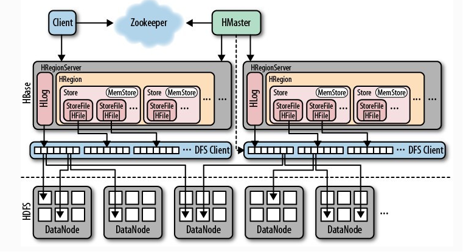

# Hbase

以下内容基于HBase 1.3.5

## 概述

Hbase的存储依赖于HDFS

开源的、分布式的、多版本的、可扩展的、非关系型的数据库

基于BigTable的开源java版本，建立在hadoop的hdfs上，提供高可靠性、高性能、列式存储、可伸缩、近实时读写的nosql数据库系统

数据量越来越大时，hive虽然能满足存储的要求，但是读写速度比较慢，不能满足非结构化的，半结构化的存储，hive主要做分析和统计。

## 架构

### Hbase表模型特点

1. Hbase对事务支持很差
2. Hbase的表有表名
3. Hbase的表没有固定的字段定义
4. Hbase的表中每行存储的都是一些key-value 键值对
5. Hbase的表中每行的key-value对可以类型不同，每行中的key-value对的数量也可以不同
6. Hbase中的数据，包含行键，包含key，包含value，都是byte\[\]类型，hbase不负责为用户维护数据类型
7. 一个表可以分为多个列簇(不同列簇的数据会存储在不同文件中)，用户可以指定将哪些kv插入哪个列簇
8. 表中的每一行有一个行键 **rowkey** ，而且行键不可重复
9. 表中的每一对kv数据称作一个cell
10. hbase对数据的存储是可以是多个历史版本（历史版本数量可配置）
11. 整张表如果数据量过大，则会被切分为若干个region，用（rowkey范围标识）不同的region的数据存储在不同的文件中
12. hbase会对插入的数据按顺序进行存储（字典排序
   - 首先按照rowkey排序
      - eg: 1 10 11 ... 19 2 20 ...
   - 同一行内的kv按照列簇排序
   - 再按列名排序
   - 优化：  将查询条件拼到rowkey中

Hbase的表数据存储在HDFS文件系统中。 

从而，hbase具备如下特性：存储容量可以线性扩展； 数据存储的安全性可靠性极高

### 适用场景

1. 需要对海量非结构化的数据进行存储
2. 需要随机近实时的读写管理数据

例如： 用户、商品、文章 等的 画像属性

被用来做实时（整合flume、storm、streaming等

存储历史明细数据（较少）

存储最终结果数据（kylin预执行数据就是放在hbase中

行业： 通信 银行 金融  
因为经常有随机实时查询报表的需求

mysql上千万支撑不住，所以不存入mysql中

### 架构图

- Client : hbase客户端，
  1. 包含访问hbase的接口。比如，linux shell，java api。
  2. 除此之外，它会维护缓存来加速访问hbase的速度。比如region的位置信息。
- Zookeeper ：
  1. 监控HMaster的状态，保证有且仅有一个活跃的HMaster。达到高可用。
  2. 它可以存储所有region的寻址入口。如：root表在哪一台服务器上。
  3. 实时监控HRegionServer的状态，感知HRegionServer的上下线信息，并实时通知给HMaster。
  4. 存储hbase的部分元数据。
- HMaster :
  1. 为HRegionServer分配Region（新建表等）。
  2. 负责HRegionServer的负载均衡。
  3. 负责Region的重新分配（HRegionServer宕机之后的Region分配，HRegion裂变：当Region过大之后的拆分）。
  4. Hdfs上的垃圾回收。
  5. 处理schema的更新请求
  6. 一个HMaster对应多个HRegionServer
- HRegionServer ：
  1. 维护HMaster分配给的Region（管理本机的Region）。
  2. 处理client对这些region的读写请求，并和HDFS进行交互。
  3. 负责切分在运行过程中组件变大的Region。
  4. 一个HRegionServer对应多个HRegion
  5. 一个HRegionServer对应一个HLog
- HLog ： 对HBase的操作进行记录，使用WAL写数据，优先写入log（put操作：先写日志再写MemStore，这样可以防止数据丢失，即使丢失也可以回滚）。
- HRegion ： HBase中分布式存储和负载均衡的最小单元，它是表或者表的一部分。
  1. 一个表对应一个或多个HRegion
  2. 一个HRegion对应一个表
  3. 一个HRegion对应多个Store，一个Store对应一个MemStore
- Store ： 相当于一个列簇
  - 一个Store对应多个StoreFile，一个StoreFile对应一个HFile
- MemStore ： 内存缓冲区，用于将数据批量刷新到hdfs中，默认大小为128M
- HStoreFile : 和HFile概念意义，不过是一个逻辑概念。HBase中的数据是以HFile存储在Hdfs上。

