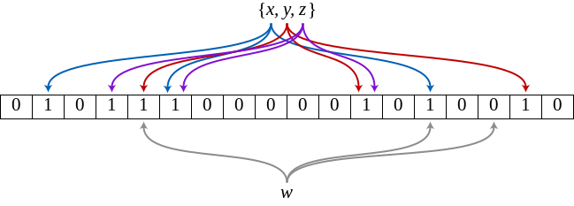

# Bloom Filters

> 布隆過濾器（英語：Bloom Filter）實際上是一個很長的二進位向量和一系列隨機對映函式。布隆過濾器可以用於檢索一個元素是否在一個集合中。它的優點是空間效率和查詢時間都遠遠超過一般的演算法，缺點是有一定的誤辨識率和刪除困難。
> --- wikipedia

Bloom Filter是提出者Burton Howard Bloom命名的，是一种数据结构。被设计用来检测元素是否存在于数据集中。bloom filter的正向(肯定)结果并不一直准确，但是负向(否定)结果可以保证准确（检测结果为true，该元素不一定在集合中；但如果检测结果为false，该元素一定不在集合中）。bloom filters是被设计用来处理足够大量的数据时，传统的哈希散列机制无法完成的情况下，保证一定准确性的选择。

- 原理

布隆过滤器（Bloom Filter）的核心实现是一个超大的位数组（或者叫位向量）和几个哈希函数。假设位数组的长度为m，哈希函数的个数为k



流程：

假设集合里有3个元素\{x,y,z\}，哈系函数的个数为3。

1. 将位数组初始化，每位都设置为0。
2. 对于集合中的每个元素，将元素依次通过3个哈系函数进行映射，每次映射产生一个哈系值，哈系值对应位数组上的一个点，将该位置坐标记为1.
3. 查询'w'元素是否存在于集合中的时候，用同样的方法将'w'元素通过哈系映射到位数组上的3个点。
4. 如果3个点里其中存在任一不为1的点，则可以判断元素一定不存在集合中。反之却不能说明元素一定存在于集合中，会有一定的误判率。

如图：如果某个元素映射后对应下标为3,4,5这3个点，虽然这3个点的值都为1,但这3个点是不同元素经过哈希得到的。如此，元素虽然不在集合中，但会返回正向的结果。


## Bloom Filters in HBase
对于HBase，bloom filters是一种轻量级的内存结构，能够减少Get操作的硬盘读取次数(Bloom filters在Scans中不工作)，只读取可能会包含所需要行的StoreFiles。以随着并行读取的数量的增加获得潜在的性能提高。

Bloom filters存储在每个Hfile的元数据中，并且从不需要更新。当HFile由于一个region上传到RegionServer上打开时，Bloom filter将会被加载进内存中。

HBase能够fold其中的Bloom filter以减少大小并保证正向结果错误率内的调整机制。


## When To Use Bloom Filters

从HBase0.96开始，默认启用基于行的Bloom filters。

可以选择禁用或者选择选择使用行+列的Bloom filters，取决于数据的特性以及加载进HBase的方式。

检查RegionServer metrics中的blockCacheHitRatio的值，判断Bloom filters能否有正向的影响。如果启用了Bloom filters，由于明确不需要的块将被Bloom filter过滤出，blockCacheHitRatio的值应该被增加。

可以选择开启Bloom filters为行或者行+列混合的。如果经常扫描整个行，行+列的组合不能提供什么好处。基于行的Bloom filter可以对行+列的Get操作，反之则不。但是当有非常多的行级的Put操作，则会产生大量StoreFile存一行值，则基于行的过滤器将一直返回正向结果并没没和好处。除非每行都有一列，否则行+列的Bloom filters将会需要更多的空间用来存储更多的keys。Bloom filters在每个数据实体都有至少几千字节大小时最有效。

当数据存储在一些较大打StoreFiles中时，开销将会减少，可以在low-level的scan中找到所需行时避免额外的磁盘读写

Bloom filters 需要在删除时重新构建，因此可能不适合于在大量删除操作的环境中使用。


## Enabling Bloom Filters

The following example creates a table and enables a ROWCOL Bloom filter on the colfam1 column family.
```
hbase> create 'mytable',{NAME => 'colfam1', BLOOMFILTER => 'ROWCOL'}
```

