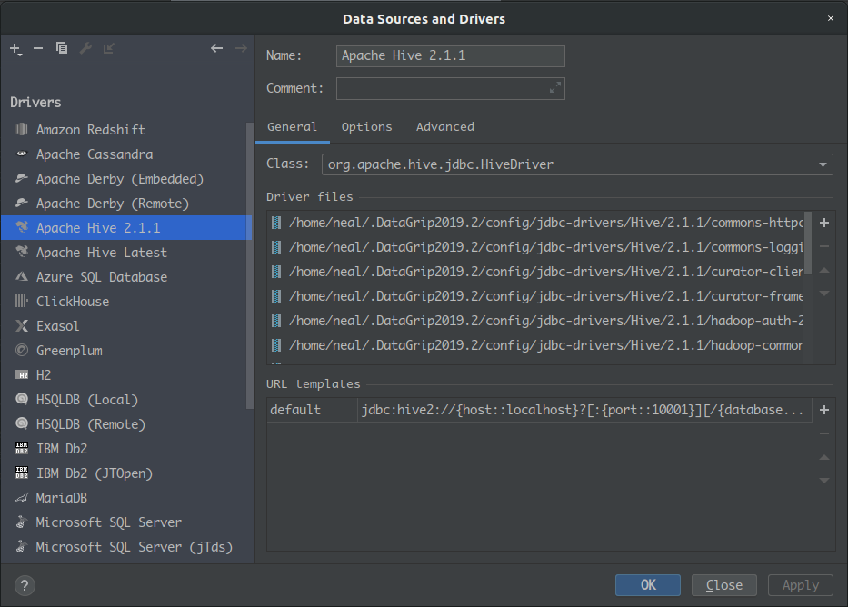

# Hive使用

## 使用DataGrip连接Hive

### 配置JDBC Driver

DataGrip打开Data Sources and Drivers 在 Driver 这一栏添加上 Hive JDBC Driver。

由于 hive-jdbc 不是包含所有依赖的包(这里是 HA 的 HiveServer, 需要有 ZK 的依赖, 也可以直接连接 HiveServer), 所以需要导入 Driver 的全部 jar, 如下：

>commons-httpclient-3.0.1.jar 
>commons-logging-1.1.3.jar 
>curator-client-2.6.0.jar 
>curator-framework-2.6.0.jar 
>hadoop-auth-2.7.3.2.5.0.0-1245.jar 
>hadoop-common-2.7.3.2.5.0.0-1245.jar 
>hive-common-1.2.1000.2.5.0.0-1245.jar 
>hive-exec-1.2.1000.2.5.0.0-1245.jar 
>hive-jdbc-1.2.1000.2.5.0.0-1245.jar 
>hive-metastore-1.2.1000.2.5.0.0-1245.jar 
>hive-service-1.2.1000.2.5.0.0-1245.jar 
>httpclient-4.4.jar 
>httpcore-4.4.jar 
>slf4j-api-1.7.5.jar 
>zookeeper-3.4.6.2.5.0.0-1245.jar 

### 配置连接Hive

和连接其他数据库类似, 配置好连接名, JDBC URL, 用户, 密码 即可

URL可以有两种形式：
- `jdbc:hive://<hiveserver_host>:<port>`: 直接连接某个 HiveServer
- `jdbc:hive://<zookeeper_server1>:<port>,<zookeeper_server2>:<port>;zooKeeperNamespace=<hiveserver_namespace>`: 通过 Zookeeper 连接 HiveServer(需要多几个依赖)

打开连接即可使用了。
