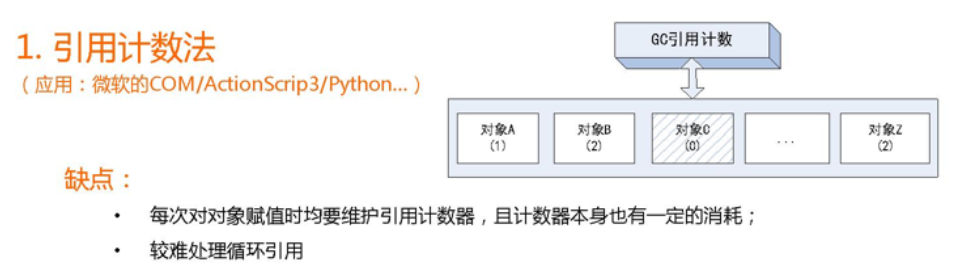

# Garbage Collection（JVM的垃圾回收机制）

JVM选用的是分代收集算法,频繁收集Young区,较少收集Old区,基本不动Perm区

JVM在进行GC时，并非每次都对三个内存区域一起回收的，大部分时候回收的都是指新生代。 因此GC按照回 收的区域又分了两种类型，一种是普通GC（minor GC），一种是全局GC（major GC or Full GC）， 普通 GC（minor GC）：只针对新生代区域的GC。 全局GC（major GC or Full GC）：针对年老代的GC，偶尔伴随对 新生代的GC以及对永久代的GC。

## GC的算法

### 复制算法

**新生区**中使用的是MinorGC,这种GC算法采用的是复制算法

Minor GC会把Eden中的所有活的对象都移到Survivor区域中，如果Survivor区中放不下，那么剩下的活的对象就 被移到Old generation中，也即一旦收集后，Eden是就变成空的了。 当对象在 Eden \( 包括一个 Survivor 区域， 这里假设是 from 区域 \) 出生后，在经过一次 Minor GC 后，如果对象还存活，并且能够被另外一块 Survivor 区域 所容纳\( 上面已经假设为 from 区域，这里应为 to 区域，即 to 区域有足够的内存空间来存储 Eden 和 from 区域中 存活的对象 \)，则使用复制算法将这些仍然还存活的对象复制到另外一块 Survivor 区域 \( 即 to 区域 \) 中，然后清理所使用过的 Eden 以及 Survivor 区域 \( 即 from 区域 \)，并且将这些对象的年龄设置为1，以后对象在 Survivor 区 每熬过一次 Minor GC，就将对象的年龄 + 1，当对象的年龄达到某个值时 \( 默认是 15 岁，通过- XX:MaxTenuringThreshold 来设定参数\)，这些对象就会成为老年代。 

-XX:MaxTenuringThreshold — 设置对象在新生代中存活的次数

HotSpot JVM把年轻代分为了三部分：1个Eden区和2个Survivor区（分别叫from和to）。默认比例为8:1:1,一般情 况下，新创建的对象都会被分配到Eden区\(一些大对象特殊处理\),这些对象经过第一次Minor GC后，如果仍然存 活，将会被移到Survivor区。对象在Survivor区中每熬过一次Minor GC，年龄就会增加1岁，当它的年龄增加到一 定程度时，就会被移动到年老代中。因为年轻代中的对象基本都是朝生夕死的\(90%以上\)，所以在年轻代的垃圾回 收算法使用的是复制算法，复制算法的基本思想就是将内存分为两块，每次只用其中一块，当这一块内存用完，就 将还活着的对象复制到另外一块上面。复制算法不会产生内存碎片。

在GC开始的时候，对象只会存在于Eden区和名为“From”的Survivor区，Survivor区“To”是空的。紧接着进行GC， Eden区中所有存活的对象都会被复制到“To”，而在“From”区中，仍存活的对象会根据他们的年龄值来决定去向。 年龄达到一定值\(年龄阈值，可以通过-XX:MaxTenuringThreshold来设置\)的对象会被移动到年老代中，没有达到阈 值的对象会被复制到“To”区域。经过这次GC后，Eden区和From区已经被清空。这个时候，“From”和“To”会交换他 们的角色，也就是新的“To”就是上次GC前的“From”，新的“From”就是上次GC前的“To”。不管怎样，都会保证名为 To的Survivor区域是空的。Minor GC会一直重复这样的过程，直到“To”区被填满，“To”区被填满之后，会将所有对 象移动到年老代中

因为Eden区对象一般存活率较低，一般的，使用两块10%的内存作为空闲和活动区间，而另外80%的内存，则是 用来给新建对象分配内存的。一旦发生GC，将10%的from活动区间与另外80%中存活的eden对象转移到10%的to 空闲区间，接下来，将之前90%的内存全部释放，以此类推。

* 从根集合\(GC Root\)开始，通过Tracing从From中找到存活对象，拷贝到To中，
* From和To交换身份，下次内存分配从To开始

**复制算法它的缺点也是相当明显的** 

1. 浪费了一半的内存 
2. 如果对象的存活率很 高，我们可以极端一点，假设是100%存活，那么我们需要将所有对象都复制一遍，并将所有引用地址重置一遍。 复制这一工作所花费的时间，在对象存活率达到一定程度时，将会变的不可忽视。 所以从以上描述不难看出，复制算法要想使用，最起码对象的存活率要非常低才行，而且最重要的是，我们必须要克服50%内存的浪费。

### 标记清除\(Mark-Sweep\)和标记压缩\(Mark-Compact\)

养老区一般是由标记清除或者是标记清除与标记整理的混合实现

#### 标记清除

当堆中的有效内存空间（available memory）被耗尽的时候，就会停止整个程序（也被称为stop the world），然 后进行两项工作，第一项则是标记，第二项则是清除。 标记：从引用根节点开始标记所有被引用的对象。标记的过 程其实就是遍历所有的GC Roots，然后将所有GC Roots可达的对象 标记为存活的对象。 清除：遍历整个堆，把未 标记的对象清除。 缺点：此算法需要暂停整个应用，会产生内存碎片。

#### 标记压缩

在整理压缩阶段，不再对标记的对像做回收，而是通过所有存活对像都向一端移动，然后直接清除边界以外的内 存。 可以看到，标记的存活对象将会被整理，按照内存地址依次排列，而未被标记的内存会被清理掉。如此一来， 当我们需要给新对象分配内存时，JVM只需要持有一个内存的起始地址即可，这比维护一个空闲列表显然少了许多 开销。 

标记压缩算法不仅可以弥补标记清除算法当中，内存区域分散的缺点，也消除了复制算法当中，内存减半的高额代价

### 引用计数法

循环引用时释放了根部引用，但是中间节点的引用判断无法，需重复多次执行垃圾回收

### 可达性分析算法

 现在主流的商用语言的视线中都是通过可达性分析来判断对象是否存活，比如JAVA，C\#等。这种方法基本思想 ——以 `GC Roots`的对象作为起点向下搜索，搜索走过的路径被称为"引用链"，当一个对象没有任何引用链相连，那么这个对象就是不可用的。如下图所示：

gc roots 是什么？ 是满足下面任意条件的某个对象。

* 虚拟机栈中reference对象；
* 方法区静态属性引用对象；
* 方法区常量引用对象；
* 本地方法栈 所谓的native方法 引用的对象

Hotspot中的native方法引用Java对象用的是通过句柄（handle）来引用。HotSpot的JNI handle是放在若干不同的区域里的，但不会放在GC堆中。传递参数用的handle直接在栈上；local handle放在每个Java线程中的JNIHandleBlock里；global handle放在VM全局的JNIHandleBlock里。

> 注:并不是不可达的对象就必须 "死"，他们还是处于"缓刑"， 真正要宣告一个对象死亡，需要经过两次标记的过程：经过可达性分析后对象没有和GC Roots 连接的引用链，那么需要被标记一次然后还需要经过筛选（筛选条件：判断该对象是否有必要执行finalize\(\)方法），如果对象已经调用了或者没有覆盖finalize方法\(finalize\(\) 方法只会被执行一次!\)，那么 虚拟机判定该对象是 "没有必要执行该方法"。

 如果该对象有必要执行finalize方法，那么对象会被放置在一个叫做`F-Queue` 的队列之中，之后会由虚拟机自动建立，由_**低优先级的Finalize 方法去执行**_。（_执行时只去触发对象的finalize\(\)方法，但是并不等待他运行结束，防止有的对象finalize\(\)进行缓慢，或者死循环，会导致队列持续等待，进而内存回收系统崩溃。_）稍后GC 会对F-Queue 队列中的对象进行第二次标记，当finalize 方法执行后成功将对象连接到引用链上任何一个对象，那么这个对象就被拯救成功了，不然则go die!

### 内存效率：

* 复制算法&gt;标记清除算法&gt;标记整理算法（此处的效率只是简单的对比时间复杂度，实际情况不一定如此）。 
* 内存整齐度：复制算法=标记整理算法&gt;标记清除算法。 
* 内存利用率：标记整理算法=标记清除算法&gt;复制算 法。 

可以看出，效率上来说，复制算法是当之无愧的老大，但是却浪费了太多内存，而为了尽量兼顾上面所提到的三个 指标，标记整理算法相对来说更平滑一些，但效率上依然不尽如人意，它比复制算法多了一个标记的阶段，又比标记清除多了一个整理内存的过程

## Java中的垃圾回收机制

### 年轻代\(Young Gen\) 

年轻代特点是区域相对老年代较小，对像存活率低。这种情况复制算法的回收整理，速度是最快的。复制算法的效率只和当前存活对像大小有关，因而很适用于年轻代 的回收。而复制算法内存利用率不高的问题，通过hotspot中的两个survivor的设计得到缓解。 

### 老年代\(Tenure Gen\) 

老年代的特点是区域较大，对像存活率高。 这种情况，存在大量存活率高的对像，复制算法明显变得不合适。一般是由标记清除或者是标记清除与标记整理的 混合实现。 Mark阶段的开销与存活对像的数量成正比，这点上说来，对于老年代，标记清除或者标记整理有一些不符，但可 以通过多核/线程利用，对并发、并行的形式提标记效率。 Sweep阶段的开销与所管理区域的大小形正相关，但Sweep“就地处决”的特点，回收的过程没有对像的移动。使其 相对其它有对像移动步骤的回收算法，仍然是效率最好的。但是需要解决内存碎片问题。 Compact阶段的开销与存活对像的数据成开比，如上一条所描述，对于大量对像的移动是很大开销的，做为老年代 的第一选择并不合适。 

基于上面的考虑，老年代一般是由标记清除或者是标记清除与标记整理的混合实现。以hotspot中的CMS回收器为 例，CMS是基于Mark-Sweep实现的，对于对像的回收效率很高，而对于碎片问题，CMS采用基于Mark-Compact 算法的Serial Old回收器做为补偿措施：当内存回收不佳（碎片导致的Concurrent Mode Failure时），将采用 Serial Old执行Full GC以达到对老年代内存的整理。

