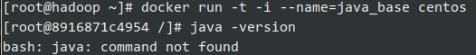
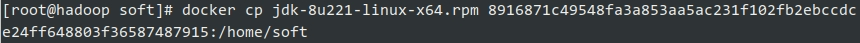
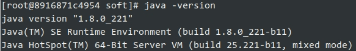
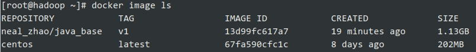

# Docker创建本地镜像

## commit命令创建本地镜像
### 创建java_base容器
在centos为基础的镜像上，安装oracle jdk8，并创建一个txt文件，然后使用commit命令打成新镜像。
```
docker run -t -i centos
```
启动一个centos的交互性容器。



记录[root@8916871c4954ae56f6cad215 /8916871c4954ae56f6cad215，后面会用到。

### 安装Oracle JDK 8
干净的centos容器中没有jdk，我们马上要安装：yum install java。

> 主机和容器之间传输文件的话需要用到容器的ID全称。
> 1. 使用容器的短ID或指定的name获取容器的ID全称
> 
> 2. 使用容器的ID全称进行本机和文件的传输
> - docker cp [OPTIONS] CONTAINER:SRC_PATH DEST_PATH|-
>   - docker cp ID全称:容器文件路径 本地路径
> - docker cp [OPTIONS] SRC_PATH|- CONTAINER:DEST_PATH
>   - docker cp 本地文件路径 ID全称:容器路径
> - Options:
>   - -a, --archive       Archive mode (copy all uid/gid information)
>   - -L, --follow-link   Always follow symbol link in SRC_PATH
> 
> 

使用主机发送过来的jdk安装并配置Java环境



退出容器 ： exit


### 提交容器到本地
```
docker commit -m="java_base" --author="neal_zhao" 8916871c4954 neal_zhao/java_base:v1
```
使用commit命令将容器里的所有修改提交到本地库中，形成以一个全新的镜像，会返回新镜像的完整ID。



完整ID可以通过docker ps -l -q(用于获取最近创建的容器ID)命令得到。

- -m：描述我们此次创建image的信息。
- --author：用来指定作者。
- 8916871c4954：被修改的基础镜像ID。
- neal_zhao/java_base:v1：仓库名/镜像名:TAG名。


## Dockerfile文件
### 创建Dockerfile文件
将需要对镜像进行的操作全部写到一个文件中，然后使用docker build命令从这个文件中创建镜像。这种方法可以使镜像的创建变得透明和独立化，并且创建过程可以被重复执行。Dockerfile文件以行为单位，行首为Dockerfile命令，命令都是大写形式，其后紧跟着的是命令的参数。

```
#Version 1.0.1
FROM centos:latest

MAINTAINER neal "neal@email.com"

#设置root用户为后续命令的执行者
USER root

#执行操作
RUN yum update -y
RUN yum install -y java

#使用&&拼接命令
RUN touch test.txt && echo "neal" >>neal.txt

#对外暴露端口
EXPOSE 80 8080

#添加文件
ADD neal.txt /opt/

#添加文件夹
ADD /webapp /opt/webapp

#添加网络文件
ADD https://www.image.com/img/image.png /opt/

#设置环境变量
ENV WEBAPP_PORT=9090

#设置工作目录
WORKDIR /opt/

#设置启动命令
ENTRYPOINT ["ls"]

#设置启动参数
CMD ["-a", "-l"]

#设置卷
VOLUME ["/data", "/var/www"]

#设置子镜像的触发操作
ONBUILD ADD . /app/src
ONBUILD RUN echo "on build excuted" >> onbuild.txt
```

### 构建Dockerfile镜像
```
$ docker build -t neal_zhao/build_dockerfile:build_dockerfile_demo .
...
Successfully build [IMAGE_ID]
```

- -t参数用来指定镜像的命名空间、仓库名及TAG。
- 这个值可以在镜像创建成功之后通过tag命令修改。
  - 事实上是创建一个镜像的两个名称引用，指向的是同一个镜像实体[IMAGE_ID]
- 紧跟-t参数的是Dockerfile文件所在的相对目录，本例使用的是当前目录，即"."

docker tag neal_zhao/build_dockerfile:build_dockerfile_demo neal_zhao/build_dockerfile:build_dockerfile_demo2

### Dockerfile在网络上

可以把dockerfile放在github上，

比如地址是https://github.com/xxx/docker/master/dockerfile

clone地址是https://github.com/xxx/docker.git

执行命令：
```
docker build -t xxx/test:build_dockerfile_test_github https://github.com/xxx/docker.git
```

## 官方文档

### Recap and cheat sheet <a id="recap-and-cheat-sheet"></a>

```text
## List Docker CLI commands
docker
docker container --help

## Display Docker version and info
docker --version
docker version
docker info

## Execute Docker image
docker run hello-world

## List Docker images
docker image ls

## List Docker containers (running, all, all in quiet mode)
docker container ls
docker container ls --all
docker container ls -aq
```

### DockerFile

These portable images are defined by something called a `Dockerfile`.

Create an empty directory on your local machine. Change directories \(`cd`\) into the new directory, create a file called `Dockerfile`, copy-and-paste the following content into that file, and save it. Take note of the comments that explain each statement in your new Dockerfile.

```text
# Use an official Python runtime as a parent image
FROM python:2.7-slim

# Set the working directory to /app
WORKDIR /app

# Copy the current directory contents into the container at /app
COPY . /app

# Install any needed packages specified in requirements.txt
RUN pip install --trusted-host pypi.python.org -r requirements.txt

# Make port 80 available to the world outside this container
EXPOSE 80

# Define environment variable
ENV NAME World

# Run app.py when the container launches
CMD ["python", "app.py"]
```

This `Dockerfile` refers to a couple of files we haven’t created yet, namely`app.py` and `requirements.txt`. Let’s create those next.

