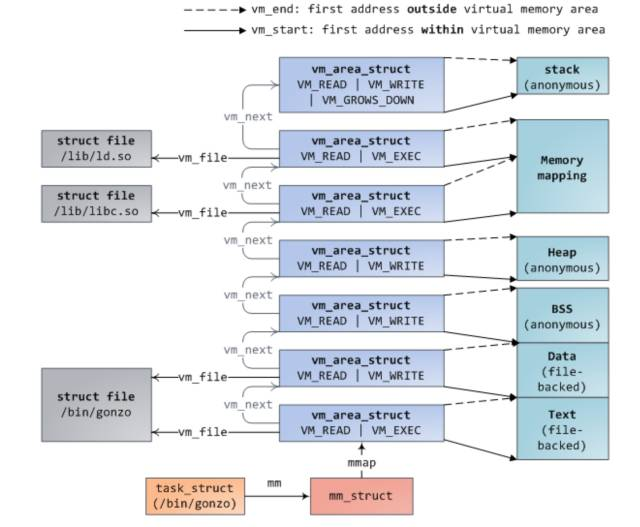

# Linux内存


本文仅供自我学习，如有侵权请联系我。

原文请关注公众号：  
来源:高效运维  
ID:greatops  

https://cloud.tencent.com/developer/article/1149327

## 内存

物理内存：就是主机安装的物理内存条，一般32位的CPU有32条地址线，最大寻址空间就是4G，而64位的CPU则能够支持更大的内存。可是，再大的内存，也有可能满足不了所有应用的内存需要；又或者是，大量使用频率极低的冷数据占用了大部分物理内存。这个时候，就是“虚拟内存”出场了。

虚拟内存（简称VM）：由操作系统OS管理，本质就是硬盘中的一个特殊格的磁盘分区、或者一个文件（linux下是swap分区、windows下是ib3文件），其写入写出由OS掌管，如果出现以上两种情景，OS会将溢出物理内存部分数据或者部分冷数据交换到虚拟内存，释放更多空间提供其他应用运作。而对于所有应用而言，其运行可使用的内存理论上是：物理内存 + 虚拟内存。

## 进程的内存申请与分配



当我们在终端启动一个程序时，终端进程调用 exec 函数将可执行文件载入内存，此时代码段，数据段，bbs 段，stack 段都通过 mmap 函数映射到内存空间，堆则要根据是否有在堆上申请内存来决定是否映射。

exec 执行之后，此时并未真正开始执行进程，而是将 cpu 控制权交给了动态链接库装载器，由它来将该进程需要的动态链接库装载进内存。之后才开始进程的执行，这个过程可以通过 strace 命令跟踪进程调用的系统函数来分析。

当第一次调用 malloc 申请内存时，通过系统调用 brk 嵌入到内核，首先会进行一次判断，是否有关于堆的 vma，如果没有，则通过 mmap 匿名映射一块内存给堆，并建立 vma 结构，挂到 mm_struct 描述符上的红黑树和链表上。

然后回到用户态，通过内存分配器（ptmaloc，tcmalloc，jemalloc）算法将分配到的内存进行管理，返回给用户所需要的内存。

如果用户态申请大内存时，是直接调用 mmap 分配内存，此时返回给用户态的内存还是虚拟内存，直到第一次访问返回的内存时，才真正进行内存的分配。

其实通过 brk 返回的也是虚拟内存，但是经过内存分配器进行切割分配之后（切割就必须访问内存），全都分配到了物理内存

当进程在用户态通过调用 free 释放内存时，如果这块内存是通过 mmap 分配，则调用 munmap 直接返回给系统。

否则内存是先返回给内存分配器，然后由内存分配器统一返还给系统，这就是为什么当我们调用 free 回收内存之后，再次访问这块内存时，可能不会报错的原因。

当然，当整个进程退出之后，这个进程占用的内存都会归还给系统。

## 内存耗尽后的OOM

OOM 关键文件 oom_kill.c，里面介绍了当内存不够时，系统如何选择最应该被杀死的进程，选择因素有挺多的，除了进程占用的内存外，还有进程运行的时间，进程的优先级，是否为 root 用户进程，子进程个数和占用内存以及用户控制参数 oom_adj 都相关。

当产生 oom 之后，函数 select_bad_process 会遍历所有进程，通过之前提到的那些因素，每个进程都会得到一个 oom_score 分数，分数最高，则被选为杀死的进程。

我们可以通过设置 `/proc/[pid]/oom_adj` （Linux2.6.36以后更推荐使用`/proc/[pid]/oom_score_adj`） 分数来干预系统选择杀死的进程。

这是内核关于这个oom_adj调整值的定义，最大可以调整为15，最小为-16，默认值为0，如果为-17，则该进程就不会被系统驱逐杀死了，因此，如果在一台机器上有跑很多服务器，且你不希望自己的服务被杀死的话，就可以设置自己服务的 oom_adj 为-17。

官方说明如下：

<details>
<summary>/proc/[pid]/oom_adj</summary>

```
This file can be used to adjust the score used to select which process should be killed in an out-of-memory (OOM) situation. The kernel uses this value for a bit-shift operation of the process's oom_score value: valid values are in the range -16 to +15, plus the special value -17, which disables OOM-killing altogether for this process. A positive score increases the likelihood of this process being killed by the OOM-killer; a negative score decreases the likelihood.

The default value for this file is 0; a new process inherits its parent's oom_adj setting. A process must be privileged (CAP_SYS_RESOURCE) to update this file.

Since Linux 2.6.36, use of this file is deprecated in favor of /proc/[pid]/oom_score_adj.
```
</details>


<details>
<summary>/proc/[pid]/oom_score (since Linux 2.6.11)</summary>

```
This file displays the current score that the kernel gives to this process for the purpose of selecting a process for the OOM-killer. A higher score means that the process is more likely to be selected by the OOM-killer. The basis for this score is the amount of memory used by the process, with increases (+) or decreases (-) for factors including:

* whether the process is privileged (-).

Before kernel 2.6.36 the following factors were also used in the calculation of oom_score:

* whether the process creates a lot of children using fork(2) (+);

* whether the process has been running a long time, or has used a lot of CPU time (-);

* whether the process has a low nice value (i.e., > 0) (+); and

* whether the process is making direct hardware access (-).

The oom_score also reflects the adjustment specified by the oom_score_adj or oom_adj setting for the process.
```
</details>

<details>
<summary>/proc/[pid]/oom_score_adj (since Linux 2.6.36)</summary>

```
This file can be used to adjust the badness heuristic used to select which process gets killed in out-of-memory conditions.

The badness heuristic assigns a value to each candidate task ranging from 0 (never kill) to 1000 (always kill) to determine which process is targeted. The units are roughly a proportion along that range of allowed memory the process may allocate from, based on an estimation of its current memory and swap use. For example, if a task is using all allowed memory, its badness score will be 1000. If it is using half of its allowed memory,
its score will be 500.

There is an additional factor included in the badness score: root processes are given 3% extra memory over other tasks.

The amount of "allowed" memory depends on the context in which the OOM-killer was called. If it is due to the memory assigned to the allocating task's cpuset being exhausted, the allowed memory represents the set of mems assigned to that cpuset (see cpuset(7)). If it is due to a mempolicy's node(s) being exhausted, the allowed memory represents the set of mempolicy nodes. If it is due to a memory limit (or swap limit) being reached, the allowed memory is that configured limit. Finally, if it is due to the entire system being out of memory, the allowed memory represents all allocatable resources.

The value of oom_score_adj is added to the badness score before it is used to determine which task to kill. Acceptable values range from -1000 (OOM_SCORE_ADJ_MIN) to +1000 (OOM_SCORE_ADJ_MAX). This allows user space to control the preference for OOM-killing, ranging from always preferring a certain task or completely disabling it from OOM killing. The lowest possible value, -1000, is equivalent to disabling OOM-killing entirely for that task, since it will always report a badness score of 0.

Consequently, it is very simple for user space to define the amount of memory to consider for each task. Setting an oom_score_adj value of +500, for example, is roughly equivalent
to allowing the remainder of tasks sharing the same system, cpuset, mempolicy, or memory controller resources to use at least 50% more memory. A value of -500, on the other hand,
would be roughly equivalent to discounting 50% of the task's allowed memory from being considered as scoring against the task.

For backward compatibility with previous kernels, /proc/[pid]/oom_adj can still be used to tune the badness score. Its value is scaled linearly with oom_score_adj.

Writing to /proc/[pid]/oom_score_adj or /proc/[pid]/oom_adj will change the other with its scaled value.
```
</details>


当然，说到这，就必须提到另一个参数 /proc/sys/vm/overcommit_memory

当 overcommit_memory 为0时，则为启发式oom(默认值)，即当申请的虚拟内存不是很夸张的大于物理内存，则系统允许申请，但是当进程申请的虚拟内存远大于物理内存，则就会产生 OOM。

例如只有8g的物理内存，然后 redis 虚拟内存占用了24G，物理内存占用3g，如果这时执行 bgsave，子进程和父进程共享物理内存，但是虚拟内存是自己的，即子进程会申请24g的虚拟内存，这很夸张大于物理内存，就会产生一次OOM。

当 overcommit_memory 为1时，则永远都允许 overmemory 内存申请，即不管你多大的虚拟内存申请都允许，但是当系统内存耗尽时，这时就会产生oom，即上述的redis例子，在 overcommit_memory=1 时，是不会产生oom 的，因为物理内存足够。

当 overcommit_memory 为2时，永远都不能超出某个限定额的内存申请，这个限定额为 swap+RAM* 系数（/proc/sys/vm/overcmmit_ratio，默认50%，可以自己调整），如果这么多资源已经用光，那么后面任何尝试申请内存的行为都会返回错误，这通常意味着此时没法运行任何新程序


<details>
<summary>/proc/sys/vm/overcommit_memory</summary>

```
This file contains the kernel virtual memory accounting mode.
Values are:

       0: heuristic overcommit (this is the default)
       1: always overcommit, never check
       2: always check, never overcommit

In mode 0, calls of mmap(2) with MAP_NORESERVE are not checked, and the default check is very weak, leading to the risk of getting a process "OOM-killed".

In mode 1, the kernel pretends there is always enough memory, until memory actually runs out. One use case for this mode is scientific computing applications that employ large sparse arrays. In Linux kernel versions before 2.6.0, any nonzero value implies mode 1.

In mode 2 (available since Linux 2.6), the total virtual address space that can be allocated (CommitLimit in /proc/meminfo) is calculated as

    CommitLimit = (total_RAM - total_huge_TLB) * overcommit_ratio / 100 + total_swap
```
</details>


<details>
<summary>/proc/sys/vm/overcommit_kbytes (since Linux 3.14)</summary>

```
This writable file provides an alternative to /proc/sys/vm/overcommit_ratio for controlling the CommitLimit when /proc/sys/vm/overcommit_memory has the value 2. It allows the amount of memory overcommitting to be specified as an absolute
value (in kB), rather than as a percentage, as is done with overcommit_ratio. This allows for finer-grained control of CommitLimit on systems with extremely large memory sizes.

Only one of overcommit_kbytes or overcommit_ratio can have an effect: if overcommit_kbytes has a nonzero value, then it is used to calculate CommitLimit, otherwise overcommit_ratio is used. Writing a value to either of these files causes the value in the other file to be set to zero.

```
</details>


## 系统申请的内存都在哪

物理内存有分为cache和普通物理内存，可以通过 free 命令查看，而且物理内存还有分 DMA，NORMAL，HIGH 三个区，这里主要分析cache和普通内存。


Linux中，可以用free命令来查看系统的内存

```
# free -h

        total   used    free    shared  buff/cache  available
Mem:    11G     6.3G    1.9G    543M    3.4G        4.4G
Swap:   2.0G    842M    1.2G
```

大部分人认为，buffers 和 cached 所占用的内存空间是可以在内存压力较大的时候被释放当做空闲空间用的。但真的是这样么？

### buffers 和 cached

##### 首先：关于 buffers 和 cached 是什么：

buffer 和 cache 是两个在计算机技术中被用滥的名词，放在不同语境下会有不同的意义。在 Linux 的内存管理中，这里的buffer 指 Linux 内存的：Buffer cache。这里的 cache 指 Linux 内存中的：Page cache。翻译成中文可以叫做缓冲区缓存和页面缓存。在历史上，它们一个（buffer）被用来当成对 io 设备写的缓存，而另一个（cache）被用来当作对 io 设备的读缓存，这里的 io 设备，主要指的是块设备文件和文件系统上的普通文件。但是现在，它们的意义已经不一样了。在当前的内核中，page cache 顾名思义就是针对内存页的缓存，说白了就是，如果有内存是以 page 进行分配管理的，都可以使用 page cache 作为其缓存来管理使用。当然，不是所有的内存都是以页page进行管理的，也有很多是针对块block进行管理的，这部分内存使用如果要用到 cache 功能，则都集中到 buffer cache 中来使用。（从这个角度出发，是不是 buffer cache 改名叫做 block cache 更好？）然而，也不是所有块block都有固定长度，系统上块的长度主要是根据所使用的块设备决定的，而页长度在 X86 上无论是32位还是64位都是 4k。


##### 什么是 page cache

Page cache 主要用来作为文件系统上的文件数据的缓存来用，尤其是针对当进程对文件有 read／write 操作的时候。如果你仔细想想的话，作为可以映射文件到内存的系统调用：mmap 是不是很自然的也应该用到 page cache？在当前的系统实现里， page cache 也被作为其它文件类型的缓存设备来用，所以事实上 page cache 也负责了大部分的块设备文件的缓存工作。

##### 什么是 buffer cache

Buffer cache 则主要是设计用来在系统对块设备进行读写的时候，对块进行数据缓存的系统来使用。这意味着某些对块的操作会使用 buffer cache 进行缓存，比如我们在格式化文件系统的时候。一般情况下两个缓存系统是一起配合使用的，比如当我们对一个文件进行写操作的时候，page cache 的内容会被改变，而 buffer cache 则可以用来将 page 标记为不同的缓冲区，并记录是哪一个缓冲区被修改了。这样，内核在后续执行脏数据的回写writeback时，就不用将整个 page 写回，而只需要写回修改的部分即可。


### 进程的地址

通过前面部分，我们知道一个进程的地址空间几乎都是 mmap 函数申请，有文件映射和匿名映射两种。


#### 共享文件映射

我们先来看下代码段和动态链接库映射段，这两个都是属于共享文件映射，也就是说由同一个可执行文件启动的两个进程是共享这两个段，都是映射到同一块物理内存，那么这块内存在哪了？

代码段和动态链接库段是映射到内核cache中，也就是说当执行共享文件映射时，文件是先被读取到 cache 中，然后再映射到用户进程空间中。


#### 私有文件映射段

对于进程空间中的数据段，其必须是私有文件映射，因为如果是共享文件映射，那么同一个可执行文件启动的两个进程，任何一个进程修改数据段，都将影响另一个进程了。

当进行私有文件映射时，首先是将文件映射到 cache 中，然后如果某个文件对这个文件进行修改，则会从其他内存中分配一块内存先将文件数据拷贝至新分配的内存，然后再在新分配的内存上进行修改，这也就是写时复制。

这也很好理解，因为如果同一个可执行文件开启多个实例，那么内核先将这个可执行的数据段映射到 cache，然后每个实例如果有修改数据段，则都将分配一个一块内存存储数据段，毕竟数据段也是一个进程私有的。


#### 私有匿名映射

像 bbs 段，堆，栈这些都是匿名映射，因为可执行文件中没有相应的段，而且必须是私有映射，否则如果当前进程 fork 出一个子进程，那么父子进程将会共享这些段，一个修改都会影响到彼此，这是不合理的。

在进行匿名私有映射时，并没有占用 cache，其实这也是有道理，因为就只有当前进程在使用这块这块内存，没有必要占用宝贵的 cache。


#### 共享匿名映射
当我们需要在父子进程共享内存时，就可以用到 mmap 共享匿名映射，那么共享匿名映射的内存是存放在哪了？

当进行共享匿名映射时，这时是从 cache 中申请内存，道理也很明显，因为父子进程共享这块内存，共享匿名映射存在于 cache，然后每个进程再映射到彼此的虚存空间，这样即可操作的是同一块内存。


## 回收内存

当系统内存不足时，有两种方式进行内存释放，一种是手动的方式，另一种是系统自己触发的内存回收，先来看下手动触发方式。`proc/sys/vm/drop_caches`

### 手动回收

当 drop_caches 文件为1时，这时将释放 pagecache 中可释放的部分（有些 cache 是不能通过这个释放的），当 drop_caches 为2时，这时将释放 dentries 和 inodes 缓存，当 drop_caches 为3时，这同时释放上述两项。

<details>
<summary>/proc/sys/vm/drop_caches</summary>

```
Writing to this file causes the kernel to drop clean caches, dentries, and inodes from memory, causing that memory to become free. This can be useful for memory management testing and per‐
forming reproducible filesystem benchmarks. Because writing to this file causes the benefits of caching to be lost, it can degrade overall system performance.

        To free pagecache, use:
            echo 1 > /proc/sys/vm/drop_caches

        To free dentries and inodes, use:
            echo 2 > /proc/sys/vm/drop_caches

        To free pagecache, dentries and inodes, use:
            echo 3 > /proc/sys/vm/drop_caches

Because writing to this file is a nondestructive operation and dirty objects are not freeable, the user should run sync(1) first.
```
</details>

关键还有最后一句，意思是说如果 pagecache 中有脏数据时，操作 drop_caches 是不能释放的，必须通过 sync 命令将脏数据刷新到磁盘，才能通过操作 drop_caches 释放 pagecache。

ok，之前有提到有些pagecache是不能通过drop_caches释放的，那么除了上述提文件映射和共享匿名映射外，还有有哪些东西是存在pagecache了？

### 不能回收的几种

#### 1.tmpfs

大家知道 Linux 提供一种“临时”文件系统叫做 tmpfs，它可以将内存的一部分空间拿来当做文件系统使用，使内存空间可以当做目录文件来用。现在绝大多数 Linux 系统都有一个叫做 /dev/shm 的 tmpfs 目录，就是这样一种存在。

tmpfs 和 procfs，sysfs 以及 ramfs 一样，都是基于内存的文件系统，tmpfs 和 ramfs 的区别就是 ramfs 的文件基于纯内存的，和 tmpfs 除了纯内存外，还会使用 swap 交换空间，以及 ramfs 可能会把内存耗尽，而 tmpfs 可以限定使用内存大小，可以用命令 df -T -h 查看系统一些文件系统，其中就有一些是 tmpfs，比较出名的是目录 /dev/shm

tmpfs 文件系统源文件在内核源码 mm/shmem.c，tmpfs实现很复杂，之前有介绍虚拟文件系统，基于 tmpfs 文件系统创建文件和其他基于磁盘的文件系统一样，也会有 inode，super_block，identry，file 等结构，区别主要是在读写上，因为读写才涉及到文件的载体是内存还是磁盘。

而 tmpfs 文件的读函数 shmem_file_read，过程主要为通过 inode 结构找到 address_space 地址空间，其实就是磁盘文件的 pagecache，然后通过读偏移定位cache 页以及页内偏移。

这时就可以直接从这个 pagecache 通过函数 __copy_to_user 将缓存页内数据拷贝到用户空间，当我们要读物的数据不pagecache中时，这时要判断是否在 swap 中，如果在则先将内存页 swap in，再读取。

tmpfs 文件的写函数 shmem_file_write，过程主要为先判断要写的页是否在内存中，如果在，则直接将用户态数据通过函数__copy_from_user拷贝至内核pagecache中覆盖老数据，并标为 dirty。

如果要写的数据不再内存中，则判断是否在swap 中，如果在，则先读取出来，用新数据覆盖老数据并标为脏，如果即不在内存也不在磁盘，则新生成一个 pagecache 存储用户数据。

由上面分析，我们知道基于 tmpfs 的文件也是使用 cache 的，我们可以在/dev/shm上创建一个文件来检测下

创建的文件大小跟 cache 占用所增长的一样，验证了tmpfs确实使用了cache内存

其实 mmap 匿名映射原理也是用了 tmpfs，在 mm/mmap.c->do_mmap_pgoff 函数内部，有判断如果 file 结构为空以及为 SHARED 映射，则调用 shmem_zero_setup(vma) 函数在 tmpfs 上用新建一个文件

这里就解释了为什么共享匿名映射内存初始化为0了，但是我们知道用 mmap 分配的内存初始化为0，就是说 mmap 私有匿名映射也为0,那么体现在哪了？

这个在 do_mmap_pgoff 函数内部可没有体现出来，而是在缺页异常，然后分配一种特殊的初始化为0的页。

尝试用 `echo 1 >> /proc/sys/vm/drop_caches` 手动回收，发现tmpfs文件占用的pagecache是不能回收的，

原因是有文件引用这些页，所以不能回收


#### 共享内存

共享内存是系统提供给我们的一种常用的进程间通信（IPC）方式，但是这种通信方式不能在 shell 中申请和使用

posix 共享内存其实和 mmap 共享映射是同一个道理，都是利用在 tmpfs 文件系统上新建一个文件，然后再映射到用户态，最后两个进程操作同一个物理内存，那么 System V 共享内存是否也是利用 tmpfs 文件系统了？

跟踪函数发现，新建一个共享内存段，会在 tmpfs 文件系统上创建一个文件，然后通过这个内存文件实现进程通信，这我就不写测试程序了，而且这也是不能回收的，因为共享内存ipc机制生命周期是随内核的，也就是说你创建共享内存之后，如果不显示删除的话，进程退出之后，共享内存还是存在的。

posix 消息队列的实现有点类似与 pipe 的实现，也是自己一套 mqueue 文件系统，然后在 inode 上的 i_private 上挂上关于消息队列属性 mqueue_inode_info，在这个属性上，内核2.6时，是用一个数组存储消息，而到了4.6则用红黑树了存储消息(我下载了这两个版本，具体什么时候开始用红黑树，没深究)。

然后两个进程每次操作都是操作这个 mqueue_inode_info 中的消息数组或者红黑树，实现进程通信，和这个 mqueue_inode_info 类似的还有 tmpfs 文件系统属性shmem_inode_info 和为epoll服务的文件系统 eventloop,也有一个特殊属性struct eventpoll，这个是挂在 file 结构的 private_data 等等。

之前看了一些技术博客，说到 Poxic 和 System V 两套 ipc 机制(消息队列，信号量以及共享内存)都是使用 tmpfs 文件系统，也就是说最终内存使用的都是 pagecache，但是我在源码中看出了两个共享内存是基于 tmpfs 文件系统，其他信号量和消息队列还没看出来(有待后续考究)。

> 说到这，可以小结下，进程空间中代码段，数据段，动态链接库(共享文件映射)，mmap 共享匿名映射都存在于 cache 中，但是这些内存页都有被进程引用，所以是不能释放的，基于 tmpfs 的 ipc 进程间通信机制的生命周期是随内核，因此也是不能通过 drop_caches 释放。

虽然上述提及的cache不能释放，但是后面有提到，当内存不足时，这些内存是可以 swap out 的。

因此 drop_caches 能释放的就是当从磁盘读取文件时的缓存页以及某个进程将某个文件映射到内存之后，进程退出，这时映射文件的的缓存页如果没有被引用，也是可以被释放的。


### 自动释放方式

当系统内存不够时，操作系统有一套自我整理内存，并尽可能的释放内存机制，如果这套机制不能释放足够多的内存，那么只能 OOM 了。

遇到redis因为OOM被杀死，其中有：

> total-vm: 186660kB, anon-rss:9388kB,file-rss:4kB

把一个进程内存使用情况，用三个属性进行了说明，即所有虚拟内存，常驻内存匿名映射页以及常驻内存文件映射页。

其实从上述的分析，我们也可以知道一个进程其实就是文件映射和匿名映射：

- 文件映射:代码段，数据段，动态链接库共享存储段以及用户程序的文件映射段；
- 匿名映射：bbs段，堆，以及当 malloc 用 mmap 分配的内存，还有mmap共享内存段；

其实内核回收内存就是根据文件映射和匿名映射来进行的，在 mmzone.h 有如下定义：

```c
#define LRU_BASE 0
#define LRU_ACTIVE 1
#define LRU_FILE 2

emum lru_list {
    LRU_INACTIVE_ANON = LRU_BASE, //不活跃匿名映射页lru
    LRU_ACTIVE_ANON = LRU_BASE + LRU_ACTIVE,//活跃匿名映射页lru
    LRU_INACTIVE_FILE = LRU_BASE + LRU_FILE,//不活跃文件映射页lru
    LRU_ACTIVE_FILE = LRU_BASE + LRU_FILE + LRU_ACTIVE,//活跃文件映射页lru
    LRU_UNEVICTABLE,
    NR_LRU_LISTS
}
```

LRU_UNEVICTABLE 即为不可驱逐页 lru，我的理解就是当调用 mlock 锁住内存，不让系统 swap out 出去的页列表。

简单说下 linux 内核自动回收内存原理，内核有一个 kswapd 会周期性的检查内存使用情况，如果发现空闲内存定于 pages_low，则 kswapd 会对 lru_list 前四个 lru 队列进行扫描，在活跃链表中查找不活跃的页，并添加不活跃链表。

然后再遍历不活跃链表，逐个进行回收释放出32个页，知道 free page 数量达到 pages_high，针对不同的页，回收方式也不一样。

当然，当内存水平低于某个极限阈值时，会直接发出内存回收，原理和 kswapd 一样，但是这次回收力度更大，需要回收更多的内存。


**文件页**：

1. 如果是脏页，则直接回写进磁盘，再回收内存。
2. 如果不是脏页，则直接释放回收，因为如果是io读缓存，直接释放掉，下次读时，缺页异常，直接到磁盘读回来即可，如果是文件映射页，直接释放掉，下次访问时，也是产生两个缺页异常，一次将文件内容读取进磁盘，另一次与进程虚拟内存关联。

匿名页： 因为匿名页没有回写的地方，如果释放掉，那么就找不到数据了，所以匿名页的回收是采取 swap out 到磁盘，并在页表项做个标记，下次缺页异常在从磁盘 swap in 进内存。

swap 换进换出其实是很占用系统IO的，如果系统内存需求突然间迅速增长，那么cpu 将被io占用，系统会卡死，导致不能对外提供服务，因此系统提供一个参数，用于设置当进行内存回收时，执行回收 cache 和 swap 匿名页的，这个参数为:


<details>
<summary>/proc/sys/vm/swappiness</summary>

```
The value in this file controls how aggressively the kernel will swap memory pages. Higher values increase aggressiveness, lower values decrease aggressiveness. The default value is 60.
```
</details>

意思就是说这个值越高，越可能使用 swap 的方式回收内存，最大值为100，如果设为0，则尽可能使用回收 cache 的方式释放内存。


## 总结

首先是回顾了进程地址空间；

其次当进程消耗大量内存而导致内存不足时，我们可以有两种方式：第一是手动回收 cache；另一种是系统后台线程 swapd 执行内存回收工作。

最后当申请的内存大于系统剩余的内存时，这时就只会产生 OOM，杀死进程，释放内存，从这个过程，可以看出系统为了腾出足够的内存，是多么的努力啊。

